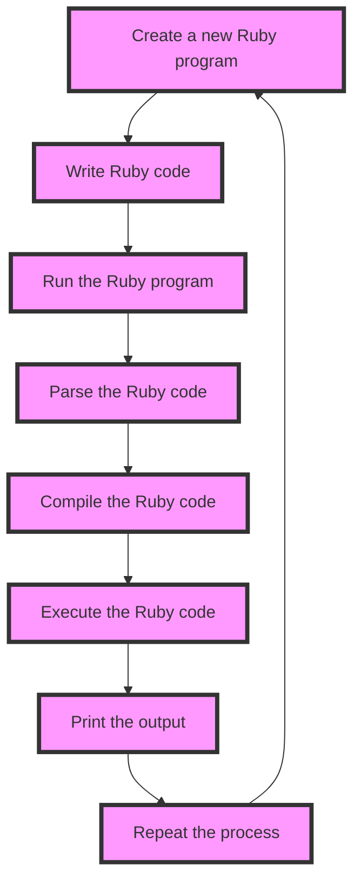

## Introduction
Ruby is a **high-level, interpreted programming language** that has been gaining popularity in recent years due to its simplicity, readability, and ease of use. It was created by **Yukihiro Matsumoto** in the mid-1990s and is known for its **dynamic typing**, **object-oriented** design, and **garbage collection**. Ruby is often used for **web development**, **scripting**, and **system administration**, and is a popular choice among developers due to its **large community** and **rich ecosystem** of libraries and frameworks. One of the most popular frameworks for Ruby is **Ruby on Rails**, which provides a **structured approach** to web development and is known for its **rapid development** capabilities.

> **Note:** Ruby is often compared to other programming languages such as Python, JavaScript, and PHP, but its unique syntax and features set it apart from these languages.

## Core Concepts
Ruby has several core concepts that make it a popular choice among developers. These include:
* **Objects**: Ruby is an object-oriented language, which means that it organizes code into objects that contain data and behavior.
* **Methods**: Methods are blocks of code that can be called multiple times from different parts of a program.
* **Blocks**: Blocks are anonymous functions that can be passed to methods as arguments.
* **Modules**: Modules are collections of related methods and constants that can be used to organize code.
* **Classes**: Classes are templates for creating objects and define the behavior of an object.

> **Tip:** Ruby's syntax is designed to be easy to read and write, with a focus on **code readability**.

## How It Works Internally
Ruby's internal mechanics are based on a **virtual machine** that executes Ruby code. The virtual machine is responsible for **parsing**, **compiling**, and **executing** Ruby code. When a Ruby program is run, the virtual machine reads the code, parses it into an **abstract syntax tree**, and then compiles it into **bytecode**. The bytecode is then executed by the virtual machine, which provides a **runtime environment** for the program.

> **Warning:** Ruby's dynamic typing can lead to **type errors** if not used carefully, so it's essential to understand the **type system** and use **type checking** to ensure the correctness of your code.

## Code Examples
Here are three examples of Ruby code that demonstrate its syntax and features:
### Example 1: Basic Usage
```ruby
# Define a class
class Person
  # Define an initializer method
  def initialize(name, age)
    @name = name
    @age = age
  end

  # Define a method to print the person's details
  def print_details
    puts "Name: #{@name}, Age: #{@age}"
  end
end

# Create an instance of the Person class
person = Person.new("John Doe", 30)

# Call the print_details method
person.print_details
```
This example demonstrates the basic syntax of Ruby, including **class definition**, **method definition**, and **object creation**.

### Example 2: Real-world Pattern
```ruby
# Define a class for a bank account
class BankAccount
  # Define an initializer method
  def initialize(balance = 0)
    @balance = balance
  end

  # Define a method to deposit money
  def deposit(amount)
    @balance += amount
  end

  # Define a method to withdraw money
  def withdraw(amount)
    if @balance >= amount
      @balance -= amount
    else
      puts "Insufficient funds"
    end
  end

  # Define a method to print the account balance
  def print_balance
    puts "Balance: #{@balance}"
  end
end

# Create an instance of the BankAccount class
account = BankAccount.new(1000)

# Deposit money into the account
account.deposit(500)

# Withdraw money from the account
account.withdraw(200)

# Print the account balance
account.print_balance
```
This example demonstrates a **real-world pattern** for a bank account, including **deposit**, **withdrawal**, and **balance inquiry**.

### Example 3: Advanced Usage
```ruby
# Define a class for a graph data structure
class Graph
  # Define an initializer method
  def initialize
    @nodes = []
    @edges = []
  end

  # Define a method to add a node to the graph
  def add_node(node)
    @nodes << node
  end

  # Define a method to add an edge to the graph
  def add_edge(from, to)
    @edges << [from, to]
  end

  # Define a method to print the graph
  def print_graph
    puts "Nodes: #{@nodes.join(", ")}"
    puts "Edges: #{@edges.map { |edge| "#{edge[0]} -> #{edge[1]}" }.join(", ")}"
  end
end

# Create an instance of the Graph class
graph = Graph.new

# Add nodes to the graph
graph.add_node("A")
graph.add_node("B")
graph.add_node("C")

# Add edges to the graph
graph.add_edge("A", "B")
graph.add_edge("B", "C")
graph.add_edge("C", "A")

# Print the graph
graph.print_graph
```
This example demonstrates an **advanced usage** of Ruby, including **graph data structure**, **node and edge management**, and **graph printing**.

## Visual Diagram

This diagram illustrates the **process of creating and running a Ruby program**, including **writing Ruby code**, **parsing**, **compiling**, and **executing** the code.

## Comparison
| Framework | Time Complexity | Space Complexity | Pros | Cons | Best For |
| --- | --- | --- | --- | --- | --- |
| Ruby on Rails | O(n) | O(n) | Rapid development, large community, rich ecosystem | Steep learning curve, complex architecture | Web development, rapid prototyping |
| Django | O(n) | O(n) | High-level framework, rapid development, secure | Complex architecture, steep learning curve | Web development, enterprise applications |
| Flask | O(n) | O(n) | Lightweight, flexible, easy to learn | Limited functionality, not suitable for large applications | Web development, small applications |
| Sinatra | O(n) | O(n) | Lightweight, flexible, easy to learn | Limited functionality, not suitable for large applications | Web development, small applications |

> **Interview:** What are the pros and cons of using Ruby on Rails for web development? What are some alternative frameworks that can be used?

## Real-world Use Cases
Here are three real-world use cases for Ruby:
* **GitHub**: GitHub uses Ruby on Rails to power its web application, which provides a **version control system** for developers.
* **Airbnb**: Airbnb uses Ruby on Rails to power its web application, which provides a **platform for booking accommodations**.
* **Groupon**: Groupon uses Ruby on Rails to power its web application, which provides a **platform for discount shopping**.

## Common Pitfalls
Here are four common pitfalls to avoid when using Ruby:
* **Not using type checking**: Ruby's dynamic typing can lead to **type errors** if not used carefully, so it's essential to use **type checking** to ensure the correctness of your code.
* **Not using error handling**: Ruby's error handling mechanisms can help **catch and handle errors**, but it's essential to use them correctly to avoid **crashes** and **unexpected behavior**.
* **Not using testing frameworks**: Ruby's testing frameworks, such as **RSpec** and **Cucumber**, can help **ensure the correctness** of your code, but it's essential to use them correctly to avoid **bugs** and **regressions**.
* **Not using security best practices**: Ruby's security best practices, such as **validating user input** and **using secure protocols**, can help **protect your application** from **security threats**, but it's essential to use them correctly to avoid **vulnerabilities** and **attacks**.

## Interview Tips
Here are three common interview questions for Ruby developers:
* **What is your experience with Ruby on Rails?**: This question is designed to assess your experience with Ruby on Rails and your ability to **build web applications**.
* **How do you handle errors in Ruby?**: This question is designed to assess your knowledge of Ruby's error handling mechanisms and your ability to **catch and handle errors**.
* **What are some security best practices for Ruby development?**: This question is designed to assess your knowledge of Ruby's security best practices and your ability to **protect your application** from **security threats**.

## Key Takeaways
Here are ten key takeaways for Ruby developers:
* **Ruby is a high-level, interpreted programming language**.
* **Ruby on Rails is a popular framework for web development**.
* **Ruby's syntax is designed to be easy to read and write**.
* **Ruby's dynamic typing can lead to type errors if not used carefully**.
* **Ruby's error handling mechanisms can help catch and handle errors**.
* **Ruby's testing frameworks can help ensure the correctness of your code**.
* **Ruby's security best practices can help protect your application from security threats**.
* **Ruby on Rails provides a structured approach to web development**.
* **Ruby on Rails is known for its rapid development capabilities**.
* **Ruby on Rails has a large community and rich ecosystem of libraries and frameworks**.