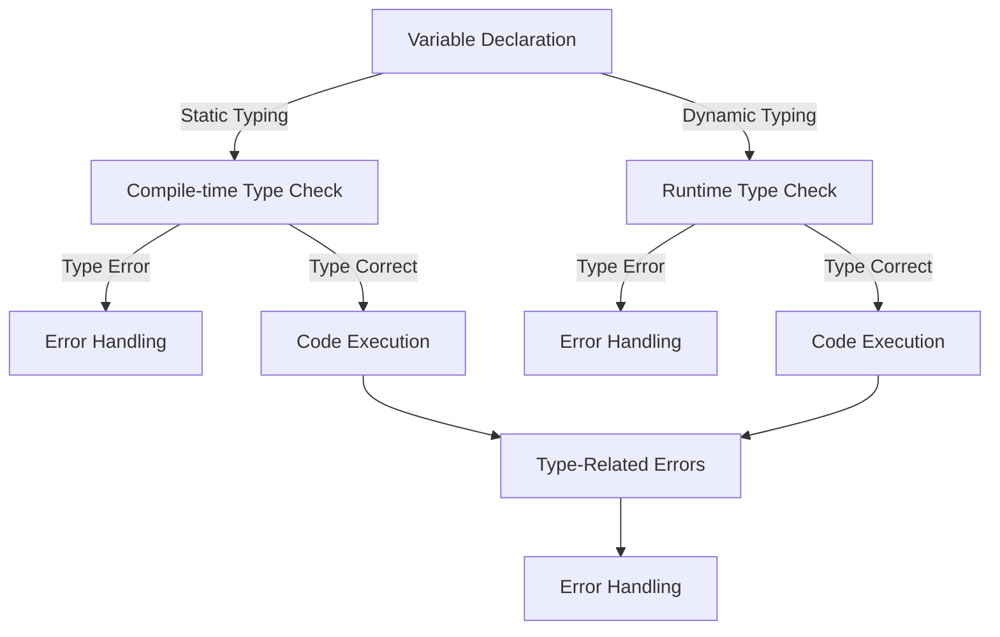

## Introduction
**Static typing** and **dynamic typing** are two fundamental concepts in programming languages that determine when and how the data type of a variable is checked. Static typing checks the data type at **compile time**, while dynamic typing checks it at **runtime**. Understanding the differences between these two approaches is crucial for every engineer, as it affects the way we design, implement, and maintain software systems. In this article, we will delve into the world of static and dynamic typing, exploring their core concepts, internal mechanics, and real-world applications.

> **Note:** The choice between static and dynamic typing has significant implications for code readability, maintainability, and performance. As we will see, each approach has its strengths and weaknesses, and the best choice depends on the specific needs of the project.

## Core Concepts
Let's start with some precise definitions:
* **Static typing**: A programming language that checks the data type of a variable at compile time, before the code is executed. This means that the compiler ensures that the variable is assigned a value of the correct type, and prevents type-related errors at runtime.
* **Dynamic typing**: A programming language that checks the data type of a variable at runtime, while the code is being executed. This means that the language does not enforce type constraints at compile time, and type-related errors may occur during execution.
* **Type inference**: The ability of a programming language to automatically deduce the data type of a variable, without requiring explicit type annotations.

> **Tip:** Type inference is a powerful feature that can simplify code and reduce the risk of type-related errors. However, it can also lead to unexpected behavior if not used carefully.

## How It Works Internally
Let's take a closer look at the internal mechanics of static and dynamic typing:
* **Static typing**: When the compiler encounters a variable declaration, it checks the type of the variable and ensures that it matches the type of the assigned value. If the types do not match, the compiler raises a type error. This process is repeated for every variable declaration, ensuring that the entire program is type-correct before it is executed.
* **Dynamic typing**: When the code is executed, the language checks the type of each variable at runtime. If a type-related error occurs, the language raises a runtime error. Dynamic typing languages often use a combination of type checking and duck typing (i.e., "if it walks like a duck and talks like a duck, it's a duck") to determine the type of a variable.

> **Warning:** Dynamic typing can lead to unexpected behavior if not used carefully. For example, if a function expects a string argument but receives a number, it may fail or produce incorrect results.

## Code Examples
Here are three complete and runnable code examples that demonstrate the differences between static and dynamic typing:
### Example 1: Basic Static Typing (Java)
```java
public class StaticTypingExample {
    public static void main(String[] args) {
        // Declare a variable with a specific type
        int x = 5;
        // Attempt to assign a value of a different type
        // x = "hello"; // Compile-time error: incompatible types
    }
}
```
### Example 2: Dynamic Typing (JavaScript)
```javascript
// Declare a variable without a specific type
let x = 5;
// Assign a value of a different type
x = "hello";
console.log(x); // Output: hello
```
### Example 3: Advanced Static Typing (Rust)
```rust
// Declare a variable with a specific type
let x: i32 = 5;
// Attempt to assign a value of a different type
// x = "hello"; // Compile-time error: expected i32, found &str
```
> **Interview:** Can you explain the differences between static and dynamic typing, and provide examples of each?

## Visual Diagram

This diagram illustrates the differences between static and dynamic typing, including the compile-time type check and runtime type check.

## Comparison
| Approach | Time Complexity | Space Complexity | Pros | Cons | Best For |
| --- | --- | --- | --- | --- | --- |
| Static Typing | O(1) | O(1) | Prevents type-related errors at runtime, improves code readability | Can be verbose, may require explicit type annotations | Systems programming, high-performance applications |
| Dynamic Typing | O(1) | O(1) | Flexible, allows for duck typing and type inference | May lead to type-related errors at runtime, can be less readable | Rapid prototyping, scripting, web development |
| Type Inference | O(1) | O(1) | Simplifies code, reduces the risk of type-related errors | May lead to unexpected behavior if not used carefully | Functional programming, data analysis |
| Duck Typing | O(1) | O(1) | Flexible, allows for dynamic typing and type inference | May lead to type-related errors at runtime, can be less readable | Rapid prototyping, scripting, web development |

## Real-world Use Cases
Here are three real-world examples of static and dynamic typing in production systems:
* **Google's Go language**: Go is a statically typed language that is designed for building scalable and concurrent systems. Its type system is designed to be simple and efficient, making it well-suited for systems programming.
* **Facebook's JavaScript infrastructure**: Facebook's JavaScript infrastructure is built on top of a dynamically typed language, which allows for rapid prototyping and development. However, Facebook also uses a combination of type checking and code analysis tools to ensure the correctness and reliability of their codebase.
* **Python's scientific computing ecosystem**: Python is a dynamically typed language that is widely used in scientific computing and data analysis. Its flexibility and ease of use make it an ideal choice for rapid prototyping and development, but its dynamic typing can also lead to type-related errors if not used carefully.

> **Tip:** When choosing between static and dynamic typing, consider the specific needs of your project. If you need to build a high-performance system with strict type constraints, static typing may be a better choice. However, if you need to rapidly prototype and develop a system with flexible type constraints, dynamic typing may be a better choice.

## Common Pitfalls
Here are four common mistakes that engineers make when working with static and dynamic typing:
* **Ignoring type-related errors**: Ignoring type-related errors can lead to unexpected behavior and runtime errors. Always address type-related errors and warnings, and use type checking tools to ensure the correctness of your code.
* **Using dynamic typing without type checking**: Using dynamic typing without type checking can lead to type-related errors at runtime. Always use type checking tools and code analysis tools to ensure the correctness and reliability of your code.
* **Overusing explicit type annotations**: Overusing explicit type annotations can make your code verbose and less readable. Use type inference and duck typing to simplify your code and reduce the risk of type-related errors.
* **Not using type inference**: Not using type inference can lead to unnecessary explicit type annotations and make your code less readable. Use type inference to simplify your code and reduce the risk of type-related errors.

## Interview Tips
Here are three common interview questions on static and dynamic typing, along with weak and strong answers:
* **Question 1: What is the difference between static and dynamic typing?**
	+ Weak answer: "Static typing is when the compiler checks the type of a variable at compile time, while dynamic typing is when the language checks the type at runtime."
	+ Strong answer: "Static typing is a compile-time check that ensures the correctness of the code, while dynamic typing is a runtime check that allows for flexibility and duck typing. However, dynamic typing can lead to type-related errors at runtime, so it's essential to use type checking tools and code analysis tools to ensure the correctness and reliability of the code."
* **Question 2: When would you use static typing, and when would you use dynamic typing?**
	+ Weak answer: "I would use static typing for systems programming and dynamic typing for web development."
	+ Strong answer: "I would use static typing for systems programming and high-performance applications, where type correctness is critical. However, I would use dynamic typing for rapid prototyping and development, where flexibility and ease of use are essential. Ultimately, the choice between static and dynamic typing depends on the specific needs of the project and the trade-offs between type correctness, flexibility, and readability."
* **Question 3: How do you handle type-related errors in a dynamically typed language?**
	+ Weak answer: "I would use try-catch blocks to catch type-related errors at runtime."
	+ Strong answer: "I would use a combination of type checking tools, code analysis tools, and unit testing to ensure the correctness and reliability of the code. I would also use try-catch blocks to catch type-related errors at runtime, but I would also use type inference and duck typing to simplify the code and reduce the risk of type-related errors."

## Key Takeaways
Here are ten key takeaways from this article:
* **Static typing is a compile-time check** that ensures the correctness of the code.
* **Dynamic typing is a runtime check** that allows for flexibility and duck typing.
* **Type inference is a powerful feature** that can simplify code and reduce the risk of type-related errors.
* **Duck typing is a flexible approach** that allows for dynamic typing and type inference.
* **Type-related errors can lead to unexpected behavior** and runtime errors.
* **Type checking tools and code analysis tools** are essential for ensuring the correctness and reliability of the code.
* **Unit testing is critical** for ensuring the correctness and reliability of the code.
* **The choice between static and dynamic typing** depends on the specific needs of the project and the trade-offs between type correctness, flexibility, and readability.
* **Type correctness is critical** for systems programming and high-performance applications.
* **Flexibility and ease of use are essential** for rapid prototyping and development.