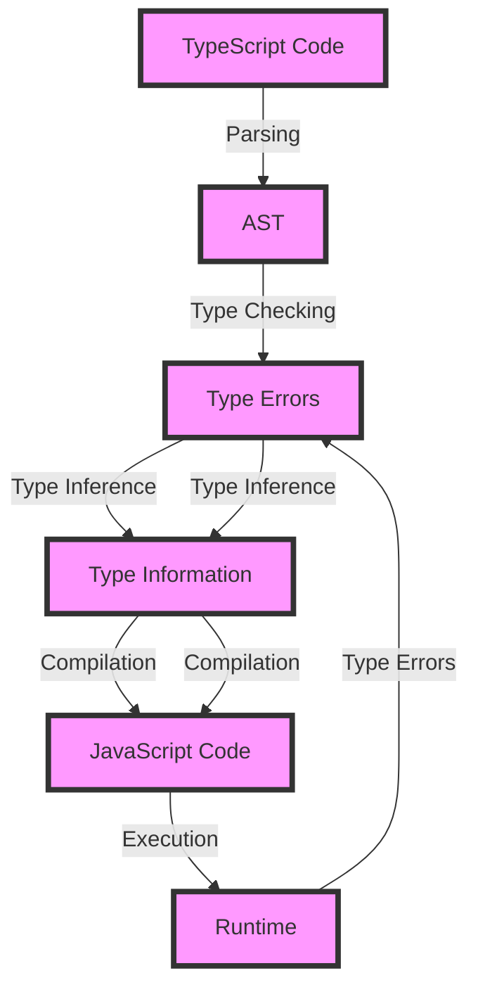

## Introduction
TypeScript is a superset of JavaScript that adds optional static typing and other features to improve the development experience. It was created by Microsoft and first released in 2012. TypeScript's main goal is to help developers catch errors early and improve code maintainability, thus making it an ideal choice for large and complex codebases. **TypeScript is not a replacement for JavaScript**, but rather a way to write JavaScript with additional features that make it more robust and efficient.

> **Note:** TypeScript is designed to be fully compatible with existing JavaScript code, so you can easily integrate it into your existing projects.

In the real world, TypeScript is widely used in many industries, including web development, mobile app development, and backend development. Companies like Microsoft, Google, and Facebook use TypeScript in their production codebases. **Every engineer should know TypeScript** because it has become the industry standard for large codebases, and having knowledge of it can significantly improve your career prospects.

## Core Concepts
Here are some core concepts that you need to understand when working with TypeScript:

* **Types**: In TypeScript, a type is a way to describe the shape of a value. You can think of it as a contract that the value must conform to. Types can be primitive (like `number` or `string`), or they can be complex (like `object` or `array`).
* **Interfaces**: An interface is a way to define the shape of an object. It's like a blueprint for an object that specifies what properties it must have.
* **Classes**: A class is a way to define a blueprint for an object. It's similar to an interface, but it can also include methods and other members.
* **Type Inference**: Type inference is the process by which TypeScript automatically determines the type of a value based on its usage.

> **Tip:** Use the `any` type sparingly, as it can disable type checking and make your code less robust.

## How It Works Internally
Here's a high-level overview of how TypeScript works internally:

1. **Parsing**: The TypeScript compiler parses your code into an abstract syntax tree (AST).
2. **Type Checking**: The type checker analyzes the AST and checks for type errors.
3. **Type Inference**: The type inference engine infers the types of variables and expressions.
4. **Compilation**: The compiler generates JavaScript code from the AST.

> **Warning:** TypeScript's type checking is not foolproof, and it's possible to write code that passes type checking but still has runtime errors.

## Code Examples
Here are three complete and runnable code examples that demonstrate the basics of TypeScript:

### Example 1: Basic Usage
```typescript
// Define a simple interface
interface Person {
  name: string;
  age: number;
}

// Create a function that takes a Person object
function greet(person: Person) {
  console.log(`Hello, ${person.name}! You are ${person.age} years old.`);
}

// Create a Person object and pass it to the greet function
const person: Person = { name: 'John', age: 30 };
greet(person);
```

### Example 2: Real-World Pattern
```typescript
// Define a class that represents a bank account
class BankAccount {
  private balance: number;

  constructor(initialBalance: number) {
    this.balance = initialBalance;
  }

  deposit(amount: number) {
    this.balance += amount;
  }

  withdraw(amount: number) {
    if (this.balance >= amount) {
      this.balance -= amount;
    } else {
      throw new Error('Insufficient funds');
    }
  }

  getBalance() {
    return this.balance;
  }
}

// Create a bank account and perform some transactions
const account = new BankAccount(1000);
account.deposit(500);
account.withdraw(200);
console.log(`Balance: ${account.getBalance()}`);
```

### Example 3: Advanced Usage
```typescript
// Define a generic class that represents a stack
class Stack<T> {
  private elements: T[];

  constructor() {
    this.elements = [];
  }

  push(element: T) {
    this.elements.push(element);
  }

  pop(): T | undefined {
    return this.elements.pop();
  }

  isEmpty(): boolean {
    return this.elements.length === 0;
  }
}

// Create a stack of numbers and perform some operations
const numberStack = new Stack<number>();
numberStack.push(1);
numberStack.push(2);
numberStack.push(3);
console.log(`Popped: ${numberStack.pop()}`);
console.log(`Is empty: ${numberStack.isEmpty()}`);
```

## Visual Diagram

This diagram shows the internal workflow of the TypeScript compiler, from parsing to compilation and execution.

## Comparison
Here's a comparison of TypeScript with other popular programming languages:

| Language | Type System | Null Safety | Interoperability |
| --- | --- | --- | --- |
| TypeScript | Statically typed | Yes | High |
| JavaScript | Dynamically typed | No | High |
| Java | Statically typed | Yes | Medium |
| C# | Statically typed | Yes | Medium |
| Python | Dynamically typed | No | High |

> **Interview:** Can you explain the difference between statically typed and dynamically typed languages?

## Real-world Use Cases
Here are three real-world use cases of TypeScript:

1. **Microsoft**: Microsoft uses TypeScript extensively in its production codebases, including the Visual Studio Code editor.
2. **Google**: Google uses TypeScript in its Angular framework, which is a popular framework for building web applications.
3. **Facebook**: Facebook uses TypeScript in its React framework, which is a popular framework for building user interfaces.

## Common Pitfalls
Here are four common pitfalls to watch out for when using TypeScript:

1. **Using the `any` type**: Using the `any` type can disable type checking and make your code less robust.
2. **Not using type inference**: Not using type inference can lead to unnecessary type annotations and make your code less readable.
3. **Not handling null and undefined values**: Not handling null and undefined values can lead to runtime errors and make your code less robust.
4. **Not using generics**: Not using generics can lead to code duplication and make your code less maintainable.

> **Warning:** Using the `any` type can lead to runtime errors and make your code less maintainable.

## Interview Tips
Here are three common interview questions related to TypeScript, along with sample answers:

1. **What is the difference between TypeScript and JavaScript?**
	* Weak answer: "TypeScript is just JavaScript with types."
	* Strong answer: "TypeScript is a superset of JavaScript that adds optional static typing and other features to improve the development experience."
2. **How does TypeScript handle null and undefined values?**
	* Weak answer: "TypeScript doesn't handle null and undefined values."
	* Strong answer: "TypeScript uses the `null` and `undefined` types to represent null and undefined values, and it provides features like the `?` operator to handle them safely."
3. **What is the purpose of the `any` type in TypeScript?**
	* Weak answer: "The `any` type is used to disable type checking."
	* Strong answer: "The `any` type is used to represent a value that can be of any type, but it's generally discouraged because it can disable type checking and make your code less robust."

## Key Takeaways
Here are ten key takeaways from this article:

* **TypeScript is a superset of JavaScript** that adds optional static typing and other features.
* **TypeScript is designed to be fully compatible** with existing JavaScript code.
* **TypeScript uses a static type system** to check for type errors at compile time.
* **TypeScript provides features like type inference** to make your code more readable and maintainable.
* **TypeScript has a strong focus on null safety** to prevent runtime errors.
* **TypeScript is widely used in industry** for building large and complex codebases.
* **TypeScript has a large and active community** of developers and contributors.
* **TypeScript is constantly evolving** with new features and improvements being added regularly.
* **TypeScript is a valuable skill** for any developer to have, regardless of their experience level.
* **TypeScript is a great choice** for building web applications, mobile applications, and backend services.