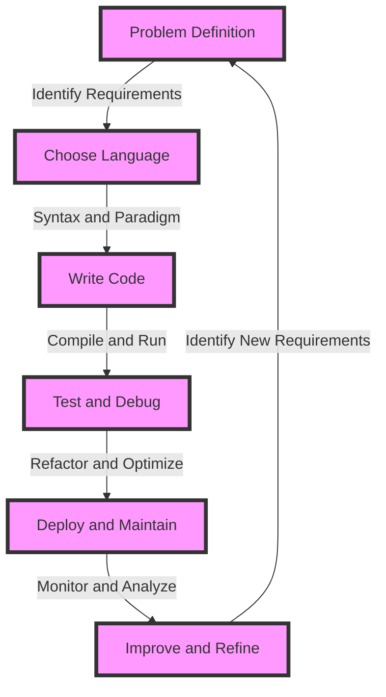

## Introduction
Learning multiple programming languages is an essential skill for any software engineer. In the real world, different problems require different tools, and being proficient in multiple languages can help you tackle a wide range of challenges. **Polyglot programming** is the practice of using multiple programming languages to solve a single problem or work on a single project. This approach can help you choose the best language for each task, rather than trying to force a single language to fit all your needs. For example, a web application might use **JavaScript** for client-side scripting, **Python** for server-side logic, and **SQL** for database queries.

> **Note:** In today's fast-paced software development environment, being able to adapt to new languages and technologies is crucial for staying competitive.

## Core Concepts
To understand the importance of learning multiple programming languages, it's essential to grasp some core concepts:
* **Language paradigms**: Different programming languages are based on different paradigms, such as **object-oriented programming (OOP)**, **functional programming (FP)**, or **imperative programming**. Each paradigm has its strengths and weaknesses, and choosing the right one for a particular problem can make a significant difference.
* **Language syntax**: The syntax of a programming language refers to the rules that govern how code is written. Different languages have different syntax, and being familiar with multiple syntaxes can help you learn new languages more quickly.
* **Language ecosystem**: The ecosystem of a programming language includes the tools, libraries, and frameworks that are available for that language. Understanding the ecosystem of a language can help you choose the right language for a particular project.

> **Tip:** When learning a new programming language, start by focusing on the language's paradigm, syntax, and ecosystem. This will give you a solid foundation for understanding the language and its applications.

## How It Works Internally
When you're working with multiple programming languages, it's essential to understand how they interact with each other. Here's a step-by-step breakdown of the process:
1. **Code compilation**: When you write code in a programming language, it needs to be compiled into machine code that the computer can understand. Different languages have different compilation processes, and some languages may require additional steps, such as **Just-In-Time (JIT) compilation**.
2. **Memory management**: Each programming language has its own memory management model, which determines how memory is allocated and deallocated for variables and data structures. Understanding the memory management model of a language can help you write more efficient code.
3. **Data exchange**: When working with multiple languages, you may need to exchange data between languages. This can be done using **Application Programming Interfaces (APIs)**, **data serialization formats**, or other mechanisms.

> **Warning:** When working with multiple programming languages, be aware of the potential for **memory leaks** or **data corruption** due to differences in memory management models or data exchange mechanisms.

## Code Examples
Here are three complete, runnable code examples that demonstrate the use of multiple programming languages:
### Example 1: Basic Usage (JavaScript and Python)
```javascript
// JavaScript code
const fs = require('fs');
const python = require('child_process');

// Write data to a file
fs.writeFileSync('data.json', JSON.stringify({ message: 'Hello, World!' }));

// Call a Python script to process the data
python.exec('python process_data.py', (error, stdout, stderr) => {
  if (error) {
    console.error(`Error: ${error}`);
  } else {
    console.log(`Output: ${stdout}`);
  }
});
```

```python
# Python code (process_data.py)
import json

# Read data from a file
with open('data.json', 'r') as file:
  data = json.load(file)

# Process the data
processed_data = { 'message': data['message'].upper() }

# Print the processed data
print(json.dumps(processed_data))
```

### Example 2: Real-World Pattern (Java and SQL)
```java
// Java code
import java.sql.Connection;
import java.sql.DriverManager;
import java.sql.ResultSet;
import java.sql.Statement;

public class DatabaseExample {
  public static void main(String[] args) {
    // Connect to a database
    Connection connection = DriverManager.getConnection('jdbc:mysql://localhost:3306/mydatabase', 'username', 'password');

    // Create a statement to execute a query
    Statement statement = connection.createStatement();

    // Execute a query
    ResultSet resultSet = statement.executeQuery('SELECT * FROM mytable');

    // Process the results
    while (resultSet.next()) {
      System.out.println(resultSet.getString('column1') + ', ' + resultSet.getString('column2'));
    }

    // Close the connection
    connection.close();
  }
}
```

```sql
-- SQL code (mytable schema)
CREATE TABLE mytable (
  column1 VARCHAR(255),
  column2 VARCHAR(255)
);

INSERT INTO mytable (column1, column2) VALUES ('Hello', 'World');
```

### Example 3: Advanced Usage (C++ and Python)
```cpp
// C++ code
extern "C" {
  #include <Python.h>
}

int main() {
  // Initialize the Python interpreter
  Py_Initialize();

  // Import a Python module
  PyObject* module = PyImport_ImportModule("my_module");

  // Call a Python function
  PyObject* func = PyObject_GetAttrString(module, "my_function");
  PyObject* args = PyTuple_New(1);
  PyTuple_SetItem(args, 0, Py_BuildValue("s", "Hello, World!"));
  PyObject* result = PyObject_CallObject(func, args);

  // Print the result
  printf("%s\n", PyUnicode_AsUTF8(result));

  // Clean up
  Py_Finalize();
  return 0;
}
```

```python
# Python code (my_module.py)
def my_function(message):
  return message.upper()
```

## Visual Diagram

This diagram illustrates the process of choosing a programming language and working with it to solve a problem. The process involves identifying requirements, choosing a language, writing code, testing and debugging, deploying and maintaining, and improving and refining.

> **Interview:** When asked about your experience with multiple programming languages, be prepared to walk the interviewer through your thought process and decision-making when choosing a language for a particular project.

## Comparison
Here's a comparison of different programming languages and their characteristics:
| Language | Paradigm | Syntax | Ecosystem | Time Complexity | Space Complexity | Pros | Cons | Best For |
| --- | --- | --- | --- | --- | --- | --- | --- | --- |
| JavaScript | OOP, FP | Dynamic | Node.js, npm | O(1) - O(n) | O(1) - O(n) | Versatile, widely adopted | Security concerns, complex | Web development, scripting |
| Python | OOP, FP | Static | Python, pip | O(1) - O(n) | O(1) - O(n) | Easy to learn, large community | Slow performance, limited multithreading | Data science, machine learning |
| Java | OOP | Static | Java, Maven | O(1) - O(n) | O(1) - O(n) | Platform-independent, secure | Verbose, complex | Android app development, enterprise software |
| C++ | OOP | Static | C++, Make | O(1) - O(n) | O(1) - O(n) | High-performance, control | Steep learning curve, error-prone | System programming, game development |

## Real-world Use Cases
Here are some real-world examples of companies and systems that use multiple programming languages:
* **Google**: Uses a combination of **C++, Java, and Python** for its search engine, advertising platform, and other internal tools.
* **Facebook**: Employs a mix of **PHP, Java, and Python** for its web application, mobile app, and data analytics.
* **Netflix**: Utilizes a combination of **Java, Python, and JavaScript** for its streaming service, recommendation engine, and user interface.

> **Tip:** When working on a project that involves multiple programming languages, consider using a **microservices architecture** to break down the system into smaller, language-agnostic components.

## Common Pitfalls
Here are some common mistakes to watch out for when working with multiple programming languages:
* **Inconsistent syntax**: Failing to follow the syntax and conventions of each language can lead to errors and confusion.
* **Memory management**: Not understanding the memory management model of each language can result in **memory leaks** or **data corruption**.
* **Data exchange**: Not using the correct data exchange mechanisms can lead to **data loss** or **incompatibility issues**.
* **Language interoperability**: Not considering the interoperability of different languages can make it difficult to integrate components written in different languages.

> **Warning:** When working with multiple programming languages, be aware of the potential for **security vulnerabilities** due to differences in language security features and best practices.

## Interview Tips
Here are some common interview questions and tips for answering them:
* **What is your experience with multiple programming languages?**: Be prepared to walk the interviewer through your thought process and decision-making when choosing a language for a particular project.
* **How do you handle language interoperability?**: Discuss the importance of using standardized data exchange mechanisms and APIs to ensure seamless communication between components written in different languages.
* **What are some common pitfalls when working with multiple programming languages?**: Mention the potential for inconsistent syntax, memory management issues, data exchange problems, and language interoperability challenges.

> **Note:** When answering interview questions, be sure to provide specific examples from your experience and highlight your problem-solving skills and attention to detail.

## Key Takeaways
Here are some key takeaways to remember:
* **Choose the right language for the problem**: Different languages are suited for different tasks, and choosing the right language can make a significant difference in the success of a project.
* **Understand the language paradigm, syntax, and ecosystem**: Familiarity with a language's paradigm, syntax, and ecosystem can help you learn the language more quickly and use it more effectively.
* **Be aware of language interoperability and data exchange**: Using standardized data exchange mechanisms and APIs can ensure seamless communication between components written in different languages.
* **Watch out for common pitfalls**: Inconsistent syntax, memory management issues, data exchange problems, and language interoperability challenges are common mistakes to avoid when working with multiple programming languages.
* **Practice and learn from experience**: The more experience you have working with multiple programming languages, the better equipped you'll be to handle the challenges and opportunities that come with polyglot programming.