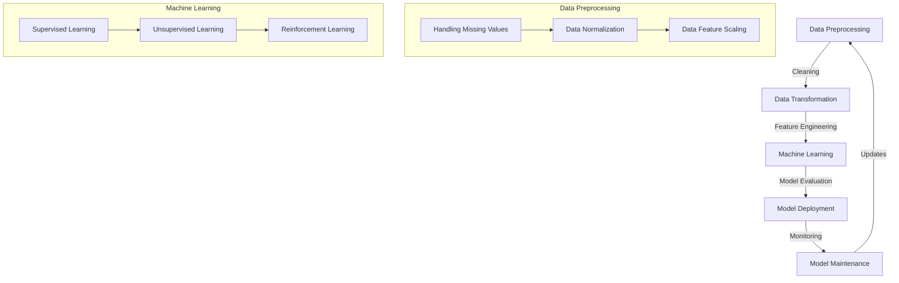

## Introduction
Choosing the right language for **Data Science** is a crucial decision that can significantly impact the efficiency and effectiveness of data analysis and modeling tasks. **Python**, **R**, and **Julia** are three popular languages used in the field of Data Science, each with its strengths and weaknesses. In this article, we will delve into the core concepts, internal mechanics, and code examples of each language to help you make an informed decision. 
> **Note:** Understanding the differences between these languages is essential for selecting the best tool for your Data Science projects.

## Core Concepts
Before diving into the details of each language, it's essential to understand the core concepts of Data Science. **Data Science** is an interdisciplinary field that combines concepts from **Statistics**, **Computer Science**, and **Domain Expertise** to extract insights from data. The key terminology includes:
* **Data Preprocessing**: cleaning, transforming, and preparing data for analysis
* **Machine Learning**: training models to make predictions or classify data
* **Data Visualization**: presenting data in a graphical format to facilitate understanding
* **Statistical Modeling**: using statistical techniques to model and analyze data
> **Tip:** Familiarizing yourself with these core concepts will help you better understand the strengths and weaknesses of each language.

## How It Works Internally
Each language has its internal mechanics and workflows. **Python** is a general-purpose language with a vast collection of libraries and frameworks, including **NumPy**, **Pandas**, and **Scikit-learn**, which provide efficient data structures and algorithms for Data Science tasks. **R** is a language specifically designed for statistical computing and provides an extensive range of libraries and packages, including **dplyr** and **tidyr**, for data manipulation and analysis. **Julia** is a new language that aims to provide the speed and efficiency of **C++** with the ease of use of **Python** and **R**.
> **Warning:** While **Julia** is a promising language, it still lacks the maturity and ecosystem of **Python** and **R**.

## Code Examples
Here are three code examples to demonstrate the basics of each language:
### Example 1: Basic Data Analysis in Python
```python
import pandas as pd

# Load data
data = pd.read_csv('data.csv')

# Calculate mean and median
mean = data['value'].mean()
median = data['value'].median()

print(f'Mean: {mean}, Median: {median}')
```
### Example 2: Data Visualization in R
```r
# Load libraries
library(ggplot2)

# Load data
data <- read.csv('data.csv')

# Create a histogram
ggplot(data, aes(x = value)) +
  geom_histogram(binwidth = 1, color = 'black', fill = 'lightblue') +
  labs(title = 'Histogram of Values', x = 'Value', y = 'Frequency')
```
### Example 3: Machine Learning in Julia
```julia
# Load libraries
using MLJ
using DataFrames

# Load data
data = DataFrame(load("data.csv"))

# Split data into training and testing sets
train, test = split(data, 0.8)

# Train a model
model = @load LinearRegression pkg = MLJLinearModels
mach = machine(model, train[:, 1], train[:, 2])

# Evaluate model
evaluate(mach, test[:, 1], test[:, 2])
```
> **Interview:** Can you explain the difference between **NumPy** and **Pandas** in **Python**? How do you handle missing values in **R**?

## Visual Diagram

The diagram illustrates the workflow of Data Science tasks, from data preprocessing to model deployment and maintenance.

## Comparison
| Language | Time Complexity | Space Complexity | Pros | Cons | Best For |
| --- | --- | --- | --- | --- | --- |
| Python | O(1) - O(n^3) | O(1) - O(n) | General-purpose, vast libraries, easy to learn | Slow for large-scale computations | Data analysis, machine learning, web development |
| R | O(1) - O(n^3) | O(1) - O(n) | Specifically designed for statistical computing, extensive libraries | Steep learning curve, limited general-purpose programming | Statistical modeling, data visualization, data mining |
| Julia | O(1) - O(n^3) | O(1) - O(n) | Fast execution speed, dynamic typing, macros | Limited ecosystem, still developing | High-performance computing, numerical analysis, machine learning |

## Real-world Use Cases
* **Netflix**: uses **Python** for data analysis and machine learning to recommend movies and TV shows
* **Google**: uses **R** for statistical modeling and data visualization to analyze user behavior
* **NASA**: uses **Julia** for high-performance computing and numerical analysis to simulate complex systems
> **Tip:** Understanding the strengths and weaknesses of each language can help you choose the best tool for your specific use case.

## Common Pitfalls
* **Incorrect data types**: using incorrect data types can lead to errors and slow performance
* **Inefficient algorithms**: using inefficient algorithms can lead to slow performance and increased memory usage
* **Overfitting**: overfitting can lead to poor model performance on unseen data
* **Underfitting**: underfitting can lead to poor model performance on seen data
> **Warning:** Be careful when handling missing values and outliers in your data.

## Interview Tips
* **What is the difference between **Python** and **R**?**: Python is a general-purpose language with a vast collection of libraries, while R is specifically designed for statistical computing.
* **How do you handle missing values in **R**?**: You can use the **is.na()** function to identify missing values and the **na.omit()** function to remove them.
* **What is the advantage of using **Julia** for high-performance computing?**: Julia provides fast execution speed and dynamic typing, making it ideal for high-performance computing applications.
> **Interview:** Can you explain the concept of **bias-variance tradeoff** in machine learning?

## Key Takeaways
* **Python** is a general-purpose language with a vast collection of libraries and frameworks for Data Science tasks.
* **R** is specifically designed for statistical computing and provides an extensive range of libraries and packages.
* **Julia** is a new language that aims to provide the speed and efficiency of **C++** with the ease of use of **Python** and **R**.
* **Data preprocessing** is a critical step in the Data Science workflow.
* **Machine learning** is a key aspect of Data Science, and **Python** and **R** provide extensive libraries and frameworks for machine learning tasks.
* **Data visualization** is an essential step in presenting insights and results to stakeholders.
* **Statistical modeling** is a critical aspect of Data Science, and **R** provides an extensive range of libraries and packages for statistical modeling.
* **High-performance computing** is a key aspect of Data Science, and **Julia** provides fast execution speed and dynamic typing for high-performance computing applications.