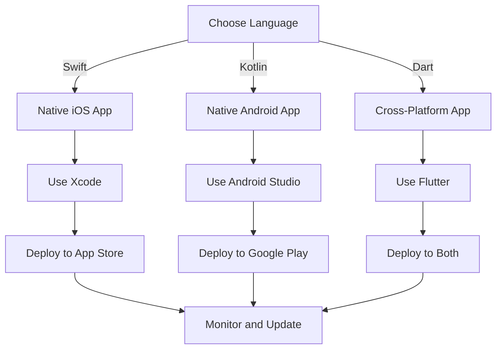

## Introduction
Choosing the right programming language for mobile app development is a crucial decision that can significantly impact the success of your project. With the rise of mobile devices, the demand for mobile apps has increased exponentially, and the market is flooded with various programming languages, each with its strengths and weaknesses. In this article, we will explore three popular languages for mobile app development: **Swift** for iOS, **Kotlin** for Android, and **Dart** for Flutter. We will delve into the core concepts, internal mechanics, and provide code examples to help you make an informed decision.

> **Note:** The choice of programming language depends on various factors, including the target platform, development team experience, and project requirements.

## Core Concepts
Before we dive into the details of each language, let's define some key terms:
* **Native app development**: Developing apps using the platform's native language, such as Swift for iOS or Kotlin for Android.
* **Cross-platform development**: Developing apps that can run on multiple platforms, such as Flutter using Dart.
* **Hybrid app development**: Developing apps using web technologies, such as HTML, CSS, and JavaScript, and wrapping them in a native shell.

> **Warning:** Choosing the wrong language can lead to increased development time, cost, and maintenance efforts.

## How It Works Internally
Let's take a brief look at how each language works internally:
* **Swift**: Swift is a compiled language that uses the **LLVM** (Low-Level Virtual Machine) compiler to generate machine code. It uses a **reference counting** mechanism for memory management.
* **Kotlin**: Kotlin is a statically typed language that runs on the **JVM** (Java Virtual Machine). It uses a **garbage collector** for memory management.
* **Dart**: Dart is a compiled language that uses the **Dart VM** (Virtual Machine) to execute code. It uses a **garbage collector** for memory management.

## Code Examples
Here are three code examples to illustrate the basics of each language:
### Example 1: Basic Swift Example
```swift
// Define a class
class Person {
    let name: String
    let age: Int

    init(name: String, age: Int) {
        self.name = name
        self.age = age
    }

    func greet() {
        print("Hello, my name is \(name) and I am \(age) years old.")
    }
}

// Create an instance of the class
let person = Person(name: "John", age: 30)

// Call a method on the instance
person.greet()
```
### Example 2: Basic Kotlin Example
```kotlin
// Define a class
class Person(val name: String, val age: Int) {
    fun greet() {
        println("Hello, my name is $name and I am $age years old.")
    }
}

// Create an instance of the class
val person = Person("John", 30)

// Call a method on the instance
person.greet()
```
### Example 3: Basic Dart Example
```dart
// Define a class
class Person {
  final String name;
  final int age;

  Person({required this.name, required this.age});

  void greet() {
    print('Hello, my name is $name and I am $age years old.');
  }
}

// Create an instance of the class
final person = Person(name: 'John', age: 30);

// Call a method on the instance
person.greet();
```
> **Tip:** When choosing a language, consider the development team's experience and the project's requirements.

## Visual Diagram

The diagram illustrates the decision-making process for choosing a language and the subsequent development and deployment steps.

## Comparison
| Language | Time Complexity | Space Complexity | Pros | Cons | Best For |
| --- | --- | --- | --- | --- | --- |
| Swift | O(1) - O(n) | O(1) - O(n) | Native performance, Easy to learn | Limited to iOS | iOS App Development |
| Kotlin | O(1) - O(n) | O(1) - O(n) | Concise syntax, Null safety | Steep learning curve | Android App Development |
| Dart | O(1) - O(n) | O(1) - O(n) | Fast development, Cross-platform | Limited libraries | Cross-Platform App Development |

> **Interview:** What are the advantages and disadvantages of using a native language versus a cross-platform language?

## Real-world Use Cases
Here are three real-world examples of companies that have successfully used each language:
* **Swift**: Apple uses Swift for developing their native iOS apps, such as **Apple Music** and **Apple Maps**.
* **Kotlin**: **Pinterest** uses Kotlin for developing their Android app, which has over 100 million monthly active users.
* **Dart**: **Google** uses Dart for developing their cross-platform **Google Ads** app, which runs on both iOS and Android.

## Common Pitfalls
Here are four common mistakes to avoid when choosing a language:
* **Not considering the development team's experience**: Choosing a language that the team is not familiar with can lead to increased development time and cost.
* **Not evaluating the project's requirements**: Failing to assess the project's requirements can result in choosing a language that is not suitable for the project.
* **Not considering the target platform**: Choosing a language that is not optimized for the target platform can lead to performance issues and increased maintenance efforts.
* **Not planning for scalability**: Failing to plan for scalability can result in a language that is not suitable for large-scale applications.

> **Warning:** Choosing a language without considering these factors can lead to project failure.

## Interview Tips
Here are three common interview questions and tips for answering them:
* **What are the advantages and disadvantages of using a native language versus a cross-platform language?**: Be prepared to discuss the trade-offs between native and cross-platform development, including performance, development time, and maintenance efforts.
* **How do you handle memory management in Swift?**: Discuss the use of **ARC** (Automatic Reference Counting) and **manual memory management** techniques in Swift.
* **What are the benefits of using Kotlin for Android app development?**: Discuss the benefits of using Kotlin, including **concise syntax**, **null safety**, and **interoperability with Java**.

## Key Takeaways
Here are ten key takeaways to remember:
* **Choose a language that aligns with the project's requirements and the development team's experience**.
* **Consider the target platform and plan for scalability**.
* **Evaluate the language's performance, development time, and maintenance efforts**.
* **Use native languages for high-performance, platform-specific features**.
* **Use cross-platform languages for rapid development and deployment**.
* **Plan for memory management and garbage collection**.
* **Use **ARC** and **manual memory management** techniques in Swift**.
* **Use **Kotlin** for Android app development for concise syntax and null safety**.
* **Use **Dart** for cross-platform app development for fast development and deployment**.
* **Continuously evaluate and improve the development process to ensure optimal results**.