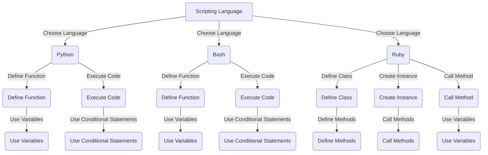

## Introduction
Choosing a language for scripting is a crucial decision that can significantly impact the efficiency and effectiveness of your workflow. **Scripting languages** are designed to automate tasks, interact with systems, and glue together different components. In this section, we will explore three popular scripting languages: **Python**, **Bash**, and **Ruby**. We will delve into their core concepts, internal mechanics, and provide code examples to demonstrate their usage. 
> **Note:** Understanding the strengths and weaknesses of each language is essential to make an informed decision about which one to use for your scripting needs.

## Core Concepts
Before diving into the details of each language, let's define some core concepts:
* **Scripting language**: A language designed for rapid development and execution of scripts, which are sequences of commands that automate tasks.
* **Interpreted language**: A language that is executed line-by-line by an interpreter, without the need for compilation.
* **Dynamic typing**: A language feature that allows variables to hold values of different data types, without the need for explicit type declarations.

## How It Works Internally
Let's take a look at how each language works internally:
* **Python**: Python code is compiled into bytecode, which is then executed by the Python interpreter. The interpreter uses a **virtual machine** to execute the bytecode, which provides a layer of abstraction between the code and the underlying hardware.
* **Bash**: Bash scripts are executed by the Bash shell, which parses the script and executes each command in sequence. Bash uses a **tokenizer** to break the script into individual commands and arguments, and then executes each command using the **fork-exec** model.
* **Ruby**: Ruby code is compiled into bytecode, which is then executed by the Ruby interpreter. Ruby uses a **just-in-time (JIT)** compiler to optimize performance-critical code, and a **garbage collector** to manage memory.

## Code Examples
Here are three code examples, one for each language:
### Example 1: Basic Python Script
```python
# Define a function to greet the user
def greet(name: str) -> None:
    print(f"Hello, {name}!")

# Call the function with a name
greet("John")
```
### Example 2: Real-World Bash Script
```bash
# Define a function to backup a file
backup_file() {
    local filename=$1
    local backup_filename="${filename}.bak"
    cp -p "$filename" "$backup_filename"
    echo "Backup complete: $backup_filename"
}

# Call the function with a filename
backup_file "example.txt"
```
### Example 3: Advanced Ruby Script
```ruby
# Define a class to represent a person
class Person
    attr_accessor :name, :age

    def initialize(name, age)
        @name = name
        @age = age
    end

    def greet
        puts "Hello, my name is #{@name} and I am #{@age} years old."
    end
end

# Create an instance of the Person class
person = Person.new("Jane", 30)

# Call the greet method
person.greet
```
> **Tip:** When choosing a language for scripting, consider the type of tasks you need to automate and the level of complexity involved.

## Visual Diagram

The diagram illustrates the process of choosing a scripting language and defining functions, classes, and instances. It also shows the execution of code and the use of variables and conditional statements.

## Comparison
Here is a comparison table of the three languages:
| Language | Time Complexity | Space Complexity | Pros | Cons | Best For |
| --- | --- | --- | --- | --- | --- |
| Python | O(1) - O(n) | O(1) - O(n) | Easy to learn, versatile, large community | Slow for performance-critical code | Data analysis, web development, automation |
| Bash | O(1) - O(n) | O(1) - O(n) | Fast, lightweight, easy to use | Limited functionality, not suitable for complex tasks | System administration, shell scripting, automation |
| Ruby | O(1) - O(n) | O(1) - O(n) | Dynamic typing, object-oriented, large community | Slow for performance-critical code, complex syntax | Web development, scripting, system administration |

> **Warning:** Choosing a language based solely on its performance characteristics can lead to poor design decisions and maintenance issues.

## Real-world Use Cases
Here are three real-world use cases for each language:
* **Python**: Data analysis at **Google**, web development at **Instagram**, automation at **Dropbox**.
* **Bash**: System administration at **Red Hat**, shell scripting at **GitHub**, automation at **Amazon Web Services**.
* **Ruby**: Web development at **Airbnb**, scripting at **Heroku**, system administration at **Ruby on Rails**.

## Common Pitfalls
Here are four common pitfalls to watch out for:
* **Python**: Using mutable default arguments can lead to unexpected behavior. 
```python
# Wrong way
def append_to_list(element, list=[]):
    list.append(element)
    return list

# Right way
def append_to_list(element, list=None):
    if list is None:
        list = []
    list.append(element)
    return list
```
* **Bash**: Not quoting variables can lead to word splitting and globbing issues.
```bash
# Wrong way
filename="example.txt"
rm $filename

# Right way
filename="example.txt"
rm "$filename"
```
* **Ruby**: Not using the `self` keyword can lead to unexpected behavior when defining methods.
```ruby
# Wrong way
class Person
    def greet
        name = "John"
        puts "Hello, my name is #{name}."
    end
end

# Right way
class Person
    def greet
        self.name = "John"
        puts "Hello, my name is #{self.name}."
    end
end
```
> **Interview:** When asked about common pitfalls in scripting languages, be sure to mention the importance of quoting variables, using immutable default arguments, and understanding the `self` keyword.

## Interview Tips
Here are three common interview questions for scripting languages:
* **What is the difference between a scripting language and a programming language?**
	+ Weak answer: "A scripting language is just a language that is used for scripting."
	+ Strong answer: "A scripting language is a language that is designed for rapid development and execution of scripts, which are sequences of commands that automate tasks. It is typically used for tasks such as data analysis, web development, and system administration."
* **How do you handle errors in a scripting language?**
	+ Weak answer: "I just use try-except blocks."
	+ Strong answer: "I use a combination of try-except blocks, error handling mechanisms, and logging to handle errors in a scripting language. I also make sure to test my code thoroughly to catch any errors before they occur in production."
* **What are some best practices for writing efficient scripts?**
	+ Weak answer: "I just write whatever works."
	+ Strong answer: "I follow best practices such as using meaningful variable names, commenting my code, and testing my code thoroughly. I also make sure to optimize my code for performance and use caching and memoization when possible."

## Key Takeaways
Here are six key takeaways to remember:
* **Scripting languages** are designed for rapid development and execution of scripts.
* **Python** is a versatile language that is easy to learn and has a large community.
* **Bash** is a fast and lightweight language that is ideal for system administration and shell scripting.
* **Ruby** is a dynamic language that is object-oriented and has a large community.
* **Error handling** is crucial in scripting languages, and should be done using a combination of try-except blocks, error handling mechanisms, and logging.
* **Optimization** is important for efficient scripting, and can be achieved through caching, memoization, and using meaningful variable names.