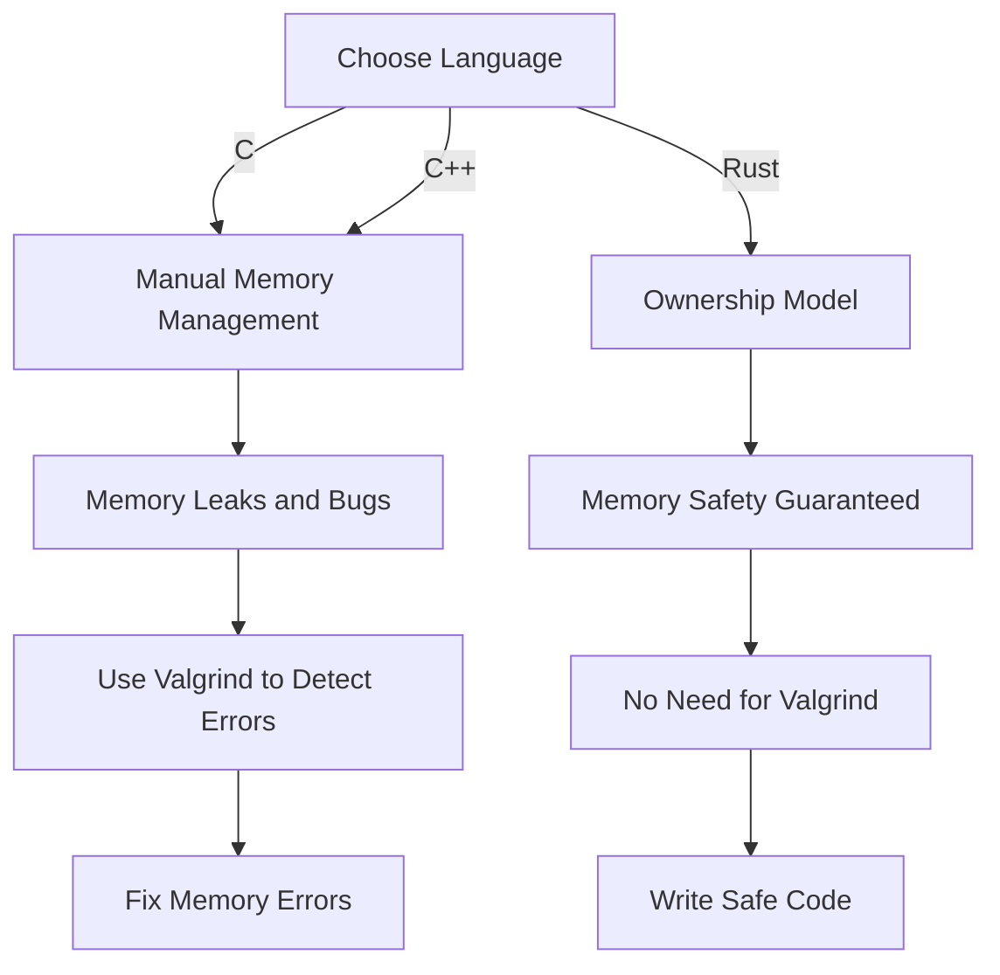

## Introduction
Choosing the right programming language for systems development is crucial in determining the performance, reliability, and maintainability of a system. In this section, we will explore three popular languages for systems programming: **C**, **C++**, and **Rust**. These languages have been widely used in various applications, including operating systems, embedded systems, and high-performance computing. **C** is a low-level, general-purpose language that provides direct access to hardware resources. **C++** is an extension of **C** that adds object-oriented programming features and is widely used in systems programming. **Rust** is a modern language that prioritizes safety and performance, making it an attractive choice for systems programming.

> **Note:** The choice of language depends on the specific requirements of the system, including performance, reliability, and development time. Understanding the strengths and weaknesses of each language is essential in making an informed decision.

## Core Concepts
In systems programming, it is essential to understand the core concepts of each language, including **memory management**, **concurrency**, and **error handling**. **C** and **C++** use manual memory management through pointers, which can lead to memory leaks and bugs if not handled correctly. **Rust**, on the other hand, uses a concept called **ownership** to manage memory, which ensures that memory is always properly deallocated.

> **Warning:** Manual memory management in **C** and **C++** can lead to memory leaks and bugs if not handled correctly. It is essential to follow best practices and use tools like **Valgrind** to detect memory errors.

## How It Works Internally
To understand how each language works internally, let's take a look at their **compilation models** and **runtime environments**. **C** and **C++** use a **compile-link-run** model, where the code is compiled into machine code, linked with libraries, and then executed. **Rust**, on the other hand, uses a **compile-link-run** model with an additional **borrow checker** that enforces memory safety rules at compile time.

> **Tip:** Understanding the compilation model and runtime environment of each language can help optimize performance and reduce bugs.

## Code Examples
Here are three complete and runnable code examples in each language, demonstrating basic usage, real-world patterns, and advanced features:

### C Example 1: Basic Usage
```c
#include <stdio.h>

int main() {
    printf("Hello, World!\n");
    return 0;
}
```
### C++ Example 2: Real-world Pattern
```cpp
#include <iostream>
#include <vector>

class Person {
public:
    Person(std::string name, int age) : name_(name), age_(age) {}

    void printInfo() {
        std::cout << "Name: " << name_ << ", Age: " << age_ << std::endl;
    }

private:
    std::string name_;
    int age_;
};

int main() {
    std::vector<Person> people = {Person("John", 30), Person("Jane", 25)};
    for (const auto& person : people) {
        person.printInfo();
    }
    return 0;
}
```
### Rust Example 3: Advanced Features
```rust
use std::thread;

fn main() {
    let handle = thread::spawn(|| {
        println!("Hello from a new thread!");
    });
    handle.join().unwrap();
}
```
> **Interview:** Can you explain the difference between **C** and **C++** in terms of memory management? How does **Rust** improve upon these languages?

## Visual Diagram

This diagram illustrates the different memory management models of **C**, **C++**, and **Rust**, and the potential consequences of each choice.

## Comparison
Here is a comparison table of the three languages, including their **time complexity**, **space complexity**, **pros**, and **cons**:

| Language | Time Complexity | Space Complexity | Pros | Cons | Best For |
| --- | --- | --- | --- | --- | --- |
| C | O(1) | O(1) | Low-level control, performance | Manual memory management, error-prone | Operating systems, embedded systems |
| C++ | O(1) | O(1) | Object-oriented programming, performance | Complex syntax, manual memory management | High-performance computing, games |
| Rust | O(1) | O(1) | Memory safety, performance | Steep learning curve, limited libraries | Systems programming, web development |

> **Note:** The time and space complexity of each language are generally O(1), but can vary depending on the specific use case.

## Real-world Use Cases
Here are three real-world examples of systems programming in each language:

1. **Operating System**: The **Linux** kernel is written in **C**, which provides low-level control and performance.
2. **Web Browser**: The **Google Chrome** browser uses **C++** for its rendering engine, which provides high-performance rendering and object-oriented programming.
3. **File System**: The **Redox** operating system uses **Rust** for its file system, which provides memory safety and performance.

## Common Pitfalls
Here are four common mistakes to avoid when using each language:

1. **Dangling Pointers**: In **C** and **C++**, using a pointer after it has been freed can lead to memory leaks and bugs.
2. **Null Pointer Dereferences**: In **C** and **C++**, dereferencing a null pointer can lead to segmentation faults and crashes.
3. **Use of Uninitialized Variables**: In **C** and **C++**, using an uninitialized variable can lead to undefined behavior and bugs.
4. **Misuse of Borrow Checker**: In **Rust**, misusing the borrow checker can lead to compile-time errors and frustration.

> **Warning:** Avoiding these common pitfalls requires careful attention to detail and a deep understanding of each language's syntax and semantics.

## Interview Tips
Here are three common interview questions for systems programming, along with weak and strong answers:

1. **What is the difference between a pointer and a reference in C++?**
	* Weak answer: "A pointer is a variable that holds a memory address, and a reference is... um... something like that too."
	* Strong answer: "A pointer is a variable that holds a memory address, while a reference is an alias for a variable. The key difference is that a pointer can be reassigned to point to a different variable, while a reference is bound to a specific variable for its lifetime."
2. **How do you handle memory leaks in C?**
	* Weak answer: "I use `free()` to deallocate memory, but I'm not sure how to find memory leaks."
	* Strong answer: "I use tools like **Valgrind** to detect memory leaks, and I follow best practices like checking for null pointer dereferences and using `free()` to deallocate memory."
3. **What is the purpose of the borrow checker in Rust?**
	* Weak answer: "It's something to do with memory safety, I think."
	* Strong answer: "The borrow checker is a compile-time mechanism that enforces memory safety rules, such as preventing null pointer dereferences and use-after-free bugs. It ensures that memory is always properly deallocated and that references are valid for their lifetime."

## Key Takeaways
Here are ten key takeaways from this section:

* **C** is a low-level, general-purpose language that provides direct access to hardware resources.
* **C++** is an extension of **C** that adds object-oriented programming features and is widely used in systems programming.
* **Rust** is a modern language that prioritizes safety and performance, making it an attractive choice for systems programming.
* Manual memory management in **C** and **C++** can lead to memory leaks and bugs if not handled correctly.
* The borrow checker in **Rust** ensures memory safety and prevents null pointer dereferences and use-after-free bugs.
* **C** and **C++** have a **compile-link-run** model, while **Rust** has a **compile-link-run** model with an additional **borrow checker**.
* Understanding the compilation model and runtime environment of each language can help optimize performance and reduce bugs.
* **Valgrind** is a tool that can be used to detect memory leaks and bugs in **C** and **C++**.
* **Rust** has a steep learning curve, but provides memory safety and performance benefits.
* Systems programming requires careful attention to detail and a deep understanding of each language's syntax and semantics.