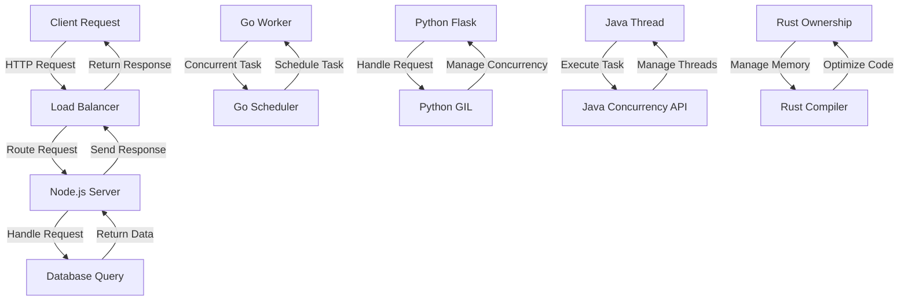

## Introduction
Choosing the right programming language for a web backend is a crucial decision that can significantly impact the performance, scalability, and maintainability of a web application. With numerous languages to choose from, each with its strengths and weaknesses, it's essential to understand the characteristics of each language and how they align with the needs of a project. In this article, we'll explore five popular languages for web backend development: **Node.js**, **Go**, **Python**, **Java**, and **Rust**. We'll delve into their core concepts, internal mechanics, and provide code examples to help you make an informed decision.

> **Note:** The choice of language depends on various factors, including the type of application, performance requirements, development team expertise, and ecosystem support.

## Core Concepts
Before diving into the languages, let's define some core concepts that are essential for web backend development:

* **Request/Response Cycle**: The process of handling incoming requests and sending responses to clients.
* **Concurrency**: The ability of a language to handle multiple tasks simultaneously, improving responsiveness and throughput.
* **Memory Management**: The way a language manages memory allocation and deallocation, affecting performance and preventing memory leaks.

## How It Works Internally
Let's take a brief look at how each language handles these core concepts internally:

* **Node.js**: Uses an event-driven, non-blocking I/O model, allowing for efficient concurrency and scalability.
* **Go**: Employs a lightweight goroutine scheduling system, enabling efficient concurrency and parallelism.
* **Python**: Uses a Global Interpreter Lock (GIL) to manage concurrency, which can limit performance in CPU-bound tasks.
* **Java**: Utilizes a multithreaded approach, with a built-in concurrency API for managing threads and synchronization.
* **Rust**: Leverages a ownership-based memory management system, ensuring memory safety and preventing common errors like null pointer dereferences.

## Code Examples
Here are three code examples, each demonstrating a different aspect of web backend development:

### Example 1: Basic Node.js Server
```javascript
const http = require('http');

// Create a simple server
http.createServer((req, res) => {
  res.writeHead(200, {'Content-Type': 'text/plain'});
  res.end('Hello World\n');
}).listen(3000, () => {
  console.log('Server running on port 3000');
});
```
This example creates a basic Node.js server that responds to requests with a simple "Hello World" message.

### Example 2: Go Concurrency
```go
package main

import (
  "fmt"
  "time"
)

func worker(id int) {
  fmt.Printf("Worker %d starting...\n", id)
  time.Sleep(2 * time.Second)
  fmt.Printf("Worker %d done.\n", id)
}

func main() {
  for i := 1; i <= 5; i++ {
    go worker(i)
  }
  time.Sleep(10 * time.Second)
}
```
This example demonstrates Go's concurrency capabilities by running multiple worker goroutines concurrently.

### Example 3: Python Flask API
```python
from flask import Flask, jsonify

app = Flask(__name__)

# Define a simple API endpoint
@app.route('/api/data', methods=['GET'])
def get_data():
  data = {'message': 'Hello from Python!'}
  return jsonify(data)

if __name__ == '__main__':
  app.run(debug=True)
```
This example creates a simple Flask API that responds to GET requests with a JSON message.

## Visual Diagram

This diagram illustrates the high-level architecture of each language's approach to web backend development, including request handling, concurrency, and memory management.

## Comparison
Here's a comparison table highlighting the key characteristics of each language:
| Language | Time Complexity | Space Complexity | Pros | Cons | Best For |
| --- | --- | --- | --- | --- | --- |
| Node.js | O(1) | O(n) | Fast, scalable, easy to learn | Limited CPU-bound performance | Real-time web applications, microservices |
| Go | O(1) | O(n) | Concurrency, performance, simplicity | Limited libraries, steep learning curve | Distributed systems, network programming |
| Python | O(n) | O(n) | Easy to learn, versatile, large community | Limited performance, GIL limitations | Data science, machine learning, web development |
| Java | O(n) | O(n) | Platform-independent, large community, robust | Verbose, slow startup | Enterprise software, Android app development |
| Rust | O(1) | O(n) | Memory safety, performance, concurrency | Steep learning curve, limited libraries | Systems programming, embedded systems |

> **Warning:** Choosing a language based solely on performance characteristics can lead to overlooking other essential factors, such as development team expertise and ecosystem support.

## Real-world Use Cases
Here are three production examples of companies using these languages for web backend development:

* **Netflix**: Uses Node.js for its web application, leveraging its scalability and real-time capabilities.
* **Google**: Employs Go for its distributed systems, such as Google Cloud Storage and Google Cloud Datastore.
* **Instagram**: Uses Python for its web backend, leveraging its ease of development and large community.

## Common Pitfalls
Here are four specific mistakes to avoid when choosing a language for web backend development:

* **Insufficient concurrency**: Failing to account for concurrency can lead to performance bottlenecks and slow response times.
* **Inadequate memory management**: Poor memory management can result in memory leaks, crashes, and security vulnerabilities.
* **Incompatible libraries**: Choosing a language with limited or incompatible libraries can hinder development and increase costs.
* **Inexperienced development team**: Selecting a language that the development team is not familiar with can lead to delays, bugs, and maintenance issues.

> **Tip:** When choosing a language, consider the trade-offs between performance, development time, and maintenance costs.

## Interview Tips
Here are three common interview questions related to choosing a language for web backend development, along with weak and strong answer examples:

* **What are the advantages and disadvantages of using Node.js for web backend development?**
	+ Weak answer: "Node.js is fast and scalable, but it's not suitable for CPU-bound tasks."
	+ Strong answer: "Node.js offers excellent performance and scalability, but its single-threaded nature can limit CPU-bound tasks. However, using worker threads or clustering can help mitigate this issue."
* **How does Go's concurrency model differ from Python's?**
	+ Weak answer: "Go has goroutines, while Python has threads."
	+ Strong answer: "Go's lightweight goroutine scheduling system allows for efficient concurrency and parallelism, whereas Python's GIL can limit concurrency in CPU-bound tasks. However, Python's asyncio library can help improve concurrency in I/O-bound tasks."
* **What are the benefits and drawbacks of using Rust for systems programming?**
	+ Weak answer: "Rust is memory-safe, but it's hard to learn."
	+ Strong answer: "Rust's ownership-based memory management system ensures memory safety and prevents common errors like null pointer dereferences. While it may have a steeper learning curve, Rust's performance, concurrency, and reliability features make it an attractive choice for systems programming."

## Key Takeaways
Here are six key takeaways to remember when choosing a language for web backend development:

* **Node.js**: Excellent for real-time web applications, microservices, and scalable systems.
* **Go**: Suitable for distributed systems, network programming, and concurrent tasks.
* **Python**: Ideal for data science, machine learning, web development, and rapid prototyping.
* **Java**: Robust and platform-independent, but verbose and slow-starting.
* **Rust**: Memory-safe and performant, but with a steep learning curve and limited libraries.
* **Concurrency**: Essential for modern web applications, but requires careful consideration of language and implementation details.

> **Interview:** When asked about your language of choice for web backend development, be prepared to discuss the trade-offs, advantages, and disadvantages of each language, and how they align with the project's requirements and your team's expertise.