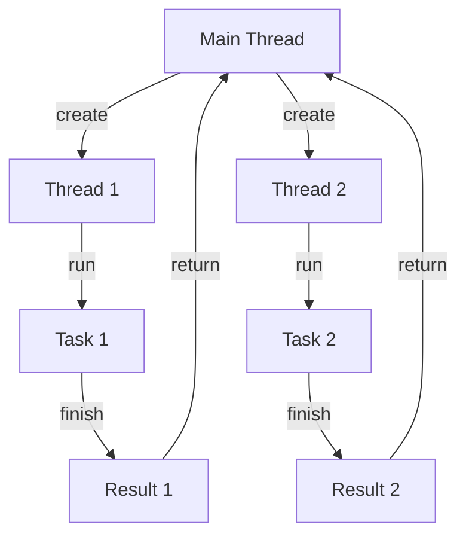

## Introduction
Concurrency models are essential in modern software development, enabling multiple tasks to run simultaneously and improving the overall performance and responsiveness of applications. **Concurrency** refers to the ability of a program to execute multiple tasks concurrently, sharing the same resources and improving system utilization. In this section, we will explore the different concurrency models, including threads, goroutines, async/await, actors, and CSP (Communicating Sequential Processes).

Concurrency models are crucial in real-world applications, such as web servers, databases, and operating systems. For instance, a web server can handle multiple requests concurrently, improving the user experience and reducing response times. **Google's** search engine, for example, uses a concurrency model to handle millions of searches per second.

Every engineer needs to understand concurrency models to design and develop efficient, scalable, and responsive applications. Concurrency models help developers to:

* Improve system performance and responsiveness
* Reduce resource utilization and overhead
* Increase system reliability and fault tolerance

## Core Concepts
To understand concurrency models, we need to define some key terms and concepts:

* **Thread**: A thread is a separate flow of execution within a process. Threads share the same memory space and resources, making them lightweight and efficient.
* **Goroutine**: A goroutine is a lightweight thread in the Go programming language. Goroutines are scheduled and managed by the Go runtime, making them easy to use and efficient.
* **Async/Await**: Async/await is a concurrency model that allows developers to write asynchronous code that is easier to read and maintain. Async/await is based on the concept of promises and callbacks.
* **Actor**: An actor is a concurrency model that uses independent units of execution, called actors, to perform tasks. Actors communicate with each other using messages.
* **CSP (Communicating Sequential Processes)**: CSP is a concurrency model that uses processes to communicate with each other using channels.

Mental models and analogies can help us understand concurrency models. For example, we can think of threads as multiple cooks in a kitchen, each preparing a different dish. Goroutines can be thought of as a team of cooks, working together to prepare a meal. Async/await can be compared to a restaurant, where orders are placed and fulfilled asynchronously.

> **Note:** Concurrency models are not mutually exclusive, and many applications use a combination of models to achieve optimal performance and responsiveness.

## How It Works Internally
Let's dive deeper into the internal mechanics of each concurrency model:

* **Threads**: Threads are created and managed by the operating system. When a thread is created, the operating system allocates a separate stack and program counter for the thread. Threads share the same memory space and resources, making them lightweight and efficient.
* **Goroutines**: Goroutines are scheduled and managed by the Go runtime. When a goroutine is created, the Go runtime allocates a separate stack and program counter for the goroutine. Goroutines are lightweight and efficient, with a typical overhead of 2-3 KB per goroutine.
* **Async/Await**: Async/await is based on the concept of promises and callbacks. When an asynchronous operation is initiated, a promise is created, and a callback is registered to handle the result. The async/await syntax makes it easier to write asynchronous code that is easier to read and maintain.
* **Actors**: Actors are independent units of execution that communicate with each other using messages. Actors are designed to be fault-tolerant and scalable, making them suitable for distributed systems.
* **CSP**: CSP uses processes to communicate with each other using channels. Channels are used to send and receive messages between processes, making it possible to write concurrent code that is easy to read and maintain.

> **Warning:** Concurrency models can introduce complexity and overhead, making it essential to understand the trade-offs and limitations of each model.

## Code Examples
Here are three complete and runnable code examples, demonstrating the use of threads, goroutines, and async/await:

### Example 1: Basic Thread Example (Java)
```java
public class ThreadExample {
    public static void main(String[] args) {
        // Create a new thread
        Thread thread = new Thread(() -> {
            System.out.println("Hello from thread!");
        });
        
        // Start the thread
        thread.start();
        
        // Wait for the thread to finish
        try {
            thread.join();
        } catch (InterruptedException e) {
            Thread.currentThread().interrupt();
        }
    }
}
```
### Example 2: Goroutine Example (Go)
```go
package main

import (
    "fmt"
    "time"
)

func worker() {
    fmt.Println("Hello from goroutine!")
    time.Sleep(1 * time.Second)
}

func main() {
    // Create a new goroutine
    go worker()
    
    // Wait for the goroutine to finish
    time.Sleep(2 * time.Second)
}
```
### Example 3: Async/Await Example (JavaScript)
```javascript
async function worker() {
    console.log("Hello from async/await!");
    await new Promise(resolve => setTimeout(resolve, 1000));
}

async function main() {
    // Create a new async/await task
    worker();
    
    // Wait for the task to finish
    await new Promise(resolve => setTimeout(resolve, 2000));
}

main();
```
> **Tip:** When using concurrency models, it's essential to consider the trade-offs and limitations of each model, including performance, scalability, and complexity.

## Visual Diagram

This diagram illustrates the basic concept of concurrency using threads. The main thread creates two threads, each running a separate task. The tasks finish and return the results to the main thread.

## Comparison
| Approach | Time Complexity | Space Complexity | Pros | Cons | Best For |
| --- | --- | --- | --- | --- | --- |
| Threads | O(1) | O(n) | Lightweight, efficient | Complexity, overhead | Real-time systems, embedded systems |
| Goroutines | O(1) | O(n) | Lightweight, efficient | Limited control, Go-specific | Web development, network programming |
| Async/Await | O(1) | O(n) | Easy to read, maintain | Callback hell, promise chaining | Web development, asynchronous programming |
| Actors | O(n) | O(n) | Fault-tolerant, scalable | Complexity, overhead | Distributed systems, cloud computing |
| CSP | O(n) | O(n) | Easy to read, maintain | Complexity, overhead | Concurrent programming, parallel computing |

> **Interview:** When asked about concurrency models, be prepared to discuss the trade-offs and limitations of each model, including performance, scalability, and complexity.

## Real-world Use Cases
Here are three production examples of concurrency models in real-world applications:

* **Google's Search Engine**: Google's search engine uses a concurrency model to handle millions of searches per second. The engine uses a combination of threads and goroutines to improve performance and responsiveness.
* **Netflix's Streaming Service**: Netflix's streaming service uses a concurrency model to handle multiple user requests concurrently. The service uses a combination of async/await and actors to improve performance and scalability.
* **Amazon's Web Services**: Amazon's web services use a concurrency model to handle multiple user requests concurrently. The services use a combination of threads, goroutines, and CSP to improve performance and scalability.

## Common Pitfalls
Here are four specific mistakes engineers make when using concurrency models:

* **Deadlocks**: Deadlocks occur when two or more threads are blocked, waiting for each other to release a resource. To avoid deadlocks, use lock ordering and avoid nested locks.
* **Starvation**: Starvation occurs when a thread is unable to access a shared resource due to other threads holding onto the resource for an extended period. To avoid starvation, use fair locking and bounded waiting.
* **Livelocks**: Livelocks occur when two or more threads are unable to proceed due to continuous attempts to acquire a shared resource. To avoid livelocks, use backoff and retry mechanisms.
* **Data Corruption**: Data corruption occurs when multiple threads access and modify shared data without proper synchronization. To avoid data corruption, use atomic operations and synchronization primitives.

> **Warning:** Concurrency models can introduce complexity and overhead, making it essential to understand the trade-offs and limitations of each model.

## Interview Tips
Here are three common interview questions on concurrency models, along with weak and strong answers:

* **What is the difference between threads and goroutines?**
	+ Weak answer: "Threads and goroutines are the same thing."
	+ Strong answer: "Threads and goroutines are both concurrency models, but threads are heavier and more complex, while goroutines are lighter and more efficient."
* **How do you avoid deadlocks in a concurrent system?**
	+ Weak answer: "You can avoid deadlocks by using locks and synchronization primitives."
	+ Strong answer: "To avoid deadlocks, you can use lock ordering, avoid nested locks, and use fair locking and bounded waiting."
* **What is the purpose of async/await in concurrent programming?**
	+ Weak answer: "Async/await is used to make code look nicer."
	+ Strong answer: "Async/await is used to make asynchronous code easier to read and maintain, by allowing developers to write asynchronous code that is easier to understand and debug."

## Key Takeaways
Here are ten key takeaways from this section on concurrency models:

* Concurrency models are essential in modern software development, enabling multiple tasks to run simultaneously and improving overall performance and responsiveness.
* Threads, goroutines, async/await, actors, and CSP are different concurrency models, each with their trade-offs and limitations.
* Concurrency models can introduce complexity and overhead, making it essential to understand the trade-offs and limitations of each model.
* Deadlocks, starvation, livelocks, and data corruption are common pitfalls in concurrent programming.
* Lock ordering, fair locking, and bounded waiting can help avoid deadlocks and starvation.
* Async/await can make asynchronous code easier to read and maintain.
* Actors and CSP can provide fault-tolerant and scalable concurrency models.
* Concurrency models are not mutually exclusive, and many applications use a combination of models to achieve optimal performance and responsiveness.
* Understanding concurrency models is crucial for designing and developing efficient, scalable, and responsive applications.
* Concurrency models can be used in a variety of applications, including web development, network programming, distributed systems, and cloud computing.