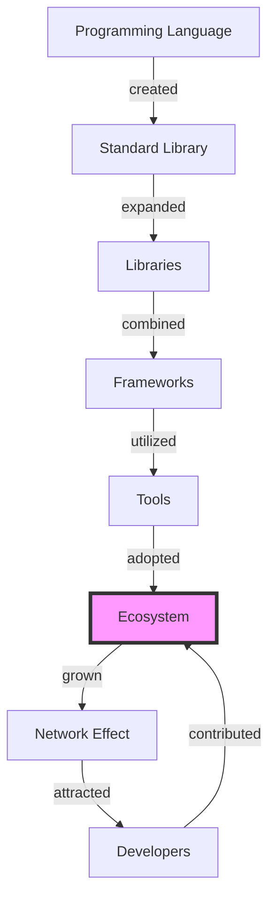

## Introduction
The world of programming languages is vast and diverse, with each language having its own strengths, weaknesses, and use cases. In this article, we will delve into the world of programming languages, exploring the **ecosystem size** of popular languages such as JavaScript, Python, Java, C#, PHP, Go, and Rust. We will examine why ecosystem size matters, its real-world relevance, and why every engineer needs to understand this concept.
> **Note:** Ecosystem size refers to the number of libraries, frameworks, and tools available for a programming language, which can greatly impact its adoption and usage.

## Core Concepts
To understand ecosystem size, we need to define some core concepts:
* **Libraries**: pre-written code that provides a specific functionality, such as data structures or algorithms.
* **Frameworks**: a set of libraries and tools that provide a structured approach to building applications.
* **Tools**: software that aids in the development, testing, and deployment of applications.
* **Ecosystem**: the collection of libraries, frameworks, and tools available for a programming language.
> **Warning:** A language with a small ecosystem can limit its adoption and usage, as developers may need to reinvent the wheel or rely on third-party libraries.

## How It Works Internally
When a programming language is created, its ecosystem is initially small, consisting of only the standard library and a few basic tools. As the language gains popularity, more developers contribute to its ecosystem by creating libraries, frameworks, and tools. This process is driven by the **network effect**, where the value of the ecosystem increases as more developers contribute to it.
> **Tip:** A language with a large ecosystem can attract more developers, creating a self-reinforcing cycle of growth and adoption.

## Code Examples
Here are three code examples that demonstrate the impact of ecosystem size:
### Example 1: Basic JavaScript Library
```javascript
// Import the jQuery library
const $ = require('jquery');

// Use jQuery to select and manipulate DOM elements
$('body').append('<h1>Hello World!</h1>');
```
This example shows how a small JavaScript library like jQuery can simplify DOM manipulation.
### Example 2: Python Data Science Framework
```python
# Import the Pandas library
import pandas as pd

# Use Pandas to read and manipulate a CSV file
df = pd.read_csv('data.csv')
print(df.head())
```
This example demonstrates how a comprehensive framework like Pandas can facilitate data analysis and manipulation.
### Example 3: Advanced Java Framework
```java
// Import the Spring Boot framework
import org.springframework.boot.SpringApplication;
import org.springframework.boot.autoconfigure.SpringBootApplication;

// Create a Spring Boot application
@SpringBootApplication
public class MyApplication {
    public static void main(String[] args) {
        SpringApplication.run(MyApplication.class, args);
    }
}
```
This example shows how a robust framework like Spring Boot can simplify the development of complex web applications.
> **Interview:** Can you explain the difference between a library and a framework? How do they contribute to the ecosystem size of a programming language?

## Visual Diagram

This diagram illustrates the process of ecosystem growth, from the creation of a programming language to the attraction of developers and the self-reinforcing cycle of growth.

## Comparison
Here is a comparison of the ecosystem sizes of popular programming languages:
| Language | Ecosystem Size | Time Complexity | Space Complexity | Pros | Cons |
| --- | --- | --- | --- | --- | --- |
| JavaScript | Large | O(1) | O(n) | Dynamic, flexible, and widely adopted | Security concerns, browser inconsistencies |
| Python | Medium | O(n) | O(n) | Easy to learn, versatile, and widely used | Slow performance, limited multithreading |
| Java | Large | O(1) | O(n) | Platform-independent, robust, and widely used | Verbose, complex, and slow startup |
| C# | Medium | O(n) | O(n) | Modern, efficient, and widely used | Limited cross-platform compatibility, steep learning curve |
| PHP | Small | O(n) | O(n) | Easy to learn, flexible, and widely used | Security concerns, outdated syntax |
| Go | Small | O(1) | O(n) | Modern, efficient, and concurrent | Limited libraries, steep learning curve |
| Rust | Small | O(1) | O(n) | Memory-safe, efficient, and concurrent | Steep learning curve, limited libraries |
> **Warning:** A language with a small ecosystem size may not be suitable for complex or large-scale applications.

## Real-world Use Cases
Here are three real-world examples of companies that have leveraged the ecosystem size of programming languages:
* **Google**: uses JavaScript for its web applications, leveraging the large ecosystem of libraries and frameworks.
* **Netflix**: uses Python for its data analysis and machine learning tasks, taking advantage of the medium-sized ecosystem of libraries and frameworks.
* **Amazon**: uses Java for its web services, relying on the large ecosystem of libraries and frameworks.

## Common Pitfalls
Here are four common mistakes that engineers make when working with ecosystem size:
* **Underestimating the importance of ecosystem size**: failing to consider the impact of ecosystem size on the adoption and usage of a programming language.
* **Overlooking security concerns**: neglecting to address security vulnerabilities in libraries and frameworks.
* **Ignoring performance issues**: failing to optimize code for performance, leading to slow and inefficient applications.
* **Not considering cross-platform compatibility**: neglecting to ensure that applications are compatible with multiple platforms and devices.
> **Tip:** When working with a programming language, consider the ecosystem size and its impact on the adoption and usage of the language.

## Interview Tips
Here are three common interview questions related to ecosystem size:
* **What is the difference between a library and a framework?**: The interviewer wants to assess your understanding of the ecosystem size and its components.
* **How do you evaluate the ecosystem size of a programming language?**: The interviewer wants to evaluate your ability to analyze and compare the ecosystem sizes of different programming languages.
* **What are the advantages and disadvantages of using a language with a large ecosystem size?**: The interviewer wants to assess your understanding of the trade-offs between ecosystem size and other factors such as performance and security.
> **Interview:** Can you explain the concept of ecosystem size and its importance in the adoption and usage of programming languages?

## Key Takeaways
Here are ten key takeaways from this article:
* **Ecosystem size matters**: a large ecosystem size can attract more developers and increase the adoption and usage of a programming language.
* **Libraries and frameworks are essential**: they provide pre-written code and structured approaches to building applications.
* **Tools aid in development, testing, and deployment**: they simplify the development process and improve productivity.
* **The network effect drives ecosystem growth**: the value of the ecosystem increases as more developers contribute to it.
* **A large ecosystem size can attract more developers**: creating a self-reinforcing cycle of growth and adoption.
* **Security concerns and performance issues must be addressed**: they can impact the adoption and usage of a programming language.
* **Cross-platform compatibility is essential**: it ensures that applications are compatible with multiple platforms and devices.
* **Evaluating ecosystem size is crucial**: it helps developers make informed decisions about the adoption and usage of programming languages.
* **A balanced approach is necessary**: considering ecosystem size, performance, security, and other factors to make informed decisions.
* **Continuously learning and adapting is essential**: staying up-to-date with the latest developments and trends in ecosystem size and programming languages.