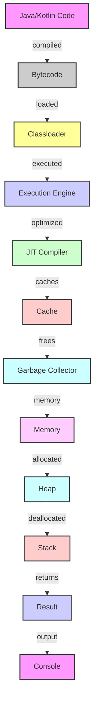

## Introduction
Java and Kotlin are two popular programming languages that run on the Java Virtual Machine (JVM). While Java is a legacy language that has been around for decades, Kotlin is a modern language that was designed to address some of the limitations and drawbacks of Java. In this section, we will explore the history and evolution of both languages, their key features, and why they are relevant in the modern software development landscape. 
> **Note:** Java is an object-oriented language that was first released in 1995, while Kotlin is a multi-paradigm language that was first released in 2011.

## Core Concepts
At their core, Java and Kotlin are both designed to run on the JVM, which provides a sandboxed environment for executing bytecode. The JVM is responsible for loading, linking, and executing the bytecode, as well as providing services such as memory management and security. 
> **Tip:** Understanding the JVM is crucial for developing efficient and scalable applications in both Java and Kotlin.

Some key terminology to keep in mind includes:
* **Bytecode**: the intermediate form of code that is generated by the Java or Kotlin compiler
* **Classloader**: the component responsible for loading classes into the JVM
* **Garbage collection**: the process by which the JVM automatically frees up memory that is no longer in use

## How It Works Internally
When you compile Java or Kotlin code, the resulting bytecode is executed by the JVM. The JVM uses a variety of techniques to optimize performance, including:
* **Just-in-time (JIT) compilation**: the JVM compiles bytecode into native machine code on the fly
* **Caching**: the JVM caches frequently accessed data to improve performance
* **Garbage collection**: the JVM periodically frees up memory that is no longer in use

Here is a high-level overview of the JVM architecture:
```java
// JVM Architecture
public class JVM {
    public static void main(String[] args) {
        // Classloader loads classes into the JVM
        ClassLoader classLoader = new ClassLoader();
        classLoader.loadClass("MyClass");

        // Execution engine executes the bytecode
        ExecutionEngine executionEngine = new ExecutionEngine();
        executionEngine.execute("MyClass");

        // Garbage collector frees up memory
        GarbageCollector garbageCollector = new GarbageCollector();
        garbageCollector.collect();
    }
}
```
> **Warning:** Writing efficient JVM code requires a deep understanding of the JVM architecture and its optimization techniques.

## Code Examples
Here are three complete and runnable examples that demonstrate the differences between Java and Kotlin:
### Example 1: Basic "Hello World" in Java
```java
// Hello World in Java
public class HelloWorld {
    public static void main(String[] args) {
        System.out.println("Hello, World!");
    }
}
```
### Example 2: Basic "Hello World" in Kotlin
```kotlin
// Hello World in Kotlin
fun main() {
    println("Hello, World!")
}
```
### Example 3: Advanced example using Java 8 streams and Kotlin coroutines
```java
// Java 8 streams example
import java.util.stream.Collectors;
import java.util.stream.Stream;

public class JavaStreams {
    public static void main(String[] args) {
        Stream<String> stream = Stream.of("a", "b", "c");
        String result = stream.map(String::toUpperCase).collect(Collectors.joining(","));
        System.out.println(result);
    }
}
```

```kotlin
// Kotlin coroutines example
import kotlinx.coroutines.*

fun main() = runBlocking {
    val deferred = async { 
        // simulate some long-running operation
        delay(1000)
        "Hello, World!"
    }
    println(deferred.await())
}
```
> **Interview:** Can you explain the difference between Java 8 streams and Kotlin coroutines? How would you use them in a real-world application?

## Visual Diagram
Here is a visual diagram that illustrates the JVM architecture and the relationship between Java and Kotlin:

> **Note:** This diagram illustrates the high-level architecture of the JVM and how Java and Kotlin code is executed.

## Comparison
Here is a comparison table that highlights the key differences between Java and Kotlin:
| Language | Type System | Null Safety | Coroutines | Interoperability |
| --- | --- | --- | --- | --- |
| Java | Statically typed | No | No | Yes |
| Kotlin | Statically typed | Yes | Yes | Yes |
| Scala | Statically typed | Yes | Yes | Yes |
| Groovy | Dynamically typed | No | No | Yes |
> **Tip:** When choosing a language, consider the type system, null safety, and coroutines support.

## Real-world Use Cases
Here are three real-world examples of companies that use Java and Kotlin:
* **Android apps**: Many Android apps are built using Java or Kotlin, including popular apps like Instagram and Facebook.
* **Spring Boot**: Spring Boot is a popular framework for building web applications in Java, and is widely used in industries such as finance and healthcare.
* **Trello**: Trello is a project management tool that is built using Kotlin, and is known for its simplicity and ease of use.

## Common Pitfalls
Here are four common mistakes that developers make when using Java and Kotlin:
* **Null pointer exceptions**: In Java, null pointer exceptions can occur when trying to access a null object. In Kotlin, null safety features can help prevent this.
* **Memory leaks**: Memory leaks can occur when objects are not properly garbage collected, leading to performance issues and crashes.
* **Concurrency issues**: Concurrency issues can occur when multiple threads are accessing shared resources, leading to data corruption and other problems.
* **Performance optimization**: Performance optimization can be challenging, especially when dealing with complex algorithms and large datasets.

Here is an example of how to avoid null pointer exceptions in Kotlin:
```kotlin
// Safe null handling in Kotlin
fun main() {
    val name: String? = null
    if (name != null) {
        println(name.length)
    } else {
        println("Name is null")
    }
}
```
> **Warning:** Null pointer exceptions can be difficult to track down and fix, so it's essential to use null safety features whenever possible.

## Interview Tips
Here are three common interview questions that are related to Java and Kotlin:
* **What is the difference between Java and Kotlin?**: This question is designed to test your knowledge of the two languages and their key features.
* **How do you handle null pointer exceptions in Java?**: This question is designed to test your knowledge of Java's null handling features and how to avoid null pointer exceptions.
* **Can you explain the concept of coroutines in Kotlin?**: This question is designed to test your knowledge of Kotlin's coroutines feature and how to use it in practice.

Here is an example of a strong answer to the first question:
> **Interview:** Java and Kotlin are both programming languages that run on the JVM, but they have some key differences. Java is a legacy language that has been around for decades, while Kotlin is a modern language that was designed to address some of the limitations and drawbacks of Java. Kotlin has a more concise syntax, null safety features, and coroutines support, making it a popular choice for Android app development and other use cases.

## Key Takeaways
Here are ten key takeaways to remember:
* **Java and Kotlin are both JVM languages**: Both languages run on the JVM and can be used for a wide range of applications.
* **Kotlin has a more concise syntax**: Kotlin's syntax is more concise than Java's, making it easier to write and read code.
* **Null safety is a key feature of Kotlin**: Kotlin's null safety features can help prevent null pointer exceptions and make code more robust.
* **Coroutines are a key feature of Kotlin**: Kotlin's coroutines feature allows for efficient and lightweight concurrency, making it a popular choice for Android app development and other use cases.
* **Java is a legacy language**: Java is a mature language that has been around for decades, but it has some limitations and drawbacks.
* **Kotlin is a modern language**: Kotlin is a modern language that was designed to address some of the limitations and drawbacks of Java.
* **Interoperability is key**: Both Java and Kotlin can be used together in the same project, making it easy to migrate existing Java code to Kotlin.
* **Performance optimization is crucial**: Performance optimization is essential for building efficient and scalable applications in both Java and Kotlin.
* **Memory management is important**: Memory management is critical for building robust and reliable applications in both Java and Kotlin.
* **Concurrency is a challenge**: Concurrency can be challenging, especially when dealing with complex algorithms and large datasets.