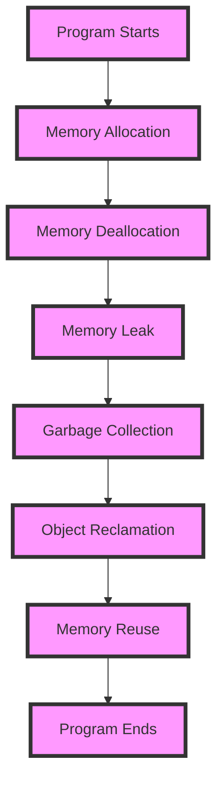

## Introduction
Memory management is a critical aspect of computer programming that deals with the allocation and deallocation of memory for running programs. It is essential to ensure that memory is used efficiently and effectively to prevent memory leaks, crashes, and other issues. In this section, we will explore the different approaches to memory management, including manual memory management in C/C++, garbage collection in Java/Go/Python, and ownership in Rust. 
> **Note:** Memory management is a fundamental concept in computer science, and understanding its principles is crucial for any aspiring software engineer.

## Core Concepts
Memory management involves several key concepts, including:
* **Memory allocation**: The process of assigning a block of memory to a program or variable.
* **Memory deallocation**: The process of releasing a block of memory back to the system.
* **Memory leak**: A situation where memory is allocated but not deallocated, causing memory waste and potential crashes.
* **Garbage collection**: A mechanism that automatically reclaims memory occupied by objects that are no longer in use.
* **Ownership**: A concept in Rust that ensures memory safety by enforcing a set of rules for managing memory.
> **Warning:** Manual memory management can be error-prone and lead to memory leaks if not done correctly.

## How It Works Internally
Let's take a look at how memory management works internally for each approach:
* **Manual memory management (C/C++)**: The programmer is responsible for allocating and deallocating memory using functions such as `malloc()` and `free()`. The memory is divided into blocks, and the programmer must keep track of the allocated blocks to avoid memory leaks.
* **Garbage collection (Java/Go/Python)**: The garbage collector periodically scans the heap for objects that are no longer in use and reclaims their memory. The garbage collector uses a combination of algorithms, such as mark-and-sweep and generational collection, to identify unreachable objects.
* **Ownership (Rust)**: Rust uses a concept called ownership to manage memory. Each value in Rust has an owner that is responsible for deallocating the value when it is no longer needed. Rust also uses a concept called borrowing to allow multiple references to the same value.
> **Tip:** Understanding the internal workings of memory management can help you write more efficient and effective code.

## Code Examples
Here are three complete and runnable code examples that demonstrate memory management in different languages:
### Example 1: Manual Memory Management in C
```c
#include <stdio.h>
#include <stdlib.h>

int main() {
    // Allocate memory for an integer
    int* ptr = malloc(sizeof(int));
    *ptr = 10;
    printf("%d\n", *ptr);
    // Deallocate memory
    free(ptr);
    return 0;
}
```
### Example 2: Garbage Collection in Java
```java
public class GarbageCollectionExample {
    public static void main(String[] args) {
        // Create an object
        Object obj = new Object();
        // The object is no longer referenced, and the garbage collector will reclaim its memory
        obj = null;
        // Force the garbage collector to run
        System.gc();
    }
}
```
### Example 3: Ownership in Rust
```rust
fn main() {
    // Create a string
    let s = String::from("Hello, world!");
    // The string is owned by the variable s
    println!("{}", s);
    // The string is dropped when it goes out of scope
}
```
> **Interview:** Can you explain the difference between manual memory management and garbage collection? How does Rust's ownership model work?

## Visual Diagram

The diagram illustrates the flow of memory management, from memory allocation to deallocation, and the role of garbage collection in reclaiming memory.

## Comparison
| Approach | Time Complexity | Space Complexity | Pros | Cons | Best For |
| --- | --- | --- | --- | --- | --- |
| Manual Memory Management | O(1) | O(1) | Fine-grained control, low overhead | Error-prone, time-consuming | Systems programming, performance-critical code |
| Garbage Collection | O(n) | O(n) | Automatic memory management, reduces memory leaks | High overhead, pause times | High-level languages, rapid development |
| Ownership | O(1) | O(1) | Memory safety, no null pointer dereferences | Steep learning curve, verbose code | Systems programming, memory-critical code |

## Real-world Use Cases
Here are three real-world examples of memory management in different languages:
* **Google's Chrome Browser**: Chrome uses a combination of manual memory management and garbage collection to manage memory. The browser's rendering engine, Blink, uses manual memory management to optimize performance, while the JavaScript engine, V8, uses garbage collection to manage memory.
* **Facebook's HipHop Virtual Machine**: HipHop uses a just-in-time compiler and garbage collection to manage memory. The virtual machine is designed to run PHP code efficiently and scales to handle large workloads.
* **Rust's Tokio Library**: Tokio is a Rust library for building concurrent and asynchronous applications. The library uses Rust's ownership model to manage memory and ensures memory safety and efficiency.

## Common Pitfalls
Here are four common mistakes that engineers make when managing memory:
* **Memory Leaks**: Forgetting to deallocate memory can cause memory leaks and crashes.
* **Dangling Pointers**: Using pointers that point to deallocated memory can cause crashes and undefined behavior.
* **Null Pointer Dereferences**: Dereferencing null pointers can cause crashes and undefined behavior.
* **Use-After-Free**: Using memory after it has been deallocated can cause crashes and undefined behavior.
> **Warning:** Memory management errors can be difficult to debug and fix, so it's essential to follow best practices and use tools to detect memory errors.

## Interview Tips
Here are three common interview questions on memory management, along with weak and strong answers:
* **What is the difference between manual memory management and garbage collection?**
	+ Weak answer: "Manual memory management is when you manually allocate and deallocate memory, while garbage collection is when the system automatically manages memory."
	+ Strong answer: "Manual memory management gives you fine-grained control over memory allocation and deallocation, but it can be error-prone and time-consuming. Garbage collection, on the other hand, automatically manages memory and reduces memory leaks, but it can introduce pause times and overhead."
* **How does Rust's ownership model work?**
	+ Weak answer: "Rust's ownership model is based on the concept of ownership, where each value has an owner that is responsible for deallocating the value when it is no longer needed."
	+ Strong answer: "Rust's ownership model ensures memory safety by enforcing a set of rules for managing memory. Each value has an owner that is responsible for deallocating the value when it is no longer needed, and the language uses a concept called borrowing to allow multiple references to the same value."
* **What are some common memory management pitfalls?**
	+ Weak answer: "Memory leaks, dangling pointers, and null pointer dereferences are common memory management pitfalls."
	+ Strong answer: "Memory leaks can occur when memory is allocated but not deallocated, causing memory waste and potential crashes. Dangling pointers can occur when pointers point to deallocated memory, causing crashes and undefined behavior. Null pointer dereferences can occur when null pointers are dereferenced, causing crashes and undefined behavior. Use-after-free can occur when memory is used after it has been deallocated, causing crashes and undefined behavior."

## Key Takeaways
Here are ten key takeaways on memory management:
* **Memory management is critical for performance and safety**: Memory management is essential for ensuring that programs run efficiently and safely.
* **Manual memory management gives fine-grained control**: Manual memory management allows programmers to control memory allocation and deallocation, but it can be error-prone and time-consuming.
* **Garbage collection reduces memory leaks**: Garbage collection automatically manages memory and reduces memory leaks, but it can introduce pause times and overhead.
* **Rust's ownership model ensures memory safety**: Rust's ownership model ensures memory safety by enforcing a set of rules for managing memory.
* **Memory leaks can cause crashes and performance issues**: Memory leaks can cause memory waste and potential crashes, and can be difficult to debug and fix.
* **Dangling pointers can cause crashes and undefined behavior**: Dangling pointers can cause crashes and undefined behavior, and can be difficult to debug and fix.
* **Null pointer dereferences can cause crashes and undefined behavior**: Null pointer dereferences can cause crashes and undefined behavior, and can be difficult to debug and fix.
* **Use-after-free can cause crashes and undefined behavior**: Use-after-free can cause crashes and undefined behavior, and can be difficult to debug and fix.
* **Memory management errors can be difficult to debug and fix**: Memory management errors can be difficult to debug and fix, so it's essential to follow best practices and use tools to detect memory errors.
* **Understanding memory management is essential for any aspiring software engineer**: Understanding memory management is essential for any aspiring software engineer, as it is a critical aspect of computer programming.