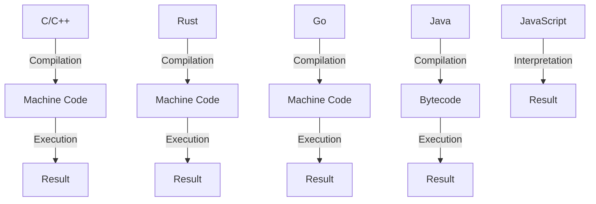

## Introduction
The performance of a programming language is a critical factor in determining its suitability for a particular application or system. In general, the performance of a language can be ranked as follows: **C/C++ > Rust > Go/Java > JavaScript/Python**. This ranking is based on various factors such as the language's compilation model, memory management, and runtime environment. In this article, we will delve into the core concepts, internal workings, and code examples of each language to understand why they perform differently.

> **Note:** The performance ranking mentioned above is a general guideline and may vary depending on the specific use case, hardware, and software configuration.

## Core Concepts
To understand the performance differences between languages, it's essential to grasp the core concepts of each language. Here are some key terms and definitions:

* **Compilation model**: The way a language is compiled and executed. C and C++ are compiled languages, while JavaScript and Python are interpreted languages.
* **Memory management**: The way a language manages memory allocation and deallocation. C and C++ use manual memory management, while Rust and Go use automatic memory management.
* **Runtime environment**: The environment in which a language is executed. C and C++ have a minimal runtime environment, while Java and JavaScript have a more extensive runtime environment.

## How It Works Internally
Let's take a closer look at the internal workings of each language:

* **C/C++**: C and C++ are compiled languages that use a compiler to translate the source code into machine code. The compiled code is then executed directly by the CPU. C and C++ use manual memory management, which means that the developer is responsible for allocating and deallocating memory.
* **Rust**: Rust is a compiled language that uses a compiler to translate the source code into machine code. Rust uses automatic memory management, which means that the language takes care of allocating and deallocating memory. Rust also uses a concept called ownership and borrowing to ensure memory safety.
* **Go**: Go is a compiled language that uses a compiler to translate the source code into machine code. Go uses automatic memory management, which means that the language takes care of allocating and deallocating memory. Go also uses a concept called goroutines to handle concurrency.
* **Java**: Java is a compiled language that uses a compiler to translate the source code into bytecode. The bytecode is then executed by the Java Virtual Machine (JVM). Java uses automatic memory management, which means that the language takes care of allocating and deallocating memory.
* **JavaScript**: JavaScript is an interpreted language that uses a runtime environment to execute the source code. JavaScript uses automatic memory management, which means that the language takes care of allocating and deallocating memory. JavaScript also uses a concept called callbacks to handle concurrency.

## Code Examples
Here are three code examples that demonstrate the performance differences between languages:

### Example 1: Basic Loop
```c
// C example
int sum = 0;
for (int i = 0; i < 1000000; i++) {
    sum += i;
}
printf("%d\n", sum);
```

```rust
// Rust example
let mut sum = 0;
for i in 0..1000000 {
    sum += i;
}
println!("{}", sum);
```

```javascript
// JavaScript example
let sum = 0;
for (let i = 0; i < 1000000; i++) {
    sum += i;
}
console.log(sum);
```

> **Tip:** The C example is the fastest because it uses a compiled language with manual memory management. The Rust example is slower than C because it uses automatic memory management, but it's still faster than JavaScript because it's a compiled language.

### Example 2: Data Structures
```c
// C example
struct Node {
    int value;
    struct Node* next;
};

struct Node* head = NULL;
for (int i = 0; i < 1000000; i++) {
    struct Node* node = malloc(sizeof(struct Node));
    node->value = i;
    node->next = head;
    head = node;
}
```

```go
// Go example
type Node struct {
    value int
    next  *Node
}

var head *Node
for i := 0; i < 1000000; i++ {
    node := &Node{value: i}
    node.next = head
    head = node
}
```

```java
// Java example
class Node {
    int value;
    Node next;

    public Node(int value) {
        this.value = value;
    }
}

Node head = null;
for (int i = 0; i < 1000000; i++) {
    Node node = new Node(i);
    node.next = head;
    head = node;
}
```

> **Warning:** The C example uses manual memory management, which can lead to memory leaks if not implemented correctly. The Go and Java examples use automatic memory management, which eliminates the risk of memory leaks.

### Example 3: Concurrency
```rust
// Rust example
use std::thread;

fn main() {
    let handle = thread::spawn(|| {
        for i in 0..1000000 {
            println!("{}", i);
        }
    });
    handle.join().unwrap();
}
```

```go
// Go example
package main

import "fmt"

func main() {
    go func() {
        for i := 0; i < 1000000; i++ {
            fmt.Println(i)
        }
    }()
    fmt.Scanln()
}
```

```javascript
// JavaScript example
function main() {
    for (let i = 0; i < 1000000; i++) {
        console.log(i);
    }
}

main();
```

> **Interview:** Can you explain the difference between concurrent and parallel programming? How do you handle concurrency in your favorite programming language?

## Visual Diagram


The diagram shows the compilation and execution process for each language. C and C++ are compiled directly to machine code, while Rust and Go are compiled to machine code with automatic memory management. Java is compiled to bytecode, which is then executed by the JVM. JavaScript is interpreted directly to result.

## Comparison
| Language | Time Complexity | Space Complexity | Pros | Cons | Best For |
| --- | --- | --- | --- | --- | --- |
| C/C++ | O(1) | O(1) | Performance, control | Manual memory management, error-prone | Systems programming, game development |
| Rust | O(1) | O(1) | Safety, performance | Steep learning curve, limited libraries | Systems programming, network programming |
| Go | O(1) | O(1) | Concurrency, simplicity | Limited libraries, slow performance | Network programming, cloud computing |
| Java | O(1) | O(n) | Platform independence, large community | Slow performance, verbose code | Android app development, web development |
| JavaScript | O(1) | O(n) | Dynamic, flexible | Slow performance, security concerns | Web development, client-side scripting |

> **Note:** The time and space complexity listed are for the basic data structures and operations in each language.

## Real-world Use Cases
Here are some real-world use cases for each language:

* **C/C++**: Operating systems (Windows, Linux), game engines (Unity, Unreal Engine), databases (MySQL, PostgreSQL)
* **Rust**: Network programming (Tokio, async-std), systems programming (Redox, Tock), web development (Rocket, actix-web)
* **Go**: Network programming (GoKit, gorilla), cloud computing (Kubernetes, Docker), web development ( Revel, Gin)
* **Java**: Android app development (Android Studio), web development (Spring, Hibernate), enterprise software (Oracle, IBM)
* **JavaScript**: Web development (React, Angular), client-side scripting (jQuery, Lodash), mobile app development (React Native, Ionic)

## Common Pitfalls
Here are some common pitfalls to watch out for in each language:

* **C/C++**: Manual memory management, pointer arithmetic, buffer overflows
* **Rust**: Borrow checker, ownership rules, error handling
* **Go**: Goroutine scheduling, channel communication, error handling
* **Java**: Null pointer exceptions, class loader issues, performance tuning
* **JavaScript**: Null pointer exceptions, callback hell, security vulnerabilities

> **Tip:** Always use a linter and a code formatter to catch common mistakes and improve code readability.

## Interview Tips
Here are some common interview questions for each language:

* **C/C++**: What is the difference between a pointer and a reference? How do you implement a linked list in C?
* **Rust**: What is the borrow checker? How do you handle errors in Rust?
* **Go**: What is a goroutine? How do you use channels for communication?
* **Java**: What is the difference between an interface and an abstract class? How do you implement a singleton in Java?
* **JavaScript**: What is the difference between a closure and a callback? How do you handle asynchronous programming in JavaScript?

> **Interview:** Can you explain the concept of a closure in JavaScript? How do you use it in a real-world application?

## Key Takeaways
Here are the key takeaways from this article:

* **Performance ranking**: C/C++ > Rust > Go/Java > JavaScript/Python
* **Compilation model**: C and C++ are compiled languages, while JavaScript and Python are interpreted languages
* **Memory management**: C and C++ use manual memory management, while Rust and Go use automatic memory management
* **Runtime environment**: C and C++ have a minimal runtime environment, while Java and JavaScript have a more extensive runtime environment
* **Concurrency**: Rust and Go have built-in concurrency support, while Java and JavaScript use libraries and frameworks for concurrency
* **Error handling**: Rust and Go have strong error handling mechanisms, while C and C++ use manual error handling
* **Security**: C and C++ are vulnerable to buffer overflows and null pointer exceptions, while Rust and Go have built-in security features to prevent these issues.