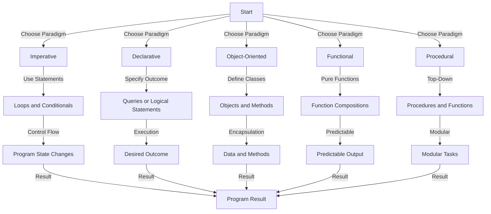

## Introduction
Programming language paradigms are fundamental styles or approaches to writing software. They shape the way developers think, design, and implement code, influencing the efficiency, readability, and maintainability of programs. Understanding these paradigms is crucial for software engineers, as it helps them choose the best language and approach for a given problem, ensuring effective and efficient solution development. In real-world scenarios, developers often encounter a mix of paradigms within a single project, making it essential to grasp the strengths and weaknesses of each. This knowledge enables engineers to leverage the right paradigm for the task at hand, whether it's imperative, declarative, object-oriented (OOP), functional, or procedural programming.

## Core Concepts
- **Imperative Programming**: Focuses on describing how to perform tasks, using statements that change the program's state. It's about the steps needed to achieve a result.
- **Declarative Programming**: Concerned with specifying what the program should accomplish, without detailing how it's done. The focus is on the outcome rather than the process.
- **Object-Oriented Programming (OOP)**: Organizes software design around objects and the interactions between them. It emphasizes modularity, reusability, and abstraction.
- **Functional Programming**: Treats programs as compositions of pure functions, each taking some input and producing output without modifying the state of the program.
- **Procedural Programming**: A type of imperative programming that follows a step-by-step approach, using procedures or functions to perform tasks.

> **Note:** Understanding these core concepts is fundamental to selecting the right programming paradigm for a project.

## How It Works Internally
The internal mechanics of programming paradigms vary significantly:
- **Imperative Programming**: The program's flow is controlled by statements that explicitly change the program's state. This is achieved through loops, conditional statements, and assignment operations.
- **Declarative Programming**: The focus is on the desired output, with the program figuring out how to achieve it. This often involves the use of queries or logical statements.
- **OOP**: Internally, OOP programs manage objects, which encapsulate data and methods that operate on that data. This paradigm relies heavily on concepts like inheritance, polymorphism, and encapsulation.
- **Functional Programming**: Pure functions are the core of this paradigm. Each function takes input, processes it, and returns output without side effects, making the code predictable and easier to reason about.
- **Procedural Programming**: This paradigm follows a top-down approach, breaking down complex tasks into simpler procedures that can be called as needed.

## Code Examples
### Example 1: Basic Imperative Programming in Python
```python
# Imperative example: Calculate the sum of numbers from 1 to n
def sum_numbers(n):
    total = 0  # Initialize a variable to hold the sum
    for i in range(1, n+1):  # Loop through numbers 1 to n
        total += i  # Add each number to the total
    return total  # Return the final sum

print(sum_numbers(10))  # Output: 55
```

### Example 2: Object-Oriented Programming in Java
```java
// OOP example: A simple BankAccount class
public class BankAccount {
    private double balance;  // Private field to store the balance

    public BankAccount(double initialBalance) {  // Constructor
        balance = initialBalance;
    }

    public void deposit(double amount) {  // Method to deposit money
        balance += amount;
    }

    public void withdraw(double amount) {  // Method to withdraw money
        if (balance >= amount) {
            balance -= amount;
        } else {
            System.out.println("Insufficient funds");
        }
    }

    public double getBalance() {  // Method to get the balance
        return balance;
    }

    public static void main(String[] args) {
        BankAccount account = new BankAccount(1000.0);  // Create a new account
        account.deposit(500.0);  // Deposit $500
        account.withdraw(200.0);  // Withdraw $200
        System.out.println("Final balance: " + account.getBalance());  // Print the final balance
    }
}
```

### Example 3: Functional Programming in Haskell
```haskell
-- Functional example: Calculate the sum of numbers from 1 to n
sumNumbers :: Int -> Int
sumNumbers n = sum [1..n]  -- Use the built-in sum function and range

main :: IO ()
main = print (sumNumbers 10)  -- Output: 55
```

## Visual Diagram

This diagram illustrates the high-level decision-making process in choosing a programming paradigm and how each paradigm internally processes information to achieve the desired outcome.

## Comparison
| Paradigm | Time Complexity | Space Complexity | Pros | Cons | Best For |
|----------|----------------|-----------------|------|------|----------|
| Imperative | Varies | Varies | Direct control over hardware resources, efficient for certain tasks | Can be verbose, prone to errors | Systems programming, embedded systems |
| Declarative | Generally efficient | Can be high for complex queries | High-level abstraction, less code | Can be less intuitive for beginners, performance issues | Database queries, web development |
| OOP | Varies | Generally high due to object creation | Encourages modularity, reusability, and abstraction | Can lead to tight coupling, over-engineering | Large-scale applications, complex systems |
| Functional | Generally efficient due to immutability | Can be high due to recursion | Predictable, composable, less prone to side effects | Can be less efficient for certain tasks, steep learning curve | Data processing, scientific computing |
| Procedural | Varies | Generally low | Simple, easy to understand, efficient for certain tasks | Can be less modular, more prone to errors | Small-scale applications, scripting |

## Real-world Use Cases
1. **Imperative Programming**: The Linux kernel is written primarily in C, an imperative language, due to its direct access to hardware resources and efficiency.
2. **Declarative Programming**: SQL is used in databases for its declarative nature, allowing users to specify what they want to retrieve without detailing how to retrieve it.
3. **OOP**: Android apps are developed using Java or Kotlin, leveraging OOP principles for modular, reusable code that interacts with the Android framework.
4. **Functional Programming**: Haskell is used in research and development for its strong type system and functional programming model, which ensures predictable and composable code.
5. **Procedural Programming**: Perl is often used for scripting tasks due to its simplicity, efficiency, and ease of use for procedural programming.

> **Tip:** Understanding the strengths and weaknesses of each paradigm helps in selecting the most appropriate one for a project.

## Common Pitfalls
1. **Tight Coupling in OOP**: When objects are too closely dependent on each other, making changes difficult without affecting other parts of the system.
2. **Mutable State in Functional Programming**: Using mutable state can lead to unpredictable behavior and side effects, contradicting the principles of functional programming.
3. **Inefficient Loops in Imperative Programming**: Using loops that are not optimized for the task at hand can lead to performance issues.
4. **Over-Engineering in Procedural Programming**: Creating overly complex procedures can make the code harder to maintain and understand.

## Interview Tips
1. **What is the difference between imperative and declarative programming?**
   - Weak answer: "Imperative is about doing things, and declarative is about what you want to do."
   - Strong answer: "Imperative programming focuses on the steps needed to achieve a result, using statements that change the program's state. Declarative programming, on the other hand, specifies what the program should accomplish without detailing how it's done, focusing on the outcome rather than the process."
2. **How does OOP promote modularity and reusability?**
   - Weak answer: "OOP is modular and reusable because it uses objects."
   - Strong answer: "OOP promotes modularity through encapsulation, where data and methods are bundled into objects, making it easier to modify or replace these modules without affecting other parts of the system. Reusability is achieved through inheritance and polymorphism, allowing for the creation of new classes based on existing ones and the ability of an object to take on multiple forms."
3. **What are the benefits of functional programming?**
   - Weak answer: "It's good for data processing."
   - Strong answer: "Functional programming offers several benefits, including predictability and composability due to the use of pure functions, which reduces the risk of side effects and makes the code easier to reason about. It also promotes immutability, making it easier to parallelize computations and improve performance."

## Key Takeaways
- Imperative programming is about the steps to achieve a result.
- Declarative programming is about specifying the desired outcome.
- OOP is centered around objects and their interactions.
- Functional programming emphasizes pure functions and immutability.
- Procedural programming follows a top-down approach with procedures.
- Each paradigm has its strengths and weaknesses.
- Understanding the paradigm used in a project is crucial for effective contribution.
- Mixing paradigms can lead to more maintainable and efficient code.
- The choice of paradigm depends on the problem domain and the desired outcomes.
- Learning multiple paradigms makes a developer more versatile and capable of tackling a wide range of problems.