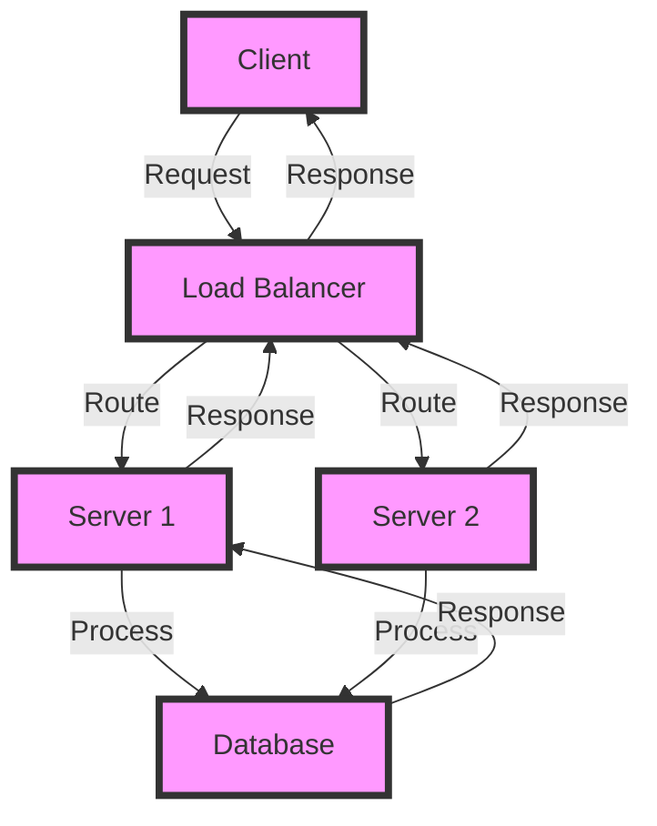

## Introduction
Python and JavaScript are two of the most popular programming languages used in backend development. **Python** is a high-level, interpreted language known for its simplicity, readability, and ease of use, while **JavaScript** is a versatile language that has evolved from a client-side scripting language to a full-fledged backend language with the advent of Node.js. In this article, we will explore the differences between Python and JavaScript in backend development, their use cases, and provide examples to help you decide which language to choose for your next project.

> **Note:** Both Python and JavaScript have their strengths and weaknesses, and the choice of language ultimately depends on the specific requirements of your project.

## Core Concepts
Before diving into the differences between Python and JavaScript, let's define some core concepts:

* **Backend development**: Refers to the server-side logic, database integration, and API connectivity of a web application.
* **Python**: A high-level, interpreted language known for its simplicity, readability, and ease of use.
* **JavaScript**: A versatile language that has evolved from a client-side scripting language to a full-fledged backend language with the advent of Node.js.
* **Node.js**: A JavaScript runtime environment that allows developers to run JavaScript on the server-side.

> **Tip:** Python is a great choice for data science, machine learning, and scientific computing, while JavaScript is ideal for real-time web applications, microservices, and serverless architecture.

## How It Works Internally
Let's take a look at how Python and JavaScript work internally:

* **Python**: Python code is compiled into bytecode, which is then executed by the Python interpreter. The interpreter is responsible for managing memory, handling errors, and providing a runtime environment for the code.
* **JavaScript (Node.js)**: JavaScript code is executed by the V8 engine, which is a JavaScript engine developed by Google. The V8 engine compiles JavaScript code into machine code, which is then executed by the CPU.

> **Warning:** Python's dynamic typing can lead to runtime errors if not properly handled, while JavaScript's asynchronous nature can make it difficult to debug and maintain complex codebases.

## Code Examples
Here are three complete and runnable examples to demonstrate the differences between Python and JavaScript:

### Example 1: Basic HTTP Server (Python)
```python
# Import the http.server module
from http.server import BaseHTTPRequestHandler, HTTPServer

# Define a custom request handler
class RequestHandler(BaseHTTPRequestHandler):
    def do_GET(self):
        # Send a response back to the client
        self.send_response(200)
        self.send_header('Content-type', 'text/html')
        self.end_headers()
        self.wfile.write(b"Hello, World!")

# Create an HTTP server
server = HTTPServer(('', 8000), RequestHandler)

# Start the server
print("Server started on port 8000")
server.serve_forever()
```

### Example 2: Real-time Chat Application (JavaScript)
```javascript
// Import the express module
const express = require('express');
const app = express();

// Define a route for the chat application
app.get('/chat', (req, res) => {
    // Send a response back to the client
    res.send("Welcome to the chat application!");
});

// Create a WebSocket server
const WebSocket = require('ws');
const wss = new WebSocket.Server({ port: 8080 });

// Handle WebSocket connections
wss.on('connection', (ws) => {
    // Handle incoming messages
    ws.on('message', (message) => {
        // Broadcast the message to all connected clients
        wss.clients.forEach((client) => {
            if (client !== ws && client.readyState === WebSocket.OPEN) {
                client.send(message);
            }
        });
    });
});

// Start the server
app.listen(3000, () => {
    console.log("Server started on port 3000");
});
```

### Example 3: Advanced API Gateway (Python)
```python
# Import the flask module
from flask import Flask, request, jsonify

# Create a Flask application
app = Flask(__name__)

# Define a route for the API gateway
@app.route('/api', methods=['GET', 'POST'])
def handle_request():
    # Handle incoming requests
    if request.method == 'GET':
        # Return a list of available endpoints
        return jsonify({'endpoints': ['/users', '/products']})
    elif request.method == 'POST':
        # Handle POST requests
        data = request.get_json()
        # Process the data and return a response
        return jsonify({'message': 'Data processed successfully'})

# Start the server
if __name__ == '__main__':
    app.run(port=5000)
```

## Visual Diagram

This diagram illustrates a simple load balancing architecture, where a load balancer routes incoming requests to multiple servers, which then process the requests and return responses to the client.

> **Interview:** Can you explain the difference between a monolithic architecture and a microservices architecture?

## Comparison
| Approach | Time Complexity | Space Complexity | Pros | Cons | Best For |
| --- | --- | --- | --- | --- | --- |
| Python | O(1) | O(1) | Easy to learn, fast development, large community | Slow performance, limited support for parallel processing | Data science, machine learning, web development |
| JavaScript (Node.js) | O(1) | O(1) | Fast performance, asynchronous I/O, scalable | Steep learning curve, callback hell, memory leaks | Real-time web applications, microservices, serverless architecture |
| Django | O(n) | O(n) | High-level framework, rapid development, secure | Complex, steep learning curve, monolithic architecture | Web development, enterprise software |
| Express.js | O(1) | O(1) | Lightweight, flexible, fast development | Limited support for parallel processing, callback hell | Web development, real-time applications |

## Real-world Use Cases
Here are three real-world use cases for Python and JavaScript:

* **Instagram**: Instagram uses Python for its backend, leveraging the Django framework for rapid development and scalability.
* **Netflix**: Netflix uses JavaScript for its backend, leveraging Node.js for real-time streaming and microservices architecture.
* **Dropbox**: Dropbox uses Python for its backend, leveraging the Flask framework for rapid development and scalability.

> **Tip:** When choosing a language for your project, consider the specific requirements of your project and the strengths and weaknesses of each language.

## Common Pitfalls
Here are four common pitfalls to watch out for when using Python and JavaScript:

* **Python**: Dynamic typing can lead to runtime errors if not properly handled.
* **JavaScript**: Asynchronous nature can make it difficult to debug and maintain complex codebases.
* **Python**: Limited support for parallel processing can lead to performance bottlenecks.
* **JavaScript**: Callback hell can lead to unmaintainable codebases.

> **Warning:** Be careful when using third-party libraries and frameworks, as they can introduce security vulnerabilities and performance issues.

## Interview Tips
Here are three common interview questions for Python and JavaScript:

* **What is the difference between Python and JavaScript?**
	+ Weak answer: "Python is for backend and JavaScript is for frontend."
	+ Strong answer: "Python is a high-level, interpreted language known for its simplicity and readability, while JavaScript is a versatile language that has evolved from a client-side scripting language to a full-fledged backend language with the advent of Node.js."
* **How do you handle errors in Python and JavaScript?**
	+ Weak answer: "I use try-catch blocks to handle errors."
	+ Strong answer: "I use try-catch blocks to handle errors, and I also use logging and monitoring tools to track and debug errors in production environments."
* **What is your experience with Node.js and Python frameworks?**
	+ Weak answer: "I have used Node.js for a simple web application and Python for a data science project."
	+ Strong answer: "I have used Node.js for real-time web applications and microservices architecture, and I have used Python for data science, machine learning, and web development with frameworks like Django and Flask."

## Key Takeaways
Here are ten key takeaways to remember when using Python and JavaScript:

* **Python is a high-level, interpreted language known for its simplicity and readability.**
* **JavaScript is a versatile language that has evolved from a client-side scripting language to a full-fledged backend language with the advent of Node.js.**
* **Node.js is a JavaScript runtime environment that allows developers to run JavaScript on the server-side.**
* **Python is ideal for data science, machine learning, and scientific computing.**
* **JavaScript is ideal for real-time web applications, microservices, and serverless architecture.**
* **Django is a high-level Python framework for rapid development and scalability.**
* **Express.js is a lightweight JavaScript framework for fast development and flexibility.**
* **Python has limited support for parallel processing, which can lead to performance bottlenecks.**
* **JavaScript has a steep learning curve, especially for beginners.**
* **Both Python and JavaScript have large communities and a wide range of libraries and frameworks to choose from.**