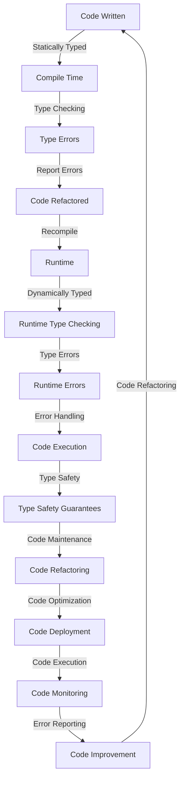

## Introduction
The debate between **statically typed** and **dynamically typed** languages has been ongoing for years, with each side having its own set of advantages and disadvantages. In this article, we will delve into the world of type systems, exploring the definitions, benefits, and trade-offs of each approach. We will also examine real-world examples, common pitfalls, and interview tips to help you solidify your understanding of this crucial concept. **Note:** Understanding the differences between statically typed and dynamically typed languages is essential for any software engineer, as it can significantly impact the design, development, and maintenance of software systems.

## Core Concepts
To begin with, let's define the key terms:
- **Statically typed**: A language that checks the types of variables at **compile time**, before the code is executed. This means that the type system checks for type errors before the code is even run.
- **Dynamically typed**: A language that checks the types of variables at **runtime**, while the code is being executed. This means that the type system checks for type errors as the code is running.
- **Type safety**: The ability of a language to prevent type-related errors, such as null pointer exceptions or type mismatches.

**Tip:** When choosing a programming language, consider the trade-offs between statically typed and dynamically typed languages. Statically typed languages, such as **Java** or **C++**, provide stronger type safety guarantees, but may require more boilerplate code. Dynamically typed languages, such as **JavaScript** or **Python**, offer more flexibility, but may be more prone to type-related errors.

## How It Works Internally
Let's take a closer look at how statically typed and dynamically typed languages work internally:
- **Statically typed languages**: The compiler checks the types of variables at compile time, using a process called **type inference**. This involves analyzing the code and determining the types of variables based on their usage. If a type error is found, the compiler will report an error and refuse to compile the code.
- **Dynamically typed languages**: The interpreter or runtime environment checks the types of variables at runtime, using a process called **dynamic typing**. This involves checking the types of variables as the code is executed, and throwing an error if a type mismatch is found.

**Warning:** Dynamically typed languages can be more error-prone than statically typed languages, as type errors may not be caught until runtime. However, many dynamically typed languages, such as **JavaScript**, have built-in features like **type checking** or **linting** to help mitigate these risks.

## Code Examples
Here are three complete and runnable code examples to illustrate the differences between statically typed and dynamically typed languages:

### Example 1: Basic Statically Typed Example (Java)
```java
// Define a class with a statically typed variable
public class Person {
    private String name;

    public Person(String name) {
        this.name = name;
    }

    public void sayHello() {
        System.out.println("Hello, my name is " + name);
    }

    public static void main(String[] args) {
        Person person = new Person("John");
        person.sayHello();
    }
}
```

### Example 2: Basic Dynamically Typed Example (JavaScript)
```javascript
// Define a class with a dynamically typed variable
class Person {
    constructor(name) {
        this.name = name;
    }

    sayHello() {
        console.log(`Hello, my name is ${this.name}`);
    }
}

// Create an instance of the Person class
const person = new Person("John");
person.sayHello();
```

### Example 3: Advanced Statically Typed Example (C++ Template Metaprogramming)
```cpp
// Define a template class with a statically typed variable
template <typename T>
class Container {
public:
    Container(T value) : value_(value) {}

    T getValue() {
        return value_;
    }

private:
    T value_;
};

int main() {
    // Create an instance of the Container class with a statically typed variable
    Container<int> container(42);
    std::cout << "Value: " << container.getValue() << std::endl;
    return 0;
}
```

## Visual Diagram

This diagram illustrates the workflow of statically typed and dynamically typed languages, from code writing to code execution and maintenance.

## Comparison
| Language | Type System | Type Safety | Performance | Development Speed |
| --- | --- | --- | --- | --- |
| Java | Statically Typed | High | Medium | Medium |
| C++ | Statically Typed | High | High | Low |
| JavaScript | Dynamically Typed | Low | Medium | High |
| Python | Dynamically Typed | Low | Medium | High |
| Rust | Statically Typed | High | High | Medium |
| Go | Statically Typed | High | Medium | Medium |

**Interview:** What are the trade-offs between statically typed and dynamically typed languages? How do you choose the right language for a project?

## Real-world Use Cases
Here are three real-world examples of statically typed and dynamically typed languages in use:
- **Google's Android Operating System**: Android uses a combination of **Java** (statically typed) and **Kotlin** (statically typed) for app development.
- **Facebook's React Framework**: React uses **JavaScript** (dynamically typed) for building user interfaces.
- **Microsoft's .NET Framework**: .NET uses a combination of **C#** (statically typed) and **F#** (statically typed) for building Windows applications.

## Common Pitfalls
Here are four common pitfalls to watch out for when working with statically typed and dynamically typed languages:
- **Type Errors**: Failing to handle type errors properly can lead to runtime errors or crashes.
- **Null Pointer Exceptions**: Failing to check for null values can lead to null pointer exceptions or crashes.
- **Type Mismatches**: Failing to handle type mismatches properly can lead to runtime errors or crashes.
- **Code Complexity**: Failing to manage code complexity can lead to maintainability issues or performance problems.

**Tip:** Use **type checking** or **linting** tools to help catch type-related errors early in the development process.

## Interview Tips
Here are three common interview questions related to statically typed and dynamically typed languages:
- **What are the advantages and disadvantages of statically typed languages?**
	+ Weak answer: "Statically typed languages are more secure, but they can be slower."
	+ Strong answer: "Statically typed languages provide stronger type safety guarantees, which can reduce the likelihood of type-related errors. However, they may require more boilerplate code and can be more verbose."
- **How do you handle type errors in a dynamically typed language?**
	+ Weak answer: "I use try-catch blocks to handle type errors."
	+ Strong answer: "I use a combination of type checking, linting, and try-catch blocks to handle type errors. I also make sure to test my code thoroughly to catch any type-related errors early in the development process."
- **What are the trade-offs between statically typed and dynamically typed languages?**
	+ Weak answer: "Statically typed languages are more secure, but dynamically typed languages are more flexible."
	+ Strong answer: "Statically typed languages provide stronger type safety guarantees, but they may require more boilerplate code and can be more verbose. Dynamically typed languages offer more flexibility, but they may be more prone to type-related errors. The choice between statically typed and dynamically typed languages depends on the specific needs of the project and the trade-offs that are willing to be made."

## Key Takeaways
Here are ten key takeaways to remember:
* Statically typed languages provide stronger type safety guarantees, but may require more boilerplate code and can be more verbose.
* Dynamically typed languages offer more flexibility, but may be more prone to type-related errors.
* Type checking and linting tools can help catch type-related errors early in the development process.
* Code complexity can lead to maintainability issues or performance problems.
* Null pointer exceptions can be avoided by checking for null values.
* Type mismatches can be handled using type checking or linting tools.
* The choice between statically typed and dynamically typed languages depends on the specific needs of the project and the trade-offs that are willing to be made.
* Statically typed languages can be more secure, but may be slower.
* Dynamically typed languages can be more flexible, but may be more prone to type-related errors.
* Type safety guarantees can reduce the likelihood of type-related errors and improve code maintainability.