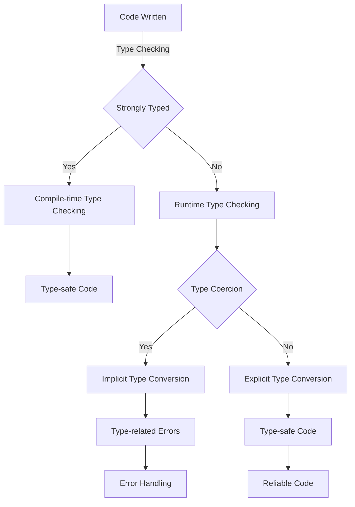

## Introduction
**Strongly typed** and **weakly typed** languages are two fundamental concepts in programming that refer to how a language handles the **data type** of variables. In a strongly typed language, the data type of a variable is known at **compile time**, whereas in a weakly typed language, the data type is determined at **runtime**. This distinction has significant implications for the **reliability**, **maintainability**, and **performance** of software systems. As a software engineer, understanding the differences between strongly typed and weakly typed languages is crucial for making informed design decisions and writing robust, efficient code.

> **Note:** Strongly typed languages are not necessarily **statically typed**, although the terms are often used interchangeably. Statically typed languages are a subset of strongly typed languages where the type checking is performed at compile time.

## Core Concepts
To grasp the concepts of strongly typed and weakly typed languages, it's essential to understand the following key terminology:

* **Type system**: A set of rules that govern the **data types** of variables, expressions, and functions in a programming language.
* **Data type**: A classification of data based on its format, size, and set of values it can hold.
* **Type safety**: The ability of a language to prevent **type-related errors** at runtime.
* **Type inference**: The ability of a language to automatically determine the data type of a variable based on its usage.

A mental model to help understand the difference between strongly typed and weakly typed languages is to think of a **postal system**. In a strongly typed language, the **address** (data type) of a **package** (variable) is verified before it's **sent** (compiled), ensuring that it reaches the correct **destination** (function or operation). In a weakly typed language, the address is verified only when the package is **delivered** (executed), which can lead to **delivery failures** (type-related errors).

## How It Works Internally
Let's dive into the under-the-hood mechanics of strongly typed and weakly typed languages:

1. **Compile-time type checking**: In strongly typed languages, the compiler checks the data type of variables at compile time, preventing type-related errors from reaching runtime.
2. **Runtime type checking**: In weakly typed languages, the data type of variables is checked at runtime, which can lead to type-related errors if not handled properly.
3. **Type coercion**: Some languages perform **type coercion**, which involves automatically converting a value from one data type to another. This can be useful in certain situations but can also lead to unexpected behavior if not used carefully.

> **Warning:** Type coercion can be a source of bugs and unexpected behavior in weakly typed languages. Be cautious when using type coercion, and always verify the resulting data type.

## Code Examples
Here are three complete, runnable code examples to illustrate the differences between strongly typed and weakly typed languages:

### Example 1: Basic Usage (Java)
```java
// Java is a strongly typed language
public class StronglyTypedExample {
    public static void main(String[] args) {
        int x = 5; // x is an integer
        // x = "hello"; // This would cause a compile-time error
        System.out.println(x);
    }
}
```

### Example 2: Real-world Pattern (JavaScript)
```javascript
// JavaScript is a weakly typed language
function calculateArea(width, height) {
    // Width and height are expected to be numbers
    if (typeof width !== 'number' || typeof height !== 'number') {
        throw new Error('Width and height must be numbers');
    }
    return width * height;
}

console.log(calculateArea(5, 10)); // Outputs: 50
console.log(calculateArea('5', 10)); // Throws an error
```

### Example 3: Advanced Usage (Rust)
```rust
// Rust is a strongly typed language with type inference
fn calculate_area(width: i32, height: i32) -> i32 {
    width * height
}

fn main() {
    let area = calculate_area(5, 10);
    println!("{}", area); // Outputs: 50
    // let area = calculate_area(5, "10"); // This would cause a compile-time error
}
```

## Visual Diagram

This diagram illustrates the differences between strongly typed and weakly typed languages, including type checking, type coercion, and error handling.

## Comparison
| Language | Type System | Type Safety | Performance |
| --- | --- | --- | --- |
| Java | Strongly Typed | High | Medium |
| JavaScript | Weakly Typed | Low | High |
| Rust | Strongly Typed | High | High |
| Python | Weakly Typed | Medium | Medium |
| C++ | Statically Typed | High | High |

> **Tip:** When choosing a programming language, consider the trade-offs between type safety, performance, and development ease. Strongly typed languages like Java and Rust offer high type safety, while weakly typed languages like JavaScript and Python provide more flexibility but may require additional error handling.

## Real-world Use Cases
Here are three production examples of strongly typed and weakly typed languages in use:

1. **Android App Development**: Java is a strongly typed language used for Android app development, providing a robust and reliable platform for building mobile applications.
2. **Web Development**: JavaScript is a weakly typed language used for web development, offering a flexible and dynamic platform for building web applications.
3. **Systems Programming**: C++ is a statically typed language used for systems programming, providing a high-performance and reliable platform for building operating systems, games, and other systems software.

## Common Pitfalls
Here are four common mistakes to avoid when working with strongly typed and weakly typed languages:

1. **Type-related Errors**: Failing to handle type-related errors can lead to runtime errors and crashes.
2. **Type Coercion**: Misusing type coercion can lead to unexpected behavior and errors.
3. **Null Pointer Exceptions**: Failing to handle null pointer exceptions can lead to runtime errors and crashes.
4. **Memory Leaks**: Failing to manage memory properly can lead to memory leaks and performance issues.

> **Interview:** When asked about type systems, be prepared to explain the differences between strongly typed and weakly typed languages, including type safety, performance, and error handling.

## Interview Tips
Here are three common interview questions related to strongly typed and weakly typed languages, along with weak and strong answer examples:

1. **What is the difference between strongly typed and weakly typed languages?**
	* Weak answer: "Strongly typed languages are more restrictive, while weakly typed languages are more flexible."
	* Strong answer: "Strongly typed languages provide type safety at compile time, while weakly typed languages provide type safety at runtime. This affects the reliability, maintainability, and performance of software systems."
2. **How do you handle type-related errors in a weakly typed language?**
	* Weak answer: "I use try-catch blocks to handle errors."
	* Strong answer: "I use a combination of type checking, error handling, and defensive programming to prevent type-related errors. I also consider using a strongly typed language for critical components."
3. **What are the advantages and disadvantages of using a strongly typed language?**
	* Weak answer: "Strongly typed languages are more verbose, but they provide better type safety."
	* Strong answer: "Strongly typed languages provide better type safety, reliability, and maintainability, but they can be more verbose and less flexible. However, the benefits of type safety and reliability outweigh the costs of verbosity, especially for large and complex software systems."

## Key Takeaways
Here are ten key takeaways to remember about strongly typed and weakly typed languages:

* **Type safety** is critical for reliable and maintainable software systems.
* **Strongly typed languages** provide type safety at compile time, while **weakly typed languages** provide type safety at runtime.
* **Type coercion** can be useful, but it can also lead to unexpected behavior if not used carefully.
* **Error handling** is essential for preventing type-related errors and crashes.
* **Memory management** is critical for preventing memory leaks and performance issues.
* **Statically typed languages** are a subset of strongly typed languages where type checking is performed at compile time.
* **Dynamically typed languages** are a subset of weakly typed languages where type checking is performed at runtime.
* **Type inference** can simplify code and improve readability, but it can also lead to type-related errors if not used carefully.
* **Type systems** are a critical component of programming languages, affecting the reliability, maintainability, and performance of software systems.
* **Language choice** depends on the specific requirements and constraints of a project, including type safety, performance, and development ease.