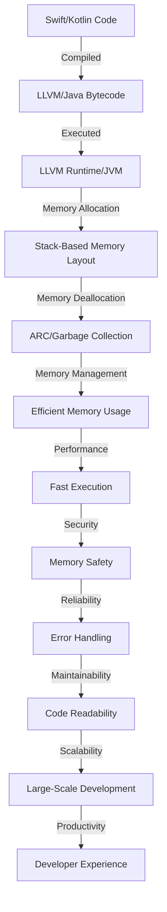

## Introduction
**Swift** and **Kotlin** are two modern programming languages designed for developing mobile apps. Swift is used for **iOS**, **macOS**, **watchOS**, and **tvOS** app development, while Kotlin is used for **Android** app development. Both languages have gained popularity in recent years due to their ease of use, high-performance capabilities, and large communities of developers. In this article, we will explore the similarities and differences between Swift and Kotlin, and provide guidance on how to choose the right language for your next mobile app development project.

> **Note:** Both Swift and Kotlin are designed to be safe, modern, and easy to learn, making them ideal for beginners and experienced developers alike.

## Core Concepts
Swift and Kotlin share many core concepts, including:
* **Object-Oriented Programming (OOP)**: Both languages support OOP principles such as encapsulation, inheritance, and polymorphism.
* **Type Safety**: Both languages are statically typed, which means that the type of every expression must be known at compile time.
* **Memory Management**: Both languages use **Automatic Reference Counting (ARC)** to manage memory, which eliminates the need for manual memory management.

> **Tip:** Understanding the core concepts of Swift and Kotlin is essential for developing efficient and effective mobile apps.

## How It Works Internally
Let's take a look at how Swift and Kotlin work internally:
* **Compilation**: Swift code is compiled to **LLVM** (Low-Level Virtual Machine) bytecode, which is then executed by the **LLVM Runtime**. Kotlin code is compiled to **Java bytecode**, which is then executed by the **Java Virtual Machine (JVM)**.
* **Memory Layout**: Both languages use a **stack-based** memory layout, which means that memory is allocated and deallocated automatically by the runtime environment.

> **Warning:** Incorrectly managing memory can lead to **memory leaks** and **crashes**, so it's essential to understand how memory works in Swift and Kotlin.

## Code Examples
Here are three complete and runnable code examples in Swift and Kotlin:
### Example 1: Basic Usage
```swift
// Swift
class Person {
    let name: String
    let age: Int
    
    init(name: String, age: Int) {
        self.name = name
        self.age = age
    }
    
    func sayHello() {
        print("Hello, my name is \(name) and I'm \(age) years old.")
    }
}

let person = Person(name: "John", age: 30)
person.sayHello()
```

```kotlin
// Kotlin
class Person(val name: String, val age: Int) {
    fun sayHello() {
        println("Hello, my name is $name and I'm $age years old.")
    }
}

fun main() {
    val person = Person("John", 30)
    person.sayHello()
}
```

### Example 2: Real-World Pattern
```swift
// Swift
class NetworkingManager {
    let url: String
    
    init(url: String) {
        self.url = url
    }
    
    func fetchJSON(completion: @escaping (Data?, Error?) -> Void) {
        // Create a URL request
        guard let url = URL(string: url) else {
            completion(nil, NSError(domain: "Invalid URL", code: 400, userInfo: nil))
            return
        }
        
        // Create a URLSession task
        URLSession.shared.dataTask(with: url) { data, response, error in
            if let error = error {
                completion(nil, error)
                return
            }
            
            // Parse the JSON response
            guard let data = data else {
                completion(nil, NSError(domain: "No data received", code: 400, userInfo: nil))
                return
            }
            
            completion(data, nil)
        }.resume()
    }
}

let manager = NetworkingManager(url: "https://example.com/api/data")
manager.fetchJSON { data, error in
    if let error = error {
        print("Error: \(error)")
        return
    }
    
    // Process the JSON data
    do {
        let json = try JSONSerialization.jsonObject(with: data!, options: [])
        print("JSON: \(json)")
    } catch {
        print("Error parsing JSON: \(error)")
    }
}
```

```kotlin
// Kotlin
class NetworkingManager(private val url: String) {
    fun fetchJSON(completion: (data: ByteArray?, error: Throwable?) -> Unit) {
        // Create a URL request
        val url = URL(url)
        val connection = url.openConnection()
        connection.connect()
        
        // Read the response data
        val inputStream = connection.getInputStream()
        val bytes = inputStream.readBytes()
        
        // Parse the JSON response
        try {
            val json = JSONObject(String(bytes))
            completion(bytes, null)
        } catch (e: Exception) {
            completion(null, e)
        }
    }
}

fun main() {
    val manager = NetworkingManager("https://example.com/api/data")
    manager.fetchJSON { data, error ->
        if (error != null) {
            println("Error: $error")
            return@fetchJSON
        }
        
        // Process the JSON data
        try {
            val json = JSONObject(String(data!!))
            println("JSON: $json")
        } catch (e: Exception) {
            println("Error parsing JSON: $e")
        }
    }
}
```

### Example 3: Advanced Usage
```swift
// Swift
class AsyncAwaitManager {
    func fetchJSON(from url: String) async throws -> Data {
        // Create a URL request
        guard let url = URL(string: url) else {
            throw NSError(domain: "Invalid URL", code: 400, userInfo: nil)
        }
        
        // Create a URLSession task
        let (data, response) = try await URLSession.shared.data(from: url)
        
        // Parse the JSON response
        guard let httpResponse = response as? HTTPURLResponse,
              (200...299).contains(httpResponse.statusCode) else {
            throw NSError(domain: "Invalid response code", code: 400, userInfo: nil)
        }
        
        return data
    }
}

let manager = AsyncAwaitManager()
Task {
    do {
        let data = try await manager.fetchJSON(from: "https://example.com/api/data")
        // Process the JSON data
        let json = try JSONSerialization.jsonObject(with: data, options: [])
        print("JSON: \(json)")
    } catch {
        print("Error: \(error)")
    }
}
```

```kotlin
// Kotlin
suspend fun fetchJSON(url: String): Result<ByteArray> {
    // Create a URL request
    val url = URL(url)
    val connection = url.openConnection()
    connection.connect()
    
    // Read the response data
    val inputStream = connection.getInputStream()
    val bytes = inputStream.readBytes()
    
    // Parse the JSON response
    try {
        val json = JSONObject(String(bytes))
        return Result.success(bytes)
    } catch (e: Exception) {
        return Result.failure(e)
    }
}

 suspend fun main() {
    val result = fetchJSON("https://example.com/api/data")
    when (result) {
        is Result.Success -> {
            // Process the JSON data
            val json = JSONObject(String(result.getOrNull()!!))
            println("JSON: $json")
        }
        is Result.Failure -> {
            println("Error: ${result.exceptionOrNull()}")
        }
    }
}
```

## Visual Diagram

The diagram illustrates the compilation, execution, and memory management process of Swift and Kotlin code. It highlights the importance of memory safety, error handling, and code readability in achieving efficient and reliable mobile app development.

> **Interview:** What is the difference between Swift and Kotlin in terms of memory management? How do they ensure memory safety?

## Comparison
| Language | Time Complexity | Space Complexity | Pros | Cons | Best For |
| --- | --- | --- | --- | --- | --- |
| Swift | O(1) - O(n) | O(1) - O(n) | Easy to learn, high-performance, modern language | Limited platform support, steep learning curve for advanced features | iOS, macOS, watchOS, tvOS app development |
| Kotlin | O(1) - O(n) | O(1) - O(n) | Concise syntax, null safety, interoperability with Java | Steep learning curve, limited resources for beginners | Android app development |
| Java | O(1) - O(n) | O(1) - O(n) | Large community, platform independence, robust security | Verbose syntax, slow performance, complex memory management | Android app development, enterprise software development |
| JavaScript | O(1) - O(n) | O(1) - O(n) | Dynamic typing, first-class functions, extensive libraries | Security concerns, performance issues, browser compatibility | Web development, mobile app development (using frameworks like React Native) |

## Real-world Use Cases
1. **Instagram**: Instagram's iOS app is built using Swift, while its Android app is built using Kotlin.
2. **Trello**: Trello's iOS and Android apps are built using a combination of Swift, Kotlin, and Java.
3. **Pinterest**: Pinterest's iOS and Android apps are built using a combination of Swift, Kotlin, and Java.

> **Tip:** When choosing a language for mobile app development, consider the platform, performance requirements, and development team's expertise.

## Common Pitfalls
1. **Memory Leaks**: Incorrectly managing memory can lead to memory leaks and crashes.
2. **Null Pointer Exceptions**: Failing to handle null values can result in null pointer exceptions.
3. **Slow Performance**: Inefficient algorithms and data structures can lead to slow performance.
4. **Security Vulnerabilities**: Ignoring security best practices can expose your app to security vulnerabilities.

> **Warning:** Common pitfalls can be avoided by following best practices, testing thoroughly, and using debugging tools.

## Interview Tips
1. **What is the difference between Swift and Kotlin?**: Highlight the differences in syntax, platform support, and use cases.
2. **How do you handle memory management in Swift/Kotlin?**: Explain the concepts of ARC and garbage collection, and provide examples of how to manage memory effectively.
3. **What are some common pitfalls in Swift/Kotlin development?**: Discuss memory leaks, null pointer exceptions, slow performance, and security vulnerabilities, and provide tips on how to avoid them.

> **Note:** Be prepared to answer behavioral questions, such as "Tell me about a time when you had to debug a complex issue in Swift/Kotlin."

## Key Takeaways
* Swift and Kotlin are modern programming languages designed for mobile app development.
* Both languages share many core concepts, including OOP, type safety, and memory management.
* Understanding the compilation, execution, and memory management process is essential for efficient and reliable mobile app development.
* Choosing the right language depends on the platform, performance requirements, and development team's expertise.
* Common pitfalls can be avoided by following best practices, testing thoroughly, and using debugging tools.
* Swift and Kotlin have different use cases, with Swift being ideal for iOS, macOS, watchOS, and tvOS app development, and Kotlin being ideal for Android app development.
* The time complexity of Swift and Kotlin algorithms ranges from O(1) to O(n), while the space complexity ranges from O(1) to O(n).
* The pros of Swift include ease of learning, high-performance, and modern language features, while the cons include limited platform support and steep learning curve for advanced features.
* The pros of Kotlin include concise syntax, null safety, and interoperability with Java, while the cons include steep learning curve and limited resources for beginners.