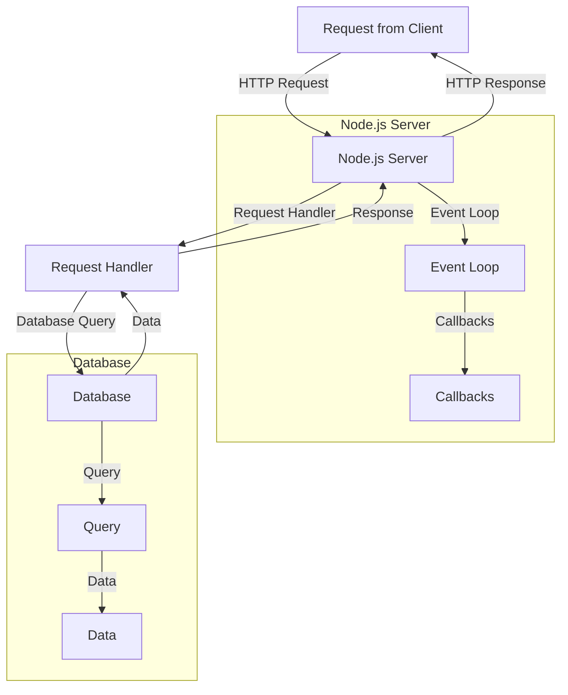

## Introduction
The path to becoming a backend developer is a journey that requires dedication, persistence, and a willingness to learn. In this journey, **JavaScript/TypeScript**, **Node.js**, **Go**, and **Java** are some of the most popular technologies used in backend development. Understanding the fundamentals of these technologies and how they work together is crucial for any aspiring backend developer. In this article, we will explore the learning path for backend developers, from the basics of JavaScript/TypeScript to the advanced topics of Node.js, Go, and Java.

> **Note:** The learning path outlined in this article is not the only way to become a backend developer, but it is a popular and well-established path that many developers have followed.

## Core Concepts
Before diving into the details of each technology, it's essential to understand some core concepts that are fundamental to backend development. These concepts include:

* **Request/Response Cycle**: The request/response cycle is the process by which a client (usually a web browser) sends a request to a server, and the server responds with the requested data.
* **APIs**: APIs (Application Programming Interfaces) are the interfaces through which clients interact with servers. They define the endpoints, methods, and data formats used for communication.
* **Database Management**: Database management is the process of storing, retrieving, and manipulating data in a database. This is a critical aspect of backend development, as it involves designing and implementing databases that can efficiently store and retrieve large amounts of data.
* **Security**: Security is a critical aspect of backend development, as it involves protecting sensitive data and preventing unauthorized access to the system.

## How It Works Internally
Let's take a closer look at how each technology works internally:

* **JavaScript/TypeScript**: JavaScript is a client-side scripting language that is executed by the browser. However, with the introduction of Node.js, JavaScript can also be executed on the server-side. TypeScript is a superset of JavaScript that adds optional static typing and other features to improve the development experience.
* **Node.js**: Node.js is a JavaScript runtime environment that allows developers to run JavaScript on the server-side. It uses an event-driven, non-blocking I/O model that makes it highly scalable and efficient.
* **Go**: Go, also known as Golang, is a statically typed language developed by Google. It is designed to be concurrent and scalable, making it well-suited for building high-performance backend systems.
* **Java**: Java is an object-oriented language that is widely used for building enterprise-level backend systems. It is known for its platform independence, strong security features, and large community of developers.

## Code Examples
Here are three complete and runnable code examples that demonstrate the basics of each technology:

### Example 1: Basic Node.js Server
```javascript
// Import the http module
const http = require('http');

// Create a server that listens on port 3000
const server = http.createServer((req, res) => {
  // Send a response back to the client
  res.writeHead(200, {'Content-Type': 'text/plain'});
  res.end('Hello World\n');
});

// Start the server
server.listen(3000, () => {
  console.log('Server running on port 3000');
});
```

### Example 2: RESTful API with Express.js
```javascript
// Import the express module
const express = require('express');

// Create an express app
const app = express();

// Define a route for the root URL
app.get('/', (req, res) => {
  res.send('Hello World');
});

// Define a route for the /users URL
app.get('/users', (req, res) => {
  // Simulate a database query
  const users = [
    { id: 1, name: 'John Doe' },
    { id: 2, name: 'Jane Doe' }
  ];
  res.json(users);
});

// Start the server
const port = 3000;
app.listen(port, () => {
  console.log(`Server running on port ${port}`);
});
```

### Example 3: Go Program with Goroutines
```go
package main

import (
  "fmt"
  "time"
)

// Function to print numbers from 1 to 5
func printNumbers() {
  for i := 1; i <= 5; i++ {
    time.Sleep(500 * time.Millisecond)
    fmt.Println(i)
  }
}

// Function to print letters from A to E
func printLetters() {
  for i := 'A'; i <= 'E'; i++ {
    time.Sleep(500 * time.Millisecond)
    fmt.Printf("%c\n", i)
  }
}

func main() {
  // Start two goroutines
  go printNumbers()
  go printLetters()

  // Wait for 3 seconds
  time.Sleep(3 * time.Second)
}
```

## Visual Diagram

This diagram illustrates the request/response cycle in a Node.js server, including the event loop, callbacks, and database queries.

## Comparison
| Technology | Time Complexity | Space Complexity | Pros | Cons | Best For |
| --- | --- | --- | --- | --- | --- |
| Node.js | O(1) | O(1) | Highly scalable, event-driven | Limited support for multithreading | Real-time web applications |
| Go | O(1) | O(1) | Concurrency support, statically typed | Steep learning curve | Distributed systems, networking |
| Java | O(1) | O(1) | Platform independence, strong security | Verbose syntax, slow startup | Enterprise-level backend systems |
| TypeScript | O(1) | O(1) | Optional static typing, compatibility with JavaScript | Additional complexity | Large-scale JavaScript applications |

## Real-world Use Cases
Here are three real-world use cases for each technology:

* **Node.js**:
	+ **Netflix**: Uses Node.js for its web application, leveraging its scalability and event-driven architecture.
	+ **LinkedIn**: Uses Node.js for its mobile application, taking advantage of its fast startup time and low latency.
	+ **eBay**: Uses Node.js for its API gateway, utilizing its high performance and concurrency support.
* **Go**:
	+ **Google**: Uses Go for its cloud infrastructure, leveraging its concurrency support and scalability.
	+ **Dropbox**: Uses Go for its file synchronization service, taking advantage of its high performance and reliability.
	+ **SoundCloud**: Uses Go for its music streaming service, utilizing its concurrency support and scalability.
* **Java**:
	+ **Amazon**: Uses Java for its web services, leveraging its platform independence and strong security features.
	+ **Google**: Uses Java for its Android operating system, taking advantage of its platform independence and large community of developers.
	+ **IBM**: Uses Java for its enterprise-level backend systems, utilizing its platform independence and strong security features.

## Common Pitfalls
Here are four common pitfalls to watch out for when working with each technology:

* **Node.js**:
	+ **Callback hell**: Not handling callbacks properly can lead to callback hell, making the code difficult to read and maintain.
	+ **Event loop blocking**: Blocking the event loop can cause performance issues and slow down the application.
	+ **Memory leaks**: Not handling memory properly can lead to memory leaks, causing the application to consume increasing amounts of memory.
	+ **Security vulnerabilities**: Not following security best practices can lead to security vulnerabilities, making the application susceptible to attacks.
* **Go**:
	+ **Concurrency issues**: Not handling concurrency properly can lead to concurrency issues, causing the application to behave erratically.
	+ **Error handling**: Not handling errors properly can lead to crashes and unexpected behavior.
	+ **Performance issues**: Not optimizing the code for performance can lead to slow performance and high latency.
	+ **Code organization**: Not organizing the code properly can lead to maintainability issues and make it difficult to scale the application.
* **Java**:
	+ **Null pointer exceptions**: Not handling null pointer exceptions properly can lead to crashes and unexpected behavior.
	+ **Memory leaks**: Not handling memory properly can lead to memory leaks, causing the application to consume increasing amounts of memory.
	+ **Performance issues**: Not optimizing the code for performance can lead to slow performance and high latency.
	+ **Code complexity**: Not keeping the code simple and concise can lead to maintainability issues and make it difficult to scale the application.

## Interview Tips
Here are three common interview questions for each technology, along with tips for answering them:

* **Node.js**:
	+ **What is the difference between Node.js and JavaScript?**: Be prepared to explain the differences between Node.js and JavaScript, including the event-driven architecture and concurrency support.
	+ **How do you handle errors in Node.js?**: Be prepared to explain how to handle errors in Node.js, including using try-catch blocks and error callbacks.
	+ **What is the purpose of the event loop in Node.js?**: Be prepared to explain the purpose of the event loop in Node.js, including its role in handling asynchronous operations and concurrency.
* **Go**:
	+ **What is the difference between Go and Java?**: Be prepared to explain the differences between Go and Java, including the concurrency support and statically typed language.
	+ **How do you handle concurrency in Go?**: Be prepared to explain how to handle concurrency in Go, including using goroutines and channels.
	+ **What is the purpose of the `defer` statement in Go?**: Be prepared to explain the purpose of the `defer` statement in Go, including its role in handling resource cleanup and error handling.
* **Java**:
	+ **What is the difference between Java and C++?**: Be prepared to explain the differences between Java and C++, including the platform independence and strong security features.
	+ **How do you handle errors in Java?**: Be prepared to explain how to handle errors in Java, including using try-catch blocks and error handling mechanisms.
	+ **What is the purpose of the `finally` block in Java?**: Be prepared to explain the purpose of the `finally` block in Java, including its role in handling resource cleanup and error handling.

## Key Takeaways
Here are ten key takeaways to remember when working with each technology:

* **Node.js**:
	+ Use asynchronous operations to improve performance and concurrency.
	+ Handle errors properly using try-catch blocks and error callbacks.
	+ Use the event loop to handle asynchronous operations and concurrency.
	+ Keep the code simple and concise to improve maintainability and scalability.
* **Go**:
	+ Use concurrency support to improve performance and scalability.
	+ Handle errors properly using error handling mechanisms and `defer` statements.
	+ Use goroutines and channels to handle concurrency and communication between goroutines.
	+ Keep the code simple and concise to improve maintainability and scalability.
* **Java**:
	+ Use platform independence to improve portability and maintainability.
	+ Handle errors properly using try-catch blocks and error handling mechanisms.
	+ Use strong security features to improve security and protect against vulnerabilities.
	+ Keep the code simple and concise to improve maintainability and scalability.
* **TypeScript**:
	+ Use optional static typing to improve code quality and maintainability.
	+ Handle errors properly using try-catch blocks and error handling mechanisms.
	+ Use compatibility with JavaScript to improve interoperability and reuse code.
	+ Keep the code simple and concise to improve maintainability and scalability.