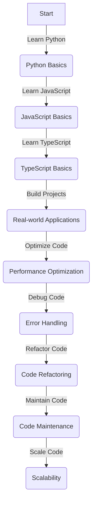

## Introduction
The journey of a software engineer often begins with learning a programming language, and for many, this journey starts with **Python**. As engineers progress in their careers, they may find themselves needing to learn additional languages, such as **JavaScript** and **TypeScript**, to stay competitive in the industry. In this article, we will explore the path of learning Python, JavaScript, and TypeScript, and provide guidance on how to navigate this journey.

> **Note:** Mastering multiple programming languages can significantly enhance an engineer's career prospects and versatility. 

## Core Concepts
To understand the basics of Python, JavaScript, and TypeScript, let's first define what each language is and its primary use cases:
- **Python**: A high-level, interpreted language known for its simplicity and readability. Python is often used in data science, machine learning, and web development.
- **JavaScript**: A high-level, dynamic language primarily used for client-side scripting on the web. However, with the advent of Node.js, JavaScript is now also used for server-side development.
- **TypeScript**: A statically typed language that is a superset of JavaScript. TypeScript is designed to help developers catch errors early and improve code maintainability, making it an attractive choice for large-scale applications.

> **Tip:** When learning a new language, it's essential to understand its core concepts, such as data types, control structures, functions, and object-oriented programming principles.

## How It Works Internally
Let's delve into the internal workings of each language:
- **Python**: Python code is compiled into bytecode, which is then executed by the Python interpreter. This process involves several steps, including lexing, parsing, and execution.
- **JavaScript**: JavaScript code is executed by web browsers or Node.js. The execution process involves parsing, compilation, and interpretation.
- **TypeScript**: TypeScript code is compiled into JavaScript, which can then be executed by web browsers or Node.js. The compilation process involves type checking and transpilation.

> **Warning:** Understanding the internal workings of a language is crucial for optimizing performance and debugging code.

## Code Examples
Here are three code examples to demonstrate the progression from basic to advanced:
### Example 1: Basic Python
```python
# Basic Python example: printing "Hello, World!"
def print_hello():
    print("Hello, World!")

print_hello()
```
### Example 2: Real-world JavaScript
```javascript
// Real-world JavaScript example: creating a to-do list app
class ToDoList {
    constructor() {
        this.tasks = [];
    }

    addTask(task) {
        this.tasks.push(task);
    }

    removeTask(task) {
        const index = this.tasks.indexOf(task);
        if (index !== -1) {
            this.tasks.splice(index, 1);
        }
    }
}

const toDoList = new ToDoList();
toDoList.addTask("Buy milk");
toDoList.removeTask("Buy milk");
```
### Example 3: Advanced TypeScript
```typescript
// Advanced TypeScript example: using generics and interfaces
interface Container<T> {
    value: T;
}

class GenericContainer<T> implements Container<T> {
    value: T;

    constructor(value: T) {
        this.value = value;
    }
}

const stringContainer = new GenericContainer<string>("Hello, World!");
console.log(stringContainer.value);
```
> **Interview:** Be prepared to answer questions about the differences between Python, JavaScript, and TypeScript, as well as their use cases and advantages.

## Visual Diagram

This diagram illustrates the learning path from Python to JavaScript to TypeScript, with a focus on building real-world applications, optimizing performance, and maintaining code.

## Comparison
| Language | Time Complexity | Space Complexity | Pros | Cons | Best For |
|----------|----------------|-----------------|------|------|----------|
| Python | O(1) - O(n^3) | O(1) - O(n) | Easy to learn, versatile | Slow performance, limited multithreading | Data science, web development |
| JavaScript | O(1) - O(n^3) | O(1) - O(n) | Ubiquitous, dynamic | Security concerns, browser limitations | Web development, client-side scripting |
| TypeScript | O(1) - O(n^3) | O(1) - O(n) | Statically typed, maintainable | Steeper learning curve, compatibility issues | Large-scale applications, enterprise development |

> **Tip:** When choosing a language, consider the trade-offs between time and space complexity, as well as the language's pros and cons.

## Real-world Use Cases
Here are three real-world examples of companies using Python, JavaScript, and TypeScript:
- **Instagram**: Uses Python for its backend services, including user authentication and content processing.
- **Google**: Uses JavaScript for its client-side scripting, including Google Maps and Google Docs.
- **Microsoft**: Uses TypeScript for its large-scale applications, including Visual Studio Code and Azure.

> **Note:** These examples demonstrate the versatility and adoption of Python, JavaScript, and TypeScript in the industry.

## Common Pitfalls
Here are four common mistakes to avoid when learning Python, JavaScript, and TypeScript:
- **Inconsistent indentation**: In Python, inconsistent indentation can lead to syntax errors. In JavaScript and TypeScript, it can lead to confusing code.
- **Undefined variables**: In JavaScript, undefined variables can cause runtime errors. In TypeScript, the type checker can help prevent these errors.
- **Memory leaks**: In JavaScript, memory leaks can occur when objects are not properly garbage collected. In TypeScript, the type system can help prevent these leaks.
- **Compatibility issues**: When using TypeScript, compatibility issues can arise when working with JavaScript libraries or frameworks.

> **Warning:** Be aware of these common pitfalls to avoid debugging headaches and ensure smooth development.

## Interview Tips
Here are three common interview questions and tips for answering them:
- **What is the difference between Python and JavaScript?**: A strong answer should highlight the differences in syntax, use cases, and performance.
- **How do you handle errors in TypeScript?**: A strong answer should demonstrate knowledge of TypeScript's error handling mechanisms, including try-catch blocks and error types.
- **Can you explain the concept of type inference in TypeScript?**: A strong answer should show an understanding of type inference, including its benefits and limitations.

> **Interview:** Practice answering these questions to demonstrate your knowledge and expertise in Python, JavaScript, and TypeScript.

## Key Takeaways
Here are ten key takeaways to remember:
* Python is a high-level, interpreted language ideal for data science and web development.
* JavaScript is a dynamic language primarily used for client-side scripting on the web.
* TypeScript is a statically typed language that is a superset of JavaScript, ideal for large-scale applications.
* Mastering multiple programming languages can enhance career prospects and versatility.
* Understanding the internal workings of a language is crucial for optimizing performance and debugging code.
* Python's syntax is known for its simplicity and readability.
* JavaScript's ubiquity and dynamic nature make it a popular choice for web development.
* TypeScript's statically typed nature and maintainability make it an attractive choice for large-scale applications.
* Real-world examples demonstrate the adoption and versatility of Python, JavaScript, and TypeScript in the industry.
* Common pitfalls, such as inconsistent indentation and undefined variables, should be avoided to ensure smooth development.