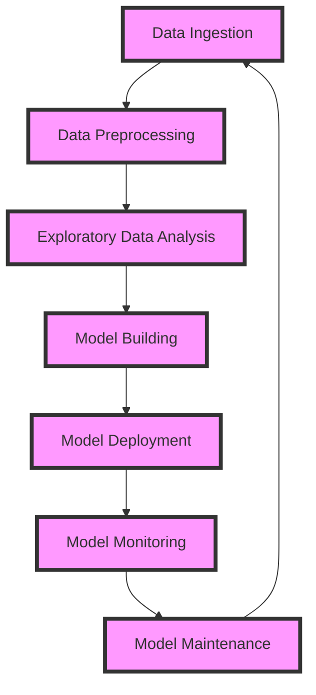

## Introduction
The Data Scientist path is a journey that takes you from the basics of **Python** programming to the advanced world of **Deep Learning**. This path is crucial for anyone who wants to work in the field of data science, as it provides a solid foundation in the tools and techniques used to extract insights from data. In real-world scenarios, data scientists use this path to analyze and visualize data, build predictive models, and deploy them to production environments. For example, companies like **Google**, **Amazon**, and **Facebook** rely heavily on data scientists to drive their business decisions.

> **Note:** The Data Scientist path is not just about learning new tools and techniques, but also about developing a mindset that is focused on problem-solving, critical thinking, and continuous learning.

## Core Concepts
The core concepts of the Data Scientist path include:

* **Python**: a high-level programming language that is widely used in data science for its simplicity, flexibility, and large community of developers.
* **NumPy** and **Pandas**: libraries that provide support for large, multi-dimensional arrays and data structures, and are used for data manipulation and analysis.
* **Scikit-learn**: a library that provides a wide range of algorithms for machine learning, including classification, regression, clustering, and more.
* **Deep Learning**: a subfield of machine learning that involves the use of neural networks to analyze and interpret data.

> **Warning:** One of the biggest mistakes that beginners make is trying to learn too much too quickly. It's essential to focus on building a solid foundation in the basics before moving on to more advanced topics.

## How It Works Internally
Let's take a closer look at how the Data Scientist path works internally. Here's a step-by-step breakdown:

1. **Data Ingestion**: This is the process of collecting and loading data into a format that can be used for analysis.
2. **Data Preprocessing**: This involves cleaning, transforming, and preparing the data for analysis.
3. **Exploratory Data Analysis**: This is the process of using statistical and visual techniques to understand the characteristics of the data.
4. **Model Building**: This involves using machine learning algorithms to build predictive models.
5. **Model Deployment**: This is the process of deploying the model to a production environment.

> **Tip:** One of the most important things to keep in mind when working on the Data Scientist path is to always keep the end goal in mind. What problem are you trying to solve? What insights are you trying to gain?

## Code Examples
Here are three complete and runnable code examples that demonstrate the Data Scientist path:

### Example 1: Basic Data Analysis with Pandas
```python
import pandas as pd

# Load the data
data = pd.read_csv('data.csv')

# Print the first few rows of the data
print(data.head())

# Calculate the mean and standard deviation of the data
mean = data['value'].mean()
std = data['value'].std()

# Print the results
print(f'Mean: {mean}')
print(f'Standard Deviation: {std}')
```

### Example 2: Building a Predictive Model with Scikit-learn
```python
from sklearn.datasets import load_iris
from sklearn.model_selection import train_test_split
from sklearn.linear_model import LogisticRegression

# Load the iris dataset
iris = load_iris()

# Split the data into training and testing sets
X_train, X_test, y_train, y_test = train_test_split(iris.data, iris.target, test_size=0.2, random_state=42)

# Create a logistic regression model
model = LogisticRegression()

# Train the model
model.fit(X_train, y_train)

# Make predictions on the test set
predictions = model.predict(X_test)

# Print the accuracy of the model
print(f'Accuracy: {model.score(X_test, y_test)}')
```

### Example 3: Building a Deep Learning Model with Keras
```python
from keras.models import Sequential
from keras.layers import Dense
from keras.datasets import mnist
import numpy as np

# Load the MNIST dataset
(X_train, y_train), (X_test, y_test) = mnist.load_data()

# Reshape the data
X_train = X_train.reshape(-1, 784)
X_test = X_test.reshape(-1, 784)

# Normalize the data
X_train = X_train / 255.0
X_test = X_test / 255.0

# Create a deep learning model
model = Sequential()
model.add(Dense(128, activation='relu', input_shape=(784,)))
model.add(Dense(10, activation='softmax'))

# Compile the model
model.compile(loss='sparse_categorical_crossentropy', optimizer='adam', metrics=['accuracy'])

# Train the model
model.fit(X_train, y_train, epochs=10, batch_size=128)

# Make predictions on the test set
predictions = model.predict(X_test)

# Print the accuracy of the model
print(f'Accuracy: {np.mean(predictions.argmax(-1) == y_test)}')
```

## Visual Diagram

The diagram shows the different stages of the Data Scientist path, from data ingestion to model deployment and maintenance.

## Comparison
| Approach | Time Complexity | Space Complexity | Pros | Cons | Best For |
| --- | --- | --- | --- | --- | --- |
| **Pandas** | O(n) | O(n) | Easy to use, fast, and efficient | Limited functionality | Data analysis and manipulation |
| **Scikit-learn** | O(n^2) | O(n) | Wide range of algorithms, easy to use | Slow for large datasets | Machine learning and predictive modeling |
| **Deep Learning** | O(n^3) | O(n) | High accuracy, flexible, and scalable | Complex, computationally expensive | Image and speech recognition, natural language processing |
| **Spark** | O(n) | O(n) | Fast, scalable, and fault-tolerant | Steep learning curve, resource-intensive | Big data processing and analytics |

## Real-world Use Cases
Here are three real-world use cases for the Data Scientist path:

1. **Predicting Customer Churn**: A company like **AT&T** might use the Data Scientist path to build a predictive model that identifies customers who are likely to churn. The model would be trained on historical data and would use machine learning algorithms to make predictions.
2. **Image Classification**: A company like **Google** might use the Data Scientist path to build a deep learning model that classifies images into different categories. The model would be trained on a large dataset of images and would use convolutional neural networks to make predictions.
3. **Recommendation Systems**: A company like **Netflix** might use the Data Scientist path to build a recommendation system that suggests movies and TV shows to users based on their viewing history. The system would use collaborative filtering and matrix factorization to make recommendations.

## Common Pitfalls
Here are four common pitfalls that data scientists might encounter:

1. **Overfitting**: This occurs when a model is too complex and fits the training data too closely. To avoid overfitting, data scientists can use techniques like regularization and early stopping.
2. **Underfitting**: This occurs when a model is too simple and fails to capture the underlying patterns in the data. To avoid underfitting, data scientists can use techniques like feature engineering and model selection.
3. **Data Quality Issues**: This occurs when the data is noisy, missing, or inconsistent. To avoid data quality issues, data scientists can use techniques like data cleaning and data preprocessing.
4. **Model Deployment Issues**: This occurs when the model is not deployed correctly or is not monitored and maintained properly. To avoid model deployment issues, data scientists can use techniques like model serving and model monitoring.

## Interview Tips
Here are three common interview questions for data scientists, along with some tips for answering them:

1. **What is your experience with machine learning?**: This question is designed to test your knowledge of machine learning algorithms and your experience with implementing them. To answer this question, you should provide specific examples of machine learning projects you have worked on and describe your role in the project.
2. **How do you handle missing data?**: This question is designed to test your knowledge of data preprocessing and your ability to handle missing data. To answer this question, you should describe the different techniques you use to handle missing data, such as imputation and interpolation.
3. **How do you evaluate the performance of a model?**: This question is designed to test your knowledge of model evaluation metrics and your ability to interpret them. To answer this question, you should describe the different metrics you use to evaluate model performance, such as accuracy and precision.

## Key Takeaways
Here are ten key takeaways from the Data Scientist path:

* **Python** is a popular programming language for data science.
* **NumPy** and **Pandas** are essential libraries for data manipulation and analysis.
* **Scikit-learn** is a widely used library for machine learning.
* **Deep Learning** is a subfield of machine learning that involves the use of neural networks.
* **Data ingestion** is the process of collecting and loading data into a format that can be used for analysis.
* **Data preprocessing** is the process of cleaning, transforming, and preparing the data for analysis.
* **Exploratory data analysis** is the process of using statistical and visual techniques to understand the characteristics of the data.
* **Model building** is the process of using machine learning algorithms to build predictive models.
* **Model deployment** is the process of deploying the model to a production environment.
* **Model monitoring** is the process of monitoring the performance of the model and making updates as necessary.

> **Interview:** When interviewing for a data science position, be prepared to answer questions about your experience with machine learning, data preprocessing, and model deployment. Be sure to provide specific examples of projects you have worked on and describe your role in the project.