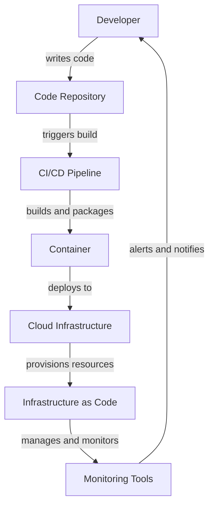

## Introduction
The DevOps path is a journey that many engineers embark on to improve their skills in development, operations, and automation. This path typically starts with **Bash**, a Unix shell scripting language, and progresses to **Python**, a popular programming language, then to **Go**, a modern language for building scalable systems, and finally to **Terraform**, a tool for infrastructure as code. In this article, we will explore the DevOps path, its relevance in the industry, and why every engineer should consider learning these skills.

> **Note:** The DevOps path is not a one-size-fits-all approach. Engineers can start at any point and progress at their own pace. However, having a solid foundation in **Bash** and **Python** is essential for success in DevOps.

The DevOps path is crucial in today's fast-paced technology landscape. With the rise of cloud computing, containerization, and microservices architecture, companies need engineers who can bridge the gap between development and operations. By learning the DevOps path, engineers can improve their skills in automation, deployment, and monitoring, making them more valuable to their organizations.

## Core Concepts
Before diving into the DevOps path, it's essential to understand the core concepts involved. These include:

* **Bash**: A Unix shell scripting language used for automating tasks, configuring systems, and managing infrastructure.
* **Python**: A popular programming language used for development, data analysis, and automation.
* **Go**: A modern language used for building scalable systems, networking, and distributed systems.
* **Terraform**: A tool for infrastructure as code, used for managing and provisioning cloud and on-premises infrastructure.

> **Tip:** Learning **Bash** and **Python** is a great starting point for any engineer interested in DevOps. These skills are essential for automating tasks, deploying applications, and monitoring systems.

Key terminology in the DevOps path includes:

* **Infrastructure as Code (IaC)**: The practice of managing and provisioning infrastructure through code, rather than manual configuration.
* **Continuous Integration/Continuous Deployment (CI/CD)**: The practice of automating testing, building, and deployment of applications.
* **Containerization**: The practice of packaging applications and their dependencies into containers, making them portable and efficient.

## How It Works Internally
The DevOps path involves a series of tools and technologies that work together to automate and streamline the development, deployment, and monitoring of applications. Here's a high-level overview of how it works:

1. **Development**: Engineers write code in languages like **Python** or **Go**, using tools like **Git** for version control.
2. **Build**: Code is built and packaged into containers using tools like **Docker**.
3. **Deployment**: Containers are deployed to cloud or on-premises infrastructure using tools like **Kubernetes** or **Terraform**.
4. **Monitoring**: Applications are monitored for performance, security, and availability using tools like **Prometheus** or **Grafana**.

> **Warning:** Manual configuration and deployment of infrastructure can lead to errors, downtime, and security vulnerabilities. Automating these processes using **Terraform** and **CI/CD** pipelines is essential for modern DevOps practices.

## Code Examples
Here are three code examples that demonstrate the DevOps path:

### Example 1: Bash Scripting
```bash
# Create a new user and add to sudo group
useradd -m -s /bin/bash newuser
usermod -aG sudo newuser

# Update package list and install Docker
apt update
apt install -y docker.io

# Start Docker service and enable on boot
systemctl start docker
systemctl enable docker
```
This script creates a new user, adds them to the sudo group, updates the package list, installs Docker, starts the Docker service, and enables it on boot.

### Example 2: Python Automation
```python
import os
import subprocess

# Define a function to deploy an application
def deploy_app(app_name):
    # Create a new directory for the application
    os.mkdir(app_name)

    # Clone the application repository
    subprocess.run(["git", "clone", f"https://github.com/{app_name}.git"])

    # Build and deploy the application using Docker
    subprocess.run(["docker", "build", "-t", app_name, "."])
    subprocess.run(["docker", "run", "-d", app_name])

# Deploy the application
deploy_app("myapp")
```
This script defines a function to deploy an application, creates a new directory, clones the application repository, builds and deploys the application using Docker.

### Example 3: Terraform Infrastructure
```terraform
# Configure the AWS provider
provider "aws" {
  region = "us-west-2"
}

# Create a new VPC
resource "aws_vpc" "myvpc" {
  cidr_block = "10.0.0.0/16"
}

# Create a new subnet
resource "aws_subnet" "mysubnet" {
  vpc_id            = aws_vpc.myvpc.id
  cidr_block        = "10.0.1.0/24"
  availability_zone = "us-west-2a"
}

# Create a new EC2 instance
resource "aws_instance" "myinstance" {
  ami           = "ami-0c94855ba95c71c99"
  instance_type = "t2.micro"
  subnet_id     = aws_subnet.mysubnet.id
}
```
This script configures the AWS provider, creates a new VPC, subnet, and EC2 instance using Terraform.

## Visual Diagram

This diagram illustrates the DevOps path, from development to deployment, and monitoring.

## Comparison
| Tool | Purpose | Time Complexity | Space Complexity | Pros | Cons |
| --- | --- | --- | --- | --- | --- |
| Bash | Scripting | O(1) | O(1) | Easy to learn, versatile | Limited functionality |
| Python | Automation | O(n) | O(n) | Easy to learn, powerful | Slow performance |
| Go | Development | O(n) | O(n) | Fast performance, concurrent | Steep learning curve |
| Terraform | Infrastructure as Code | O(n) | O(n) | Declarative, version-controlled | Complex setup |

## Real-world Use Cases
Here are three real-world use cases for the DevOps path:

1. **Netflix**: Uses **Terraform** to manage its cloud infrastructure, and **Docker** to deploy its applications.
2. **Google**: Uses **Go** to build its scalable systems, and **Kubernetes** to manage its containerized applications.
3. **Amazon**: Uses **Bash** to automate its devops tasks, and **Python** to build its machine learning models.

## Common Pitfalls
Here are four common pitfalls to avoid when following the DevOps path:

1. **Manual Configuration**: Avoid manual configuration of infrastructure, as it can lead to errors and downtime.
2. **Inadequate Monitoring**: Avoid inadequate monitoring of applications, as it can lead to performance issues and security vulnerabilities.
3. **Insufficient Testing**: Avoid insufficient testing of code, as it can lead to bugs and errors.
4. **Inadequate Version Control**: Avoid inadequate version control, as it can lead to code conflicts and lost changes.

> **Interview:** When asked about common pitfalls in DevOps, be sure to mention manual configuration, inadequate monitoring, insufficient testing, and inadequate version control.

## Interview Tips
Here are three common interview questions for DevOps engineers, along with weak and strong answers:

1. **What is DevOps?**
	* Weak answer: "DevOps is a tool or a technology."
	* Strong answer: "DevOps is a culture and a set of practices that aim to improve the collaboration and communication between development and operations teams."
2. **How do you automate deployment?**
	* Weak answer: "I use a script to deploy the application."
	* Strong answer: "I use a CI/CD pipeline to automate the build, test, and deployment of the application, using tools like **Jenkins** or **GitLab CI/CD**."
3. **What is infrastructure as code?**
	* Weak answer: "It's a way to configure infrastructure manually."
	* Strong answer: "It's a way to manage and provision infrastructure through code, using tools like **Terraform** or **CloudFormation**."

## Key Takeaways
Here are ten key takeaways from the DevOps path:

* **Bash** is a versatile scripting language for automating tasks.
* **Python** is a powerful language for automation and development.
* **Go** is a modern language for building scalable systems.
* **Terraform** is a tool for infrastructure as code.
* **CI/CD** pipelines are essential for automating deployment and testing.
* **Monitoring** is critical for ensuring performance and security.
* **Version control** is necessary for managing code changes.
* **Infrastructure as code** is a best practice for managing infrastructure.
* **Containerization** is a way to package applications and their dependencies.
* **DevOps** is a culture and a set of practices that aim to improve collaboration and communication between development and operations teams.