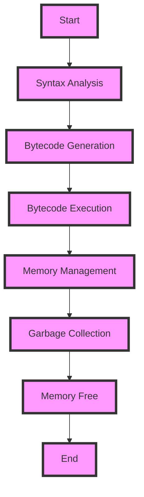

## Introduction
**Python** is a high-level, interpreted programming language that has become a staple in the industry due to its simplicity, readability, and versatility. It was created in the late 1980s by Guido van Rossum and was first released in 1991. Python is often recommended as a **first language** for beginners due to its gentle learning curve and extensive libraries, making it an ideal choice for a wide range of applications, from web development and data analysis to artificial intelligence and scientific computing. 
> **Note:** Python's simplicity and readability make it an excellent language for beginners, allowing them to focus on programming concepts without getting bogged down in complex syntax.

In real-world scenarios, Python is used by companies like **Google**, **Facebook**, and **Instagram** for various purposes, including data analysis, machine learning, and web development. Its popularity can be attributed to its large and active community, which constantly contributes to its growth and development.
> **Tip:** Python's extensive libraries and frameworks, such as **NumPy**, **pandas**, and **Django**, make it an attractive choice for beginners and experienced developers alike.

## Core Concepts
To understand Python, it's essential to grasp its core concepts, including:
* **Variables**: Used to store and manipulate data.
* **Data Types**: Python has several built-in data types, such as **int**, **float**, **str**, and **list**.
* **Control Structures**: Used to control the flow of a program, including **if-else statements**, **for loops**, and **while loops**.
* **Functions**: Reusable blocks of code that take arguments and return values.
* **Modules**: Pre-written code that can be imported into a program to perform specific tasks.

> **Warning:** Python's dynamic typing can lead to type-related errors if not managed properly. It's crucial to understand the differences between Python's built-in data types and use them correctly.

## How It Works Internally
Python's internal mechanics can be broken down into several steps:
1. **Syntax Analysis**: The Python interpreter reads the source code and checks for syntax errors.
2. **Bytecode Generation**: The interpreter converts the source code into bytecode, which is platform-independent.
3. **Bytecode Execution**: The bytecode is executed by the Python virtual machine (PVM), which performs the actual computation.
4. **Memory Management**: Python's memory management is handled by its garbage collector, which automatically frees memory occupied by unused objects.

> **Interview:** When asked about Python's internal workings, be prepared to explain the bytecode generation and execution process, as well as the role of the garbage collector in memory management.

## Code Examples
### Example 1: Basic Python Program
```python
# Print "Hello, World!" to the console
print("Hello, World!")
```
This example demonstrates the basic syntax of a Python program and how to print output to the console.

### Example 2: Data Structures and Control Structures
```python
# Create a list of numbers
numbers = [1, 2, 3, 4, 5]

# Use a for loop to iterate over the list
for num in numbers:
    if num % 2 == 0:
        print(f"{num} is even")
    else:
        print(f"{num} is odd")
```
This example showcases the use of lists, for loops, and if-else statements to perform a simple task.

### Example 3: Functions and Modules
```python
# Import the math module
import math

# Define a function to calculate the area of a circle
def calculate_circle_area(radius):
    return math.pi * (radius ** 2)

# Call the function with a radius of 5
area = calculate_circle_area(5)
print(f"The area of the circle is {area:.2f}")
```
This example demonstrates the use of functions, modules, and basic mathematical operations to calculate the area of a circle.

## Visual Diagram

This diagram illustrates the internal workings of the Python interpreter, from syntax analysis to memory management.

## Comparison
| Language | Time Complexity | Space Complexity | Pros | Cons | Best For |
| --- | --- | --- | --- | --- | --- |
| Python | O(1) - O(n) | O(1) - O(n) | Easy to learn, versatile, large community | Slow performance, limited multithreading | Web development, data analysis, machine learning |
| Java | O(1) - O(n) | O(1) - O(n) | Platform-independent, robust security, large community | Verbose syntax, slow startup | Android app development, enterprise software, web development |
| JavaScript | O(1) - O(n) | O(1) - O(n) | Dynamic, flexible, ubiquitous | Security concerns, browser dependencies | Web development, front-end development, mobile app development |
| C++ | O(1) - O(n) | O(1) - O(n) | High performance, control over memory, compiled language | Steep learning curve, error-prone, limited libraries | Operating systems, games, embedded systems |

> **Tip:** When choosing a programming language, consider the trade-offs between time and space complexity, as well as the language's strengths and weaknesses.

## Real-world Use Cases
1. **Instagram**: Uses Python for its backend services, including data analysis and machine learning.
2. **Google**: Employs Python for various tasks, such as data analysis, machine learning, and web development.
3. **Dropbox**: Utilizes Python for its file synchronization and sharing services.

## Common Pitfalls
1. **Type Errors**: Python's dynamic typing can lead to type-related errors if not managed properly.
```python
# Wrong way: Using the wrong data type
numbers = "1, 2, 3"
for num in numbers:
    print(num)

# Right way: Using the correct data type
numbers = [1, 2, 3]
for num in numbers:
    print(num)
```
2. **Memory Leaks**: Failing to manage memory properly can lead to memory leaks.
```python
# Wrong way: Creating a memory leak
numbers = []
while True:
    numbers.append(1)

# Right way: Managing memory properly
numbers = []
for i in range(10):
    numbers.append(i)
```
3. **Infinite Loops**: Failing to terminate loops can lead to infinite loops.
```python
# Wrong way: Creating an infinite loop
while True:
    print("Hello, World!")

# Right way: Terminating the loop
i = 0
while i < 10:
    print("Hello, World!")
    i += 1
```
4. **Exception Handling**: Failing to handle exceptions can lead to crashes and errors.
```python
# Wrong way: Not handling exceptions
try:
    x = 1 / 0
except:
    pass

# Right way: Handling exceptions
try:
    x = 1 / 0
except ZeroDivisionError:
    print("Cannot divide by zero!")
```

## Interview Tips
1. **What is Python?**: Be prepared to explain Python's history, features, and use cases.
2. **How does Python's memory management work?**: Understand the role of the garbage collector and how it affects memory management.
3. **What is the difference between Python 2 and Python 3?**: Know the key differences between the two versions, including syntax changes and library updates.

## Key Takeaways
* Python is a high-level, interpreted programming language with a gentle learning curve.
* Python's internal mechanics involve syntax analysis, bytecode generation, and execution.
* Python has a large and active community, with extensive libraries and frameworks.
* Python is suitable for web development, data analysis, machine learning, and scientific computing.
* Python's time and space complexity vary depending on the algorithm and data structure used.
* Python's memory management is handled by its garbage collector, which automatically frees memory occupied by unused objects.
* Python has several common pitfalls, including type errors, memory leaks, infinite loops, and exception handling issues.
* When choosing a programming language, consider the trade-offs between time and space complexity, as well as the language's strengths and weaknesses.