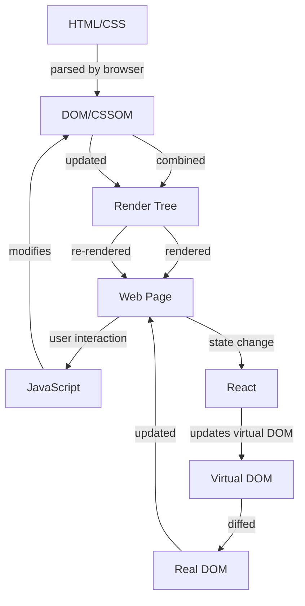

## Introduction
The **Frontend Developer Path** is a learning journey that takes you from the basics of web development to building complex user interfaces with popular libraries like React. This path is crucial for any aspiring frontend developer, as it covers the fundamental technologies used in web development, including **HTML/CSS**, **JavaScript**, **TypeScript**, and **React**. In this article, we will delve into the details of each technology, providing a comprehensive overview of the frontend developer path.

> **Note:** The frontend developer path is not a straightforward journey, and it requires dedication, persistence, and continuous learning. As a frontend developer, you will encounter various challenges, from designing responsive layouts to optimizing complex applications.

## Core Concepts
To become a proficient frontend developer, you need to understand the core concepts of each technology in the path.

* **HTML/CSS**: HyperText Markup Language (HTML) is used for structuring content on the web, while Cascading Style Sheets (CSS) is used for styling and layout. HTML provides the structure, and CSS provides the visual presentation.
* **JavaScript**: JavaScript is a programming language used for adding interactivity to web pages. It allows you to create dynamic effects, animate elements, and respond to user interactions.
* **TypeScript**: TypeScript is a superset of JavaScript that adds optional static typing and other features to improve the development experience. It helps you catch errors early and improves code maintainability.
* **React**: React is a JavaScript library for building user interfaces. It allows you to break down complex interfaces into smaller, reusable components, making it easier to manage and maintain your codebase.

> **Tip:** When learning the frontend developer path, it's essential to focus on building projects and experimenting with different technologies. This hands-on approach will help you solidify your understanding of each concept and develop practical skills.

## How It Works Internally
Let's take a closer look at how each technology works internally.

* **HTML/CSS**: When a user requests a web page, the browser sends a request to the server, which returns the HTML and CSS files. The browser then parses the HTML and CSS, creating a Document Object Model (DOM) and a CSS Object Model (CSSOM). The DOM and CSSOM are then combined to create a render tree, which is used to render the web page.
* **JavaScript**: When JavaScript is executed, it creates a runtime environment that interacts with the DOM and CSSOM. JavaScript code can modify the DOM and CSSOM, allowing you to create dynamic effects and respond to user interactions.
* **TypeScript**: TypeScript compiles to JavaScript, so it works internally in a similar way. However, TypeScript adds an additional layer of checking and optimization, which helps catch errors and improve code maintainability.
* **React**: React uses a virtual DOM (a lightweight in-memory representation of the real DOM) to optimize rendering and reduce the number of DOM mutations. When the state of a component changes, React updates the virtual DOM, which is then used to update the real DOM.

> **Warning:** When working with React, it's essential to understand the concept of state and props. State is used to store data that changes over time, while props are used to pass data from a parent component to a child component. Misusing state and props can lead to unexpected behavior and bugs.

## Code Examples
Here are three complete and runnable code examples that demonstrate the progression from HTML/CSS to JavaScript to TypeScript to React.

### Example 1: Basic HTML/CSS
```html
<!-- index.html -->
<!DOCTYPE html>
<html lang="en">
<head>
    <meta charset="UTF-8">
    <meta name="viewport" content="width=device-width, initial-scale=1.0">
    <title>Basic HTML/CSS</title>
    <link rel="stylesheet" href="styles.css">
</head>
<body>
    <h1>Hello World!</h1>
</body>
</html>
```

```css
/* styles.css */
body {
    background-color: #f2f2f2;
    font-family: Arial, sans-serif;
}

h1 {
    color: #00698f;
}
```

### Example 2: JavaScript Calculator
```javascript
// calculator.js
class Calculator {
    constructor() {
        this.result = 0;
    }

    add(num) {
        this.result += num;
    }

    subtract(num) {
        this.result -= num;
    }

    multiply(num) {
        this.result *= num;
    }

    divide(num) {
        if (num !== 0) {
            this.result /= num;
        } else {
            throw new Error("Cannot divide by zero!");
        }
    }

    getResult() {
        return this.result;
    }
}

const calculator = new Calculator();
calculator.add(10);
calculator.subtract(5);
calculator.multiply(2);
console.log(calculator.getResult()); // Output: 10
```

### Example 3: React Todo List
```typescript
// TodoList.tsx
import * as React from 'react';

interface Todo {
    id: number;
    text: string;
    completed: boolean;
}

interface TodoListProps {
    todos: Todo[];
    onToggleCompleted: (id: number) => void;
}

const TodoList: React.FC<TodoListProps> = ({ todos, onToggleCompleted }) => {
    return (
        <ul>
            {todos.map((todo) => (
                <li key={todo.id}>
                    <input
                        type="checkbox"
                        checked={todo.completed}
                        onChange={() => onToggleCompleted(todo.id)}
                    />
                    <span style={{ textDecoration: todo.completed ? 'line-through' : 'none' }}>
                        {todo.text}
                    </span>
                </li>
            ))}
        </ul>
    );
};

export default TodoList;
```

## Visual Diagram

This diagram illustrates the flow of data from HTML/CSS to the browser's rendering engine, and then to JavaScript and React.

## Comparison
| Approach | Time Complexity | Space Complexity | Pros | Cons | Best For |
| --- | --- | --- | --- | --- | --- |
| HTML/CSS | O(1) | O(1) | Fast, easy to learn | Limited interactivity | Static websites, simple web pages |
| JavaScript | O(n) | O(n) | Dynamic, interactive | Can be slow, complex | Dynamic web pages, web applications |
| TypeScript | O(n) | O(n) | Type-safe, maintainable | Steeper learning curve | Large-scale web applications, enterprise software |
| React | O(n) | O(n) | Efficient, scalable | Complex, requires expertise | Complex web applications, large-scale enterprise software |

## Real-world Use Cases
Here are three real-world use cases for the frontend developer path:

1. **Airbnb**: Airbnb's website is built using React, and it features a complex user interface with multiple components, including a map view, a list view, and a booking form.
2. **Facebook**: Facebook's website is built using a combination of HTML/CSS, JavaScript, and React. It features a complex news feed, a messaging system, and a variety of interactive components.
3. **Dropbox**: Dropbox's website is built using a combination of HTML/CSS, JavaScript, and React. It features a simple and intuitive user interface, with a focus on file sharing and collaboration.

> **Interview:** When interviewing for a frontend developer position, be prepared to answer questions about your experience with HTML/CSS, JavaScript, and React. Be sure to highlight your understanding of state and props in React, as well as your experience with debugging and optimizing complex web applications.

## Common Pitfalls
Here are four common pitfalls to watch out for when working on the frontend developer path:

1. **Misusing state and props in React**: Make sure to understand the difference between state and props, and use them correctly in your React components.
2. **Not optimizing JavaScript code**: Make sure to optimize your JavaScript code for performance, using techniques such as memoization and caching.
3. **Not testing code thoroughly**: Make sure to test your code thoroughly, using a combination of unit tests, integration tests, and end-to-end tests.
4. **Not following best practices for HTML/CSS**: Make sure to follow best practices for HTML/CSS, including using semantic HTML, avoiding inline styles, and using a preprocessor like Sass or Less.

> **Tip:** When working on a complex web application, make sure to use a version control system like Git to track changes and collaborate with other developers.

## Interview Tips
Here are three common interview questions for frontend developer positions, along with tips for answering them:

1. **What is the difference between var, let, and const in JavaScript?**: Make sure to explain the differences between var, let, and const, including their scope and hoisting behavior.
2. **How do you optimize the performance of a React application?**: Make sure to explain techniques such as memoization, caching, and code splitting, as well as how to use the React DevTools to identify performance bottlenecks.
3. **How do you handle errors and debugging in a complex web application?**: Make sure to explain your approach to error handling and debugging, including how to use tools like the browser console and a debugger.

## Key Takeaways
Here are ten key takeaways from the frontend developer path:

* **HTML/CSS is the foundation of web development**: Make sure to understand the basics of HTML/CSS, including semantic HTML and CSS layout.
* **JavaScript is a powerful programming language**: Make sure to understand the basics of JavaScript, including variables, data types, and control structures.
* **TypeScript is a superset of JavaScript**: Make sure to understand the benefits of using TypeScript, including type safety and improved maintainability.
* **React is a popular JavaScript library**: Make sure to understand the basics of React, including components, state, and props.
* **Optimizing performance is crucial**: Make sure to understand techniques for optimizing performance, including memoization, caching, and code splitting.
* **Debugging and error handling are essential**: Make sure to understand how to handle errors and debug complex web applications.
* **Best practices are important**: Make sure to follow best practices for HTML/CSS, JavaScript, and React, including using semantic HTML and avoiding inline styles.
* **Version control is essential**: Make sure to use a version control system like Git to track changes and collaborate with other developers.
* **Continuous learning is necessary**: Make sure to stay up-to-date with the latest developments in web development, including new technologies and best practices.
* **Practice and experimentation are key**: Make sure to practice and experiment with different technologies and techniques to solidify your understanding and develop practical skills.