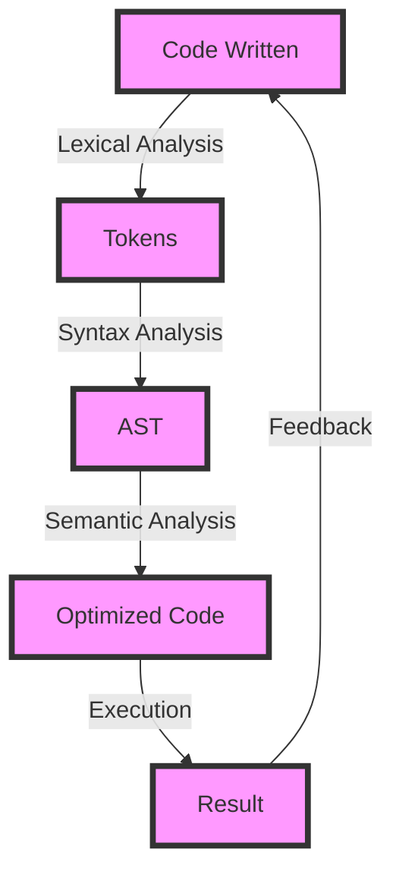

## Introduction
JavaScript is a **high-level**, **dynamic**, and **interpreted** programming language that is primarily used for **client-side** scripting on the web. It is a crucial part of the web development process, as it allows developers to create **interactive** and **dynamic** web pages. JavaScript is also used for **server-side** programming with technologies like **Node.js**, and for **mobile** and **desktop** application development. In this study guide, we will focus on JavaScript for web development, exploring its core concepts, internal mechanics, and best practices.

> **Note:** JavaScript is often confused with Java, but they are two distinct languages. Java is a **statically-typed** language, while JavaScript is **dynamically-typed**.

## Core Concepts
JavaScript is built around several core concepts, including:

* **Variables**: JavaScript uses **let**, **const**, and **var** to declare variables. **Let** and **const** are **block-scoped**, while **var** is **function-scoped**.
* **Data Types**: JavaScript has several built-in data types, including **Number**, **String**, **Boolean**, **Array**, **Object**, and **Null**.
* **Functions**: JavaScript functions are **first-class citizens**, meaning they can be assigned to variables, passed as arguments, and returned from other functions.
* **Object-Oriented Programming (OOP)**: JavaScript supports OOP concepts like **inheritance**, **polymorphism**, and **encapsulation** through **prototypes** and **classes**.

> **Tip:** Understanding the differences between **let**, **const**, and **var** is crucial for writing efficient and bug-free JavaScript code.

## How It Works Internally
When a JavaScript file is executed, the browser or Node.js environment performs the following steps:

1. **Lexical Analysis**: The code is broken down into individual tokens, such as keywords, identifiers, and symbols.
2. **Syntax Analysis**: The tokens are parsed into an **Abstract Syntax Tree (AST)**, which represents the code's syntax and structure.
3. **Semantic Analysis**: The AST is analyzed for semantic errors, such as type mismatches and undefined variables.
4. **Optimization**: The code is optimized for performance, including **minification**, **compression**, and **caching**.
5. **Execution**: The optimized code is executed by the JavaScript engine, which performs the actual computations and interactions with the environment.

> **Warning:** JavaScript's dynamic nature and lack of explicit type definitions can lead to **type-related errors** and **security vulnerabilities** if not handled properly.

## Code Examples
### Example 1: Basic JavaScript
```javascript
// Define a variable and assign a value
let name = 'John Doe';

// Define a function and call it
function greet(name) {
  console.log(`Hello, ${name}!`);
}
greet(name);
```
### Example 2: JavaScript Object-Oriented Programming
```javascript
// Define a class and create an instance
class Person {
  constructor(name, age) {
    this.name = name;
    this.age = age;
  }

  greet() {
    console.log(`Hello, my name is ${this.name} and I am ${this.age} years old.`);
  }
}
const person = new Person('Jane Doe', 30);
person.greet();
```
### Example 3: Advanced JavaScript with Async/Await
```javascript
// Define an asynchronous function and use async/await
async function fetchData(url) {
  try {
    const response = await fetch(url);
    const data = await response.json();
    console.log(data);
  } catch (error) {
    console.error(error);
  }
}
fetchData('https://api.example.com/data');
```
> **Interview:** Can you explain the differences between **async/await** and **callbacks** in JavaScript?

## Visual Diagram

The diagram illustrates the internal mechanics of JavaScript execution, from code writing to result generation.

## Comparison
| Approach | Time Complexity | Space Complexity | Pros | Cons | Best For |
| --- | --- | --- | --- | --- | --- |
| **JavaScript** | O(1) - O(n) | O(1) - O(n) | Dynamic, flexible, and widely adopted | Security vulnerabilities, performance issues | Web development, mobile app development |
| **TypeScript** | O(1) - O(n) | O(1) - O(n) | Statically typed, better code completion, and error checking | Steeper learning curve, compatibility issues | Large-scale web applications, enterprise software development |
| **CoffeeScript** | O(1) - O(n) | O(1) - O(n) | Simplified syntax, improved readability, and faster development | Compatibility issues, limited adoption | Rapid prototyping, small-scale web development |
| **Dart** | O(1) - O(n) | O(1) - O(n) | Statically typed, high-performance, and secure | Limited adoption, compatibility issues | Mobile app development, web development |

> **Tip:** Choosing the right programming language depends on the project's specific needs, scalability requirements, and development team expertise.

## Real-world Use Cases
1. **Google**: Uses JavaScript for its web applications, including Google Maps, Google Drive, and Google Docs.
2. **Facebook**: Employs JavaScript for its web platform, including the news feed, messaging, and advertising systems.
3. **Netflix**: Utilizes JavaScript for its web application, including the user interface, playback, and recommendation systems.

> **Note:** JavaScript is widely adopted in the industry due to its flexibility, dynamic nature, and extensive ecosystem of libraries and frameworks.

## Common Pitfalls
1. **Type-related errors**: JavaScript's dynamic typing can lead to type mismatches and errors if not handled properly.
```javascript
// Wrong
let name = 'John';
name = 30; // Error: cannot assign number to string

// Right
let name: string = 'John';
name = 'Jane'; // OK
```
2. **Security vulnerabilities**: JavaScript's client-side execution and lack of explicit type definitions can lead to security vulnerabilities if not addressed.
```javascript
// Wrong
const userInput = document.getElementById('input').value;
eval(userInput); // Security vulnerability: code injection

// Right
const userInput = document.getElementById('input').value;
const sanitizedInput = userInput.replace(/[^a-zA-Z0-9]/g, '');
eval(sanitizedInput); // Safer, but still not recommended
```
3. **Performance issues**: JavaScript's dynamic nature and lack of explicit optimization can lead to performance issues if not addressed.
```javascript
// Wrong
for (let i = 0; i < 1000000; i++) {
  console.log(i);
}

// Right
for (let i = 0; i < 1000000; i++) {
  // Use a more efficient logging mechanism, such as a buffer
}
```
4. **Compatibility issues**: JavaScript's evolving nature and varying browser support can lead to compatibility issues if not addressed.
```javascript
// Wrong
const supportsES6 = true;
if (supportsES6) {
  // Use ES6 features
} else {
  // Fallback to older features
}

// Right
const supportsES6 = 'let' in globalThis;
if (supportsES6) {
  // Use ES6 features
} else {
  // Fallback to older features
}
```
> **Warning:** JavaScript's dynamic nature and lack of explicit type definitions require careful handling to avoid type-related errors, security vulnerabilities, performance issues, and compatibility problems.

## Interview Tips
1. **What is the difference between null and undefined in JavaScript?**
	* Weak answer: "Null is when a variable has no value, and undefined is when a variable is not defined."
	* Strong answer: "Null is a primitive value that represents the absence of any object value, while undefined is a primitive value that represents an uninitialized variable or a non-existent property."
2. **How do you handle errors in JavaScript?**
	* Weak answer: "I use try-catch blocks to catch errors."
	* Strong answer: "I use try-catch blocks to catch errors, and I also use error handling mechanisms like error callbacks, promises, and async/await to handle errors in a more robust and scalable way."
3. **What is the difference between a macro and a function in JavaScript?**
	* Weak answer: "A macro is like a function, but it's faster."
	* Strong answer: "A macro is a compile-time construct that generates code at compile time, while a function is a runtime construct that executes code at runtime. Macros are not supported in JavaScript, but functions are a fundamental building block of the language."

> **Interview:** Can you explain the concept of **hoisting** in JavaScript and provide an example?

## Key Takeaways
* JavaScript is a **high-level**, **dynamic**, and **interpreted** programming language.
* JavaScript is primarily used for **client-side** scripting on the web, but it's also used for **server-side** programming with Node.js and for **mobile** and **desktop** application development.
* Understanding the differences between **let**, **const**, and **var** is crucial for writing efficient and bug-free JavaScript code.
* JavaScript's dynamic nature and lack of explicit type definitions require careful handling to avoid type-related errors, security vulnerabilities, performance issues, and compatibility problems.
* Choosing the right programming language depends on the project's specific needs, scalability requirements, and development team expertise.
* JavaScript is widely adopted in the industry due to its flexibility, dynamic nature, and extensive ecosystem of libraries and frameworks.
* Error handling, security, and performance optimization are critical aspects of JavaScript development.
* Understanding the concepts of **hoisting**, **closures**, and **this** is essential for writing efficient and effective JavaScript code.