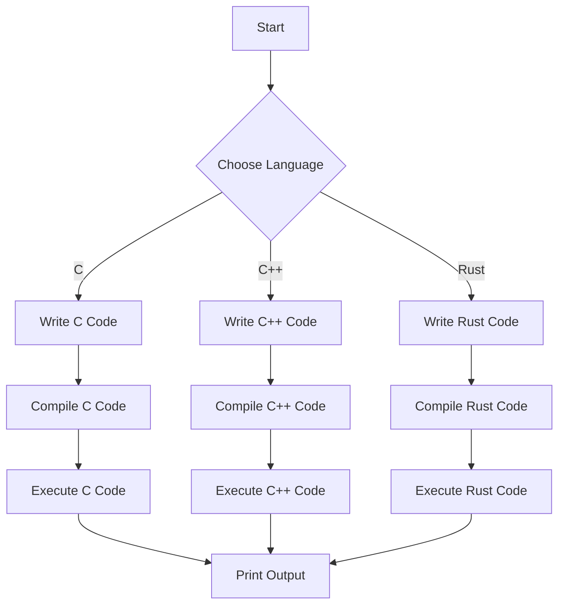

## Introduction
The systems programmer path is a journey that takes developers from the basics of **C** to the intermediate level of **C++**, and finally to the advanced level of **Rust**. This path is essential for any developer who wants to work on systems programming, which involves building low-level software that interacts directly with computer hardware. Systems programming is a crucial aspect of computer science, as it provides the foundation for operating systems, device drivers, and other low-level software. In this section, we will explore the importance of systems programming and why every engineer should know about it. 
> **Note:** Systems programming is a complex and challenging field that requires a deep understanding of computer architecture, operating systems, and programming languages.

## Core Concepts
To become a systems programmer, one needs to have a solid understanding of the core concepts of **C**, **C++**, and **Rust**. These concepts include:
* **Memory management**: The ability to manage memory manually using pointers, which is essential for systems programming.
* **Data structures**: The knowledge of data structures such as arrays, linked lists, and trees, which are used to store and manipulate data.
* **Algorithms**: The understanding of algorithms such as sorting, searching, and graph traversal, which are used to solve complex problems.
* **Concurrency**: The ability to write concurrent programs that can execute multiple tasks simultaneously, which is essential for systems programming.
> **Warning:** Systems programming can be error-prone, and small mistakes can lead to significant consequences, such as system crashes or security vulnerabilities.

## How It Works Internally
Let's take a look at how **C**, **C++**, and **Rust** work internally. 
* **C**: C is a low-level language that provides direct access to memory using pointers. The C compiler translates C code into assembly code, which is then executed by the computer's processor.
* **C++**: C++ is an object-oriented language that provides a higher level of abstraction than C. The C++ compiler translates C++ code into assembly code, which is then executed by the computer's processor.
* **Rust**: Rust is a systems programming language that provides memory safety guarantees using its ownership system. The Rust compiler translates Rust code into assembly code, which is then executed by the computer's processor.
> **Tip:** Understanding how programming languages work internally can help developers write more efficient and effective code.

## Code Examples
Here are three code examples that demonstrate the use of **C**, **C++**, and **Rust**:
### Example 1: Basic C Program
```c
#include <stdio.h>

int main() {
    printf("Hello, World!\n");
    return 0;
}
```
This is a basic C program that prints "Hello, World!" to the console.
### Example 2: C++ Program with Classes
```cpp
#include <iostream>

class Person {
public:
    Person(std::string name, int age) {
        this->name = name;
        this->age = age;
    }

    void printInfo() {
        std::cout << "Name: " << name << ", Age: " << age << std::endl;
    }

private:
    std::string name;
    int age;
};

int main() {
    Person person("John Doe", 30);
    person.printInfo();
    return 0;
}
```
This is a C++ program that defines a `Person` class with a constructor, a `printInfo` method, and private member variables.
### Example 3: Rust Program with Ownership
```rust
fn main() {
    let s = String::from("Hello, World!");
    let len = calculate_length(&s);
    println!("The length of '{}' is {}.", s, len);
}

fn calculate_length(s: &String) -> usize {
    s.len()
}
```
This is a Rust program that demonstrates the use of ownership and borrowing. The `calculate_length` function takes a reference to a `String` and returns its length.
> **Interview:** Can you explain the concept of ownership in Rust and how it provides memory safety guarantees?

## Visual Diagram

This diagram illustrates the process of choosing a programming language, writing code, compiling it, and executing it.
> **Note:** The choice of programming language depends on the specific requirements of the project and the preferences of the developer.

## Comparison
Here is a comparison of **C**, **C++**, and **Rust**:
| Language | Time Complexity | Space Complexity | Pros | Cons | Best For |
| --- | --- | --- | --- | --- | --- |
| C | O(1) | O(1) | Low-level memory management, fast execution | Error-prone, lack of high-level abstractions | Systems programming, embedded systems |
| C++ | O(1) | O(1) | Object-oriented programming, high-level abstractions | Complex syntax, error-prone | Systems programming, game development |
| Rust | O(1) | O(1) | Memory safety guarantees, high-level abstractions | Steep learning curve, limited libraries | Systems programming, web development |
> **Tip:** The choice of programming language depends on the specific requirements of the project and the preferences of the developer.

## Real-world Use Cases
Here are three real-world use cases of **C**, **C++**, and **Rust**:
* **C**: The Linux kernel is written in C and provides a stable and efficient operating system for a wide range of devices.
* **C++**: The Google Chrome browser is written in C++ and provides a fast and secure web browsing experience for millions of users.
* **Rust**: The Dropbox file synchronization service is written in Rust and provides a secure and efficient way to synchronize files across devices.
> **Warning:** Systems programming can be challenging and requires a deep understanding of computer architecture, operating systems, and programming languages.

## Common Pitfalls
Here are four common pitfalls to avoid when working with **C**, **C++**, and **Rust**:
* **Null pointer dereferences**: In C and C++, null pointer dereferences can cause segmentation faults and crashes.
* **Memory leaks**: In C and C++, memory leaks can cause memory to be wasted and can lead to performance issues.
* **Data races**: In C++ and Rust, data races can cause undefined behavior and crashes.
* **Ownership issues**: In Rust, ownership issues can cause compile-time errors and can lead to memory safety issues.
> **Interview:** Can you explain the concept of a null pointer dereference and how to avoid it in C and C++?

## Interview Tips
Here are three common interview questions and tips for answering them:
* **What is the difference between C and C++?**: The difference between C and C++ is that C++ provides object-oriented programming features and high-level abstractions, while C provides low-level memory management and fast execution.
* **How do you avoid memory leaks in C and C++?**: To avoid memory leaks in C and C++, use smart pointers and containers that manage memory automatically.
* **What is the concept of ownership in Rust?**: The concept of ownership in Rust is that each value has an owner that is responsible for deallocating it when it is no longer needed.
> **Tip:** Practice answering common interview questions and be prepared to explain complex concepts in simple terms.

## Key Takeaways
Here are ten key takeaways to remember:
* **C** is a low-level language that provides direct access to memory using pointers.
* **C++** is an object-oriented language that provides high-level abstractions and fast execution.
* **Rust** is a systems programming language that provides memory safety guarantees using its ownership system.
* **Memory management** is essential for systems programming and requires a deep understanding of computer architecture and operating systems.
* **Data structures** and **algorithms** are used to solve complex problems in systems programming.
* **Concurrency** is essential for systems programming and requires a deep understanding of parallel programming and synchronization.
* **Error handling** is critical in systems programming and requires a deep understanding of error types and handling mechanisms.
* **Security** is essential in systems programming and requires a deep understanding of security threats and mitigation strategies.
* **Performance optimization** is critical in systems programming and requires a deep understanding of performance bottlenecks and optimization techniques.
* **Testing and debugging** are essential in systems programming and require a deep understanding of testing frameworks and debugging tools.
> **Note:** Systems programming is a complex and challenging field that requires a deep understanding of computer science concepts and programming languages.