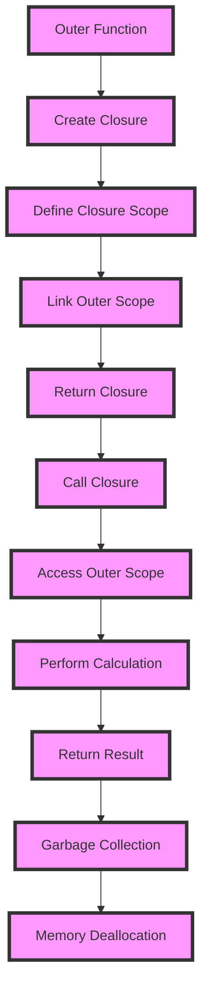

## Introduction
**Closures** and **lambdas** are fundamental concepts in programming that enable developers to write concise, expressive, and efficient code. A closure is a function that has access to its own scope, as well as the scope of its outer functions, even when the outer function has returned. A lambda, also known as an anonymous function, is a small, single-purpose function that can be defined inline within a larger expression. In this section, we will explore the importance of closures and lambdas, their real-world relevance, and why every engineer needs to know about them.

Closures and lambdas are essential in modern programming languages, as they enable developers to write functional, modular, and reusable code. They are used extensively in various domains, including web development, data science, and machine learning. For instance, in web development, closures are used to create private variables and functions, while lambdas are used to handle events and create concise callback functions.

> **Note:** Closures and lambdas are not unique to any particular programming language, but their implementation and usage may vary across languages.

## Core Concepts
To understand closures and lambdas, it's essential to grasp the following core concepts:

* **Scope**: The region of the code where a variable or function is defined and can be accessed.
* **Closure**: A function that has access to its own scope, as well as the scope of its outer functions, even when the outer function has returned.
* **Lambda**: An anonymous function that can be defined inline within a larger expression.
* **Higher-order function**: A function that takes another function as an argument or returns a function as a result.

Mental models and analogies can help make these concepts more intuitive. For example, consider a closure as a house with its own private rooms (local scope) and a shared backyard (outer scope). The house (closure) has access to both its private rooms and the shared backyard, even when the outer function (the neighborhood) has returned.

## How It Works Internally
To understand how closures and lambdas work internally, let's dive into the under-the-hood mechanics of how they are implemented in programming languages.

When a closure is created, the programming language allocates memory for the closure's scope, which includes the variables and functions defined within the closure. The closure's scope is linked to the outer function's scope, allowing the closure to access variables and functions from the outer scope.

When a lambda is defined, the programming language creates a new function object that contains the lambda's code and scope. The lambda's scope is linked to the surrounding scope, allowing the lambda to access variables and functions from the surrounding context.

> **Warning:** Closures and lambdas can lead to memory leaks if not managed properly, as they can retain references to outer scopes and prevent garbage collection.

## Code Examples
Here are three complete, runnable code examples that demonstrate the usage of closures and lambdas:

### Example 1: Basic Closure (JavaScript)
```javascript
// Define a outer function
function outer() {
  let counter = 0;
  // Define a closure that increments the counter
  function inner() {
    counter++;
    console.log(counter);
  }
  return inner;
}

// Create a closure
const closure = outer();
closure(); // Output: 1
closure(); // Output: 2
```
### Example 2: Lambda Expression (Python)
```python
# Define a list of numbers
numbers = [1, 2, 3, 4, 5]
# Use a lambda to filter even numbers
even_numbers = list(filter(lambda x: x % 2 == 0, numbers))
print(even_numbers)  # Output: [2, 4]
```
### Example 3: Advanced Closure (Java)
```java
// Define a functional interface
interface Calculator {
  int calculate(int a, int b);
}

// Define a closure that implements the Calculator interface
Calculator adder = (a, b) -> a + b;
Calculator multiplier = (a, b) -> a * b;

// Use the closures to perform calculations
System.out.println(adder.calculate(2, 3));  // Output: 5
System.out.println(multiplier.calculate(2, 3));  // Output: 6
```
## Visual Diagram

The diagram illustrates the creation and execution of a closure, including the linking of outer scopes and the access to variables and functions from the outer scope.

## Comparison
| Approach | Time Complexity | Space Complexity | Pros | Cons | Best For |
| --- | --- | --- | --- | --- | --- |
| Closures | O(1) | O(n) | Encapsulate data, create private variables | Memory leaks, complex scope management | Web development, data science |
| Lambdas | O(1) | O(1) | Concise, single-purpose functions | Limited scope, no state management | Event handling, callback functions |
| Higher-order functions | O(n) | O(n) | Abstract functions, modular code | Complex implementation, performance overhead | Functional programming, data processing |

> **Tip:** Choose the approach that best fits the problem domain and performance requirements.

## Real-world Use Cases
Here are three concrete production examples of closures and lambdas:

1. **Google Maps**: Uses closures to create private variables and functions for map rendering and event handling.
2. **Apache Spark**: Employs lambdas to create concise, single-purpose functions for data processing and transformation.
3. **React**: Utilizes closures to create private variables and functions for component state management and event handling.

## Common Pitfalls
Here are four specific mistakes that engineers make when working with closures and lambdas:

1. **Memory leaks**: Failing to manage closure scope and retain references to outer scopes, leading to memory leaks.
2. **Scope confusion**: Misunderstanding the scope of variables and functions within closures and lambdas, leading to unexpected behavior.
3. **Performance overhead**: Using closures and lambdas excessively, leading to performance overhead and slow code execution.
4. **Complex implementation**: Over-complicating closure and lambda implementation, leading to difficult maintenance and debugging.

> **Interview:** Be prepared to explain the trade-offs between closures and lambdas, and how to manage scope and performance in real-world applications.

## Interview Tips
Here are three common interview questions on closures and lambdas, along with weak and strong answers:

1. **What is the difference between a closure and a lambda?**
	* Weak answer: "A closure is a function that returns a function, while a lambda is a small, anonymous function."
	* Strong answer: "A closure is a function that has access to its own scope and the scope of its outer functions, while a lambda is a concise, single-purpose function that can be defined inline. Closures are used for encapsulation and abstraction, while lambdas are used for event handling and callback functions."
2. **How do you manage scope in closures and lambdas?**
	* Weak answer: "I use `this` and `that` to manage scope."
	* Strong answer: "I use a combination of scope chains, closures, and lambdas to manage scope. I ensure that variables and functions are defined in the correct scope and that closures and lambdas are properly linked to their outer scopes."
3. **What are the performance implications of using closures and lambdas?**
	* Weak answer: "Closures and lambdas are slow and should be avoided."
	* Strong answer: "Closures and lambdas can have performance implications, such as memory leaks and overhead, but they can also improve performance by reducing code duplication and improving modularity. I carefully evaluate the trade-offs and use closures and lambdas judiciously to optimize performance."

## Key Takeaways
Here are six key takeaways to remember:

* Closures and lambdas are fundamental concepts in programming that enable concise, expressive, and efficient code.
* Closures have access to their own scope and the scope of their outer functions, while lambdas are concise, single-purpose functions.
* Closures and lambdas can lead to memory leaks and performance overhead if not managed properly.
* Scope management is crucial when working with closures and lambdas.
* Closures and lambdas are used extensively in web development, data science, and machine learning.
* Careful evaluation of trade-offs is necessary to optimize performance and maintainability in real-world applications.