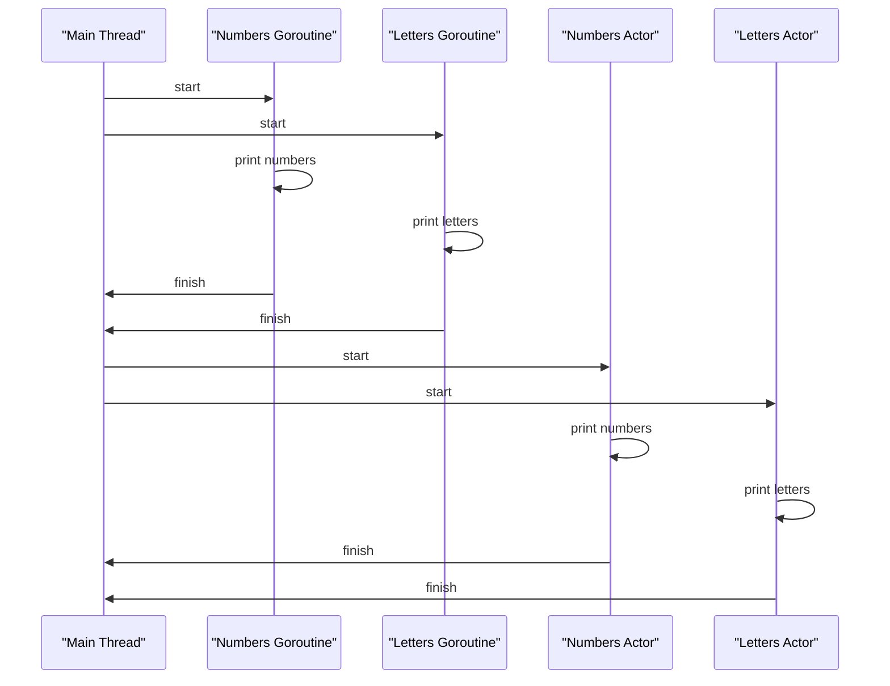

## Introduction
Concurrency is a fundamental concept in computer science that enables multiple tasks to be executed simultaneously, improving the overall performance and responsiveness of a system. It is a crucial aspect of modern software development, as it allows developers to write efficient and scalable code that can handle a large number of concurrent requests. In this section, we will explore the importance of concurrency, its real-world relevance, and why every engineer needs to know about it.

Concurrency is essential in modern software development because it enables developers to write code that can handle multiple tasks simultaneously, improving the overall performance and responsiveness of a system. For example, a web server can handle multiple requests from different clients concurrently, improving the overall user experience. **Tip:** Using concurrency can significantly improve the performance of a system, but it can also introduce complexity and make debugging more challenging.

## Core Concepts
In this section, we will explore the core concepts of concurrency, including **goroutines**, **async/await**, **threads**, and **actors**.

*   **Goroutines**: Goroutines are lightweight threads in Go that can be executed concurrently. They are scheduled by the Go runtime and are much lighter than traditional threads.
*   **Async/Await**: Async/await is a programming pattern that allows developers to write asynchronous code that is easier to read and maintain. It is supported in languages such as JavaScript, Python, Rust, Swift, and Kotlin.
*   **Threads**: Threads are a traditional way of achieving concurrency in programming languages such as Java and C++. They are heavyweight and can be more complex to manage than goroutines or async/await.
*   **Actors**: Actors are a concurrency model that is supported in languages such as Kotlin and Swift. They provide a high-level abstraction for concurrent programming and can be used to write efficient and scalable code.

> **Note:** Understanding the core concepts of concurrency is essential for writing efficient and scalable code.

## How It Works Internally
In this section, we will explore how concurrency works internally in different programming languages.

*   **Goroutines**: Goroutines are scheduled by the Go runtime, which uses a scheduler to manage the execution of goroutines. The scheduler uses a combination of techniques such as **work-stealing** and **m:n scheduling** to manage the execution of goroutines.
*   **Async/Await**: Async/await is implemented using a combination of **promises** and **coroutines**. Promises are used to represent asynchronous operations, and coroutines are used to manage the execution of asynchronous code.
*   **Threads**: Threads are managed by the operating system, which provides a threading API that can be used to create and manage threads. Threads are heavyweight and can be more complex to manage than goroutines or async/await.
*   **Actors**: Actors are managed by an actor system, which provides a high-level abstraction for concurrent programming. Actors communicate with each other using messages, and the actor system manages the execution of actors.

> **Warning:** Concurrency can introduce complexity and make debugging more challenging. It is essential to understand the internal mechanics of concurrency to write efficient and scalable code.

## Code Examples
In this section, we will explore three complete and runnable code examples that demonstrate the use of concurrency in different programming languages.

### Example 1: Basic Goroutine in Go
```go
package main

import (
    "fmt"
    "time"
)

func printNumbers() {
    for i := 0; i < 5; i++ {
        time.Sleep(500 * time.Millisecond)
        fmt.Println(i)
    }
}

func printLetters() {
    for i := 'a'; i <= 'e'; i++ {
        time.Sleep(500 * time.Millisecond)
        fmt.Printf("%c\n", i)
    }
}

func main() {
    go printNumbers()
    go printLetters()
    time.Sleep(3000 * time.Millisecond)
}
```
This example demonstrates the use of goroutines in Go to print numbers and letters concurrently.

### Example 2: Async/Await in JavaScript
```javascript
async function printNumbers() {
    for (let i = 0; i < 5; i++) {
        await new Promise(resolve => setTimeout(resolve, 500));
        console.log(i);
    }
}

async function printLetters() {
    for (let i = 'a'.charCodeAt(0); i <= 'e'.charCodeAt(0); i++) {
        await new Promise(resolve => setTimeout(resolve, 500));
        console.log(String.fromCharCode(i));
    }
}

async function main() {
    await Promise.all([printNumbers(), printLetters()]);
}

main();
```
This example demonstrates the use of async/await in JavaScript to print numbers and letters concurrently.

### Example 3: Actor in Kotlin
```kotlin
import kotlinx.coroutines.*

fun main() = runBlocking {
    val numbersActor = actor<Int> {
        for (msg in channel) {
            println(msg)
            delay(500)
        }
    }

    val lettersActor = actor<Char> {
        for (msg in channel) {
            println(msg)
            delay(500)
        }
    }

    launch {
        for (i in 0..4) {
            numbersActor.send(i)
        }
    }

    launch {
        for (i in 'a'..'e') {
            lettersActor.send(i)
        }
    }

    delay(3000)
}
```
This example demonstrates the use of actors in Kotlin to print numbers and letters concurrently.

## Visual Diagram

This diagram illustrates the execution of concurrent code using goroutines, async/await, and actors.

> **Tip:** Using visual diagrams can help to understand the execution of concurrent code and identify potential issues.

## Comparison
| Approach | Time Complexity | Space Complexity | Pros | Cons | Best For |
| --- | --- | --- | --- | --- | --- |
| Goroutines | O(1) | O(1) | Lightweight, efficient | Can be complex to manage | Go programming language |
| Async/Await | O(1) | O(1) | Easy to read and maintain | Can be less efficient than goroutines | JavaScript, Python, Rust, Swift, Kotlin |
| Threads | O(n) | O(n) | Traditional way of achieving concurrency | Can be heavyweight and complex to manage | Java, C++ |
| Actors | O(1) | O(1) | High-level abstraction for concurrent programming | Can be less efficient than goroutines | Kotlin, Swift |

> **Note:** Choosing the right approach to concurrency depends on the specific use case and programming language.

## Real-world Use Cases
In this section, we will explore three real-world use cases that demonstrate the use of concurrency in different industries.

*   **Web Server**: A web server can use concurrency to handle multiple requests from different clients simultaneously, improving the overall user experience. For example, the Apache web server uses threads to handle concurrent requests.
*   **Database Query**: A database query can use concurrency to execute multiple queries simultaneously, improving the overall performance of the database. For example, the MySQL database uses threads to execute concurrent queries.
*   **Scientific Simulation**: A scientific simulation can use concurrency to execute multiple simulations simultaneously, improving the overall performance of the simulation. For example, the NASA simulation uses goroutines to execute concurrent simulations.

> **Warning:** Concurrency can introduce complexity and make debugging more challenging. It is essential to understand the internal mechanics of concurrency to write efficient and scalable code.

## Common Pitfalls
In this section, we will explore four common pitfalls that developers can encounter when using concurrency.

*   **Deadlock**: A deadlock occurs when two or more threads are blocked indefinitely, each waiting for the other to release a resource. For example, consider two threads that are trying to acquire two locks in a different order.
*   **Livelock**: A livelock occurs when two or more threads are unable to proceed because they are too busy responding to each other's actions. For example, consider two threads that are trying to update a shared variable.
*   **Starvation**: Starvation occurs when a thread is unable to gain access to a shared resource because other threads are holding onto it for an extended period. For example, consider a thread that is trying to access a shared queue that is being held by another thread.
*   **Race Condition**: A race condition occurs when the behavior of a program depends on the relative timing of threads. For example, consider a program that is trying to update a shared variable using multiple threads.

> **Tip:** Understanding common pitfalls can help developers to write efficient and scalable concurrent code.

## Interview Tips
In this section, we will explore three common interview questions that are related to concurrency.

*   **What is the difference between concurrency and parallelism?**: Concurrency refers to the ability of a program to execute multiple tasks simultaneously, while parallelism refers to the ability of a program to execute multiple tasks simultaneously using multiple processing units.
*   **How do you handle concurrency in a programming language?**: The approach to handling concurrency depends on the programming language. For example, in Go, you can use goroutines to handle concurrency, while in Java, you can use threads.
*   **What are some common pitfalls to avoid when using concurrency?**: Some common pitfalls to avoid when using concurrency include deadlock, livelock, starvation, and race condition.

> **Interview:** When answering interview questions related to concurrency, it is essential to demonstrate a deep understanding of the concepts and be able to provide examples of how to handle concurrency in different programming languages.

## Key Takeaways
In this section, we will explore ten key takeaways that summarize the main points of this article.

*   **Concurrency is essential for modern software development**: Concurrency enables developers to write efficient and scalable code that can handle multiple tasks simultaneously.
*   **Goroutines are lightweight threads in Go**: Goroutines are scheduled by the Go runtime and are much lighter than traditional threads.
*   **Async/await is a programming pattern for asynchronous code**: Async/await is supported in languages such as JavaScript, Python, Rust, Swift, and Kotlin.
*   **Threads are a traditional way of achieving concurrency**: Threads are managed by the operating system and can be heavyweight and complex to manage.
*   **Actors provide a high-level abstraction for concurrent programming**: Actors are supported in languages such as Kotlin and Swift and provide a high-level abstraction for concurrent programming.
*   **Understanding concurrency is essential for writing efficient and scalable code**: Concurrency can introduce complexity and make debugging more challenging, but it is essential for writing efficient and scalable code.
*   **Choosing the right approach to concurrency depends on the use case and programming language**: The approach to concurrency depends on the specific use case and programming language.
*   **Common pitfalls to avoid when using concurrency include deadlock, livelock, starvation, and race condition**: Understanding common pitfalls can help developers to write efficient and scalable concurrent code.
*   **Visual diagrams can help to understand the execution of concurrent code**: Using visual diagrams can help to understand the execution of concurrent code and identify potential issues.
*   **Concurrency is a complex topic that requires a deep understanding of the concepts and techniques**: Concurrency is a complex topic that requires a deep understanding of the concepts and techniques to write efficient and scalable code.

> **Tip:** Mastering concurrency is essential for any software developer who wants to write efficient and scalable code.