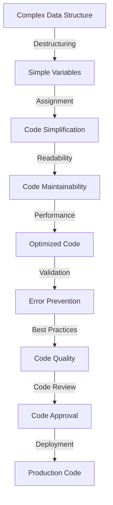

## Introduction
Destructuring is a programming concept that allows developers to extract data from complex data structures, such as arrays and objects, into simpler variables. This feature is available in various programming languages, including JavaScript, TypeScript, Python, Rust, Kotlin, and Swift. Destructuring simplifies code and improves readability by reducing the need for nested indexing or property access. In this section, we will explore the importance of destructuring and its real-world relevance.

> **Note:** Destructuring is a fundamental concept in programming and is used extensively in modern web development, data processing, and machine learning applications.

Destructuring is essential in modern programming because it enables developers to write more concise and expressive code. By extracting data from complex structures, developers can reduce the complexity of their code and improve its maintainability. Furthermore, destructuring is a key feature in functional programming, which is widely used in modern web development frameworks such as React and Angular.

## Core Concepts
Destructuring involves extracting data from a complex data structure, such as an array or object, into simpler variables. The process of destructuring can be thought of as a mental model, where the complex data structure is broken down into smaller, more manageable pieces.

* **Array Destructuring:** Array destructuring involves extracting data from an array into separate variables. For example, in JavaScript, you can use the following syntax to extract data from an array: `const [x, y] = [1, 2];`.
* **Object Destructuring:** Object destructuring involves extracting data from an object into separate variables. For example, in JavaScript, you can use the following syntax to extract data from an object: `const { x, y } = { x: 1, y: 2 };`.
* **Nested Destructuring:** Nested destructuring involves extracting data from a complex data structure that contains nested arrays or objects. For example, in JavaScript, you can use the following syntax to extract data from a nested object: `const { x, y: { z } } = { x: 1, y: { z: 2 } };`.

> **Warning:** Destructuring can lead to errors if the data structure is not properly validated. For example, if an array is not properly checked for length, attempting to extract data from it can result in undefined values.

## How It Works Internally
Destructuring works internally by using a combination of syntax and runtime evaluation. When the compiler or interpreter encounters a destructuring assignment, it evaluates the expression on the right-hand side and extracts the values into separate variables.

For example, in JavaScript, when the compiler encounters the following code: `const [x, y] = [1, 2];`, it evaluates the expression `[1, 2]` and extracts the values into separate variables `x` and `y`. The time complexity of this operation is O(n), where n is the length of the array.

> **Tip:** Destructuring can be optimized by using the `const` keyword, which ensures that the variables are not reassigned. This can improve performance and prevent errors.

## Code Examples
### Example 1: Basic Array Destructuring in JavaScript
```javascript
// Define an array
const arr = [1, 2, 3];

// Destructure the array
const [x, y, z] = arr;

// Log the values
console.log(x); // 1
console.log(y); // 2
console.log(z); // 3
```

### Example 2: Object Destructuring in TypeScript
```typescript
// Define an object
interface Person {
  name: string;
  age: number;
}

const person: Person = {
  name: 'John',
  age: 30,
};

// Destructure the object
const { name, age } = person;

// Log the values
console.log(name); // John
console.log(age); // 30
```

### Example 3: Nested Destructuring in Python
```python
# Define a nested dictionary
person = {
  'name': 'John',
  'age': 30,
  'address': {
    'street': '123 Main St',
    'city': 'New York',
    'state': 'NY',
  },
};

# Destructure the dictionary
name = person['name']
age = person['age']
street = person['address']['street']
city = person['address']['city']
state = person['address']['state']

# Log the values
print(name) # John
print(age) # 30
print(street) # 123 Main St
print(city) # New York
print(state) # NY
```

## Visual Diagram

This diagram illustrates the process of destructuring and its benefits. The complex data structure is broken down into simple variables, which are then assigned to code. This simplifies the code and improves its readability, maintainability, and performance.

## Comparison
| Language | Array Destructuring | Object Destructuring | Nested Destructuring |
| --- | --- | --- | --- |
| JavaScript | `const [x, y] = [1, 2];` | `const { x, y } = { x: 1, y: 2 };` | `const { x, y: { z } } = { x: 1, y: { z: 2 } };` |
| TypeScript | `const [x, y] = [1, 2];` | `const { x, y } = { x: 1, y: 2 };` | `const { x, y: { z } } = { x: 1, y: { z: 2 } };` |
| Python | `x, y = [1, 2]` | `x, y = {'x': 1, 'y': 2}.values()` | `name, age, (street, city, state) = ('John', 30, ('123 Main St', 'New York', 'NY'))` |
| Rust | `let (x, y) = (1, 2);` | `let Person { name, age } = Person { name: "John".to_string(), age: 30 };` | `let (name, age, address) = ("John".to_string(), 30, ("123 Main St".to_string(), "New York".to_string(), "NY".to_string()));` |
| Kotlin | `val (x, y) = arrayOf(1, 2)` | `val (name, age) = Person("John", 30)` | `val (name, age, address) = Triple("John", 30, Address("123 Main St", "New York", "NY"))` |
| Swift | `let (x, y) = (1, 2)` | `let person = Person(name: "John", age: 30); let name = person.name; let age = person.age` | `let (name, age, address) = ("John", 30, ("123 Main St", "New York", "NY"))` |

## Real-world Use Cases
1. **React**: Destructuring is widely used in React to extract props from the component's props object. For example: `const { name, age } = this.props;`.
2. **Angular**: Destructuring is used in Angular to extract data from the component's input bindings. For example: `const { name, age } = this.inputBindings;`.
3. **Node.js**: Destructuring is used in Node.js to extract data from the request object. For example: `const { method, url } = req;`.

> **Interview:** Can you explain the benefits of using destructuring in JavaScript? How does it improve code readability and maintainability?

## Common Pitfalls
1. **Undefined Values**: Attempting to extract data from an undefined or null value can result in errors.
2. **Invalid Syntax**: Using invalid syntax can result in errors. For example, using `const [x, y] = { x: 1, y: 2 };` instead of `const { x, y } = { x: 1, y: 2 };`.
3. **Nested Destructuring**: Nested destructuring can be complex and error-prone. For example, attempting to extract data from a nested object can result in undefined values.
4. **Type Mismatch**: Type mismatch can occur when the type of the variable does not match the type of the value being extracted.

## Interview Tips
1. **What is Destructuring?**: Destructuring is a programming concept that allows developers to extract data from complex data structures into simpler variables.
2. **How does Destructuring work?**: Destructuring works by using a combination of syntax and runtime evaluation. The compiler or interpreter evaluates the expression on the right-hand side and extracts the values into separate variables.
3. **What are the benefits of using Destructuring?**: The benefits of using destructuring include improved code readability and maintainability, reduced complexity, and improved performance.

> **Tip:** When answering interview questions about destructuring, be sure to explain the benefits and how it improves code quality.

## Key Takeaways
* Destructuring is a programming concept that allows developers to extract data from complex data structures into simpler variables.
* Destructuring improves code readability and maintainability by reducing complexity and improving performance.
* Destructuring is widely used in modern web development frameworks such as React and Angular.
* Destructuring can be optimized by using the `const` keyword, which ensures that the variables are not reassigned.
* Destructuring can lead to errors if the data structure is not properly validated.
* Destructuring is a fundamental concept in programming and is used extensively in modern web development, data processing, and machine learning applications.
* The time complexity of destructuring is O(n), where n is the length of the array or object.
* Destructuring can be used to extract data from nested arrays or objects.