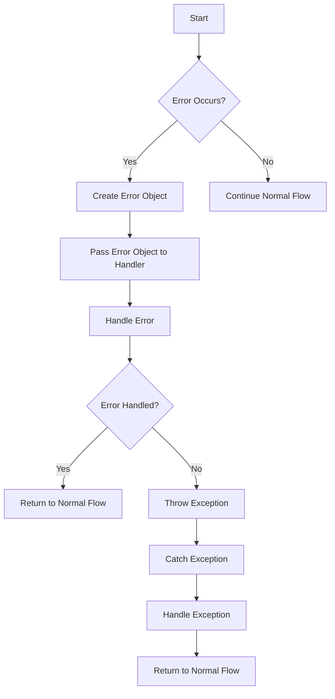

## Introduction
Error handling is a crucial aspect of programming that enables developers to anticipate, detect, and respond to errors or exceptions that may occur during the execution of their code. It is essential to handle errors effectively to prevent crashes, data corruption, and security vulnerabilities. In this section, we will explore the different approaches to error handling in various programming languages, including Java, Python, JavaScript, Rust, Go, and Swift.

> **Note:** Error handling is not just about catching exceptions, but also about preventing them from occurring in the first place. This can be achieved through careful design, testing, and validation of input data.

Error handling is particularly important in real-world applications, where errors can have significant consequences. For example, in a banking system, an error in a transaction processing module can result in financial losses or compromised sensitive information. In a web application, an error can lead to a poor user experience, causing users to abandon the site.

## Core Concepts
Error handling involves several key concepts, including:

* **Exceptions**: These are runtime errors that occur during the execution of a program. Exceptions can be caught and handled using try-catch blocks.
* **Error codes**: These are numerical values that indicate the type of error that has occurred. Error codes can be used to handle errors in a more explicit way.
* **Result types**: These are data types that can represent both a successful result and an error. Result types are commonly used in functional programming languages.
* **Error handling mechanisms**: These are language constructs that enable developers to handle errors, such as try-catch blocks, error codes, and result types.

> **Warning:** Ignoring errors or exceptions can lead to unexpected behavior, crashes, or security vulnerabilities. It is essential to handle errors explicitly and thoroughly.

## How It Works Internally
Error handling mechanisms vary across programming languages. Here is a high-level overview of how error handling works internally in each language:

* **Java**: Java uses a try-catch block to catch exceptions. When an exception occurs, the Java Virtual Machine (JVM) creates an exception object and passes it to the catch block.
* **Python**: Python uses a try-except block to catch exceptions. When an exception occurs, Python creates an exception object and passes it to the except block.
* **JavaScript**: JavaScript uses a try-catch block to catch exceptions. When an exception occurs, the JavaScript engine creates an exception object and passes it to the catch block.
* **Rust**: Rust uses a Result type to handle errors. When an error occurs, Rust returns a Result object that contains an error value.
* **Go**: Go uses an error return type to handle errors. When an error occurs, Go returns an error object that can be checked by the caller.
* **Swift**: Swift uses a try-catch block to catch exceptions. When an exception occurs, Swift creates an exception object and passes it to the catch block.

## Code Examples
Here are three complete and runnable code examples that demonstrate error handling in different programming languages:

### Example 1: Java
```java
public class ErrorHandlingExample {
    public static void main(String[] args) {
        try {
            // Attempt to divide by zero
            int x = 10 / 0;
        } catch (ArithmeticException e) {
            // Handle the exception
            System.out.println("Error: " + e.getMessage());
        }
    }
}
```

### Example 2: Rust
```rust
enum Result<T, E> {
    Ok(T),
    Err(E),
}

fn divide(x: i32, y: i32) -> Result<i32, &'static str> {
    if y == 0 {
        Err("Cannot divide by zero!")
    } else {
        Ok(x / y)
    }
}

fn main() {
    match divide(10, 0) {
        Ok(result) => println!("Result: {}", result),
        Err(error) => println!("Error: {}", error),
    }
}
```

### Example 3: Go
```go
package main

import "fmt"

func divide(x int, y int) (int, error) {
    if y == 0 {
        return 0, fmt.Errorf("Cannot divide by zero!")
    }
    return x / y, nil
}

func main() {
    result, err := divide(10, 0)
    if err != nil {
        fmt.Println("Error:", err)
    } else {
        fmt.Println("Result:", result)
    }
}
```

> **Tip:** When handling errors, it is essential to provide informative error messages that can help diagnose and fix the issue.

## Visual Diagram

This diagram illustrates the error handling process, from detecting an error to handling it and returning to normal flow.

## Comparison
Here is a comparison table that highlights the different error handling approaches in various programming languages:

| Language | Error Handling Mechanism | Time Complexity | Space Complexity | Pros | Cons |
| --- | --- | --- | --- | --- | --- |
| Java | Try-catch block | O(1) | O(1) | Easy to use, flexible | Verbose, can lead to nested try-catch blocks |
| Python | Try-except block | O(1) | O(1) | Easy to use, flexible | Verbose, can lead to nested try-except blocks |
| JavaScript | Try-catch block | O(1) | O(1) | Easy to use, flexible | Verbose, can lead to nested try-catch blocks |
| Rust | Result type | O(1) | O(1) | Explicit, safe | Steep learning curve |
| Go | Error return type | O(1) | O(1) | Explicit, safe | Verbose, can lead to error checking code |
| Swift | Try-catch block | O(1) | O(1) | Easy to use, flexible | Verbose, can lead to nested try-catch blocks |

> **Interview:** When asked about error handling, be prepared to discuss the different approaches and their trade-offs. For example, you might be asked to compare and contrast try-catch blocks with error return types.

## Real-world Use Cases
Here are three real-world examples of error handling in production systems:

1. **Banking System**: A banking system uses error handling to prevent financial losses due to incorrect transactions. When a user attempts to withdraw more money than their account balance, the system catches the error and returns an informative error message.
2. **Web Application**: A web application uses error handling to prevent crashes and provide a good user experience. When a user submits a form with invalid input, the application catches the error and returns an error message with suggestions for correction.
3. **Embedded System**: An embedded system uses error handling to prevent system crashes and ensure reliable operation. When a sensor reading is outside the expected range, the system catches the error and takes corrective action to prevent damage to the system.

## Common Pitfalls
Here are four common pitfalls to avoid when handling errors:

1. **Ignoring Errors**: Ignoring errors or exceptions can lead to unexpected behavior, crashes, or security vulnerabilities.
2. **Swallowing Errors**: Swallowing errors or exceptions can make it difficult to diagnose and fix issues.
3. **Using Broad Catch Blocks**: Using broad catch blocks can catch and handle exceptions that are not intended to be caught, leading to unexpected behavior.
4. **Not Providing Informative Error Messages**: Not providing informative error messages can make it difficult for users to diagnose and fix issues.

> **Warning:** Avoid using broad catch blocks or swallowing errors, as this can lead to unexpected behavior or security vulnerabilities.

## Interview Tips
Here are three common interview questions related to error handling, along with tips for answering them:

1. **What is the difference between a try-catch block and an error return type?**: Be prepared to discuss the trade-offs between these two approaches, including ease of use, flexibility, and safety.
2. **How do you handle errors in a distributed system?**: Be prepared to discuss strategies for handling errors in a distributed system, including error propagation, retry mechanisms, and fault tolerance.
3. **What is the importance of providing informative error messages?**: Be prepared to discuss the importance of providing informative error messages, including how they can help diagnose and fix issues.

## Key Takeaways
Here are six key takeaways related to error handling:

* **Error handling is essential for preventing crashes and ensuring reliable operation**.
* **Try-catch blocks and error return types are two common approaches to error handling**.
* **Result types can provide an explicit and safe way to handle errors**.
* **Error messages should be informative and helpful for diagnosing and fixing issues**.
* **Ignoring errors or exceptions can lead to unexpected behavior or security vulnerabilities**.
* **Broad catch blocks and swallowing errors should be avoided**.

> **Tip:** Remember to provide informative error messages and avoid ignoring errors or exceptions. This will help ensure that your code is reliable, safe, and easy to maintain.