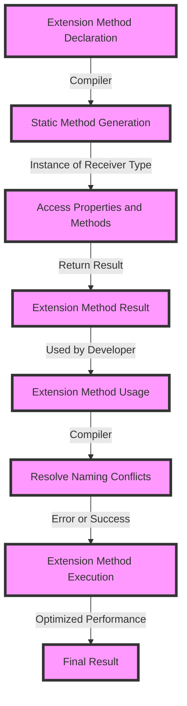

## Introduction
Extension methods/functions are a powerful feature in various programming languages, including Kotlin, Swift, C#, and TypeScript. They allow developers to add new functionality to existing classes without modifying their source code. This feature is particularly useful when working with third-party libraries or frameworks, where modifying the original code is not feasible. In this section, we will explore the concept of extension methods, their importance, and real-world relevance.

Extension methods are essential in modern software development because they enable developers to extend the functionality of existing classes without altering their underlying implementation. This feature promotes code reusability, flexibility, and maintainability. For instance, in Kotlin, extension functions can be used to add new functionality to the `String` class, such as converting a string to a specific case.

> **Note:** Extension methods are not the same as inheritance, where a new class inherits the properties and methods of an existing class. Instead, extension methods add new functionality to an existing class without creating a new class.

## Core Concepts
To understand extension methods, it's essential to grasp the following core concepts:

* **Extension method**: A method that extends the functionality of an existing class without modifying its source code.
* **Receiver type**: The type of the class that the extension method is extending.
* **Extension function**: A function that extends the functionality of an existing class.

Mental models and analogies can help make these concepts more accessible. Consider an extension method as a plugin that adds new functionality to an existing device. Just as a plugin can enhance the capabilities of a device without modifying its underlying hardware, an extension method can extend the functionality of a class without altering its source code.

Key terminology includes:

* **Extension**: The process of adding new functionality to an existing class.
* **Static**: Extension methods are typically static, meaning they belong to the class rather than an instance of the class.

## How It Works Internally
Under the hood, extension methods work by creating a new static method that takes an instance of the receiver type as its first parameter. This instance is then used to access the properties and methods of the receiver type.

Here's a step-by-step breakdown of how extension methods work:

1. The compiler encounters an extension method declaration.
2. The compiler generates a new static method with the same name as the extension method.
3. The static method takes an instance of the receiver type as its first parameter.
4. The static method uses the instance to access the properties and methods of the receiver type.
5. The static method returns the result of the extension method.

For example, in Kotlin, the following extension function:
```kotlin
fun String.toTitleCase(): String {
    return this.split(" ").map { it.capitalize() }.joinToString(" ")
}
```
Is compiled to:
```java
public static String toTitleCase(String $receiver) {
    return $receiver.split(" ").map { it.capitalize() }.joinToString(" ");
}
```
> **Warning:** Extension methods can lead to naming conflicts if not used carefully. If two extension methods have the same name, the compiler will not be able to resolve the conflict.

## Code Examples
Here are three complete and runnable examples of extension methods:

**Example 1: Basic Extension Method in Kotlin**
```kotlin
// Define an extension function for the String class
fun String.toUppercase(): String {
    return this.uppercase()
}

// Use the extension function
fun main() {
    val str = "hello"
    println(str.toUppercase()) // Output: HELLO
}
```

**Example 2: Real-World Extension Method in Swift**
```swift
// Define an extension for the Array class
extension Array {
    func filterByType<T>(_ type: T.Type) -> [T] {
        return self.compactMap { $0 as? T }
    }
}

// Use the extension method
let array = [1, "hello", 2, "world", 3]
let filteredArray = array.filterByType(String.self)
print(filteredArray) // Output: ["hello", "world"]
```

**Example 3: Advanced Extension Method in C#**
```csharp
// Define an extension method for the IEnumerable<T> interface
public static class EnumerableExtensions {
    public static IEnumerable<T> TakeWhile<T>(this IEnumerable<T> source, Func<T, bool> predicate) {
        foreach (var item in source) {
            if (predicate(item)) {
                yield return item;
            } else {
                break;
            }
        }
    }
}

// Use the extension method
int[] numbers = { 1, 2, 3, 4, 5 };
var result = numbers.TakeWhile(n => n < 4);
foreach (var number in result) {
    Console.WriteLine(number); // Output: 1, 2, 3
}
```

> **Tip:** When using extension methods, it's essential to consider the performance implications. Extension methods can lead to slower performance if not optimized properly.

## Visual Diagram

The diagram illustrates the process of extension method declaration, static method generation, and extension method usage. It also highlights the importance of resolving naming conflicts and optimizing performance.

## Comparison
| Language | Extension Method Syntax | Performance Implication |
| --- | --- | --- |
| Kotlin | `fun String.toUppercase(): String` | Moderate |
| Swift | `extension Array { func filterByType<T>(_ type: T.Type) -> [T] }` | Moderate |
| C# | `public static IEnumerable<T> TakeWhile<T>(this IEnumerable<T> source, Func<T, bool> predicate)` | High |
| TypeScript | `interface Array<T> { filterByType<T>(type: T): T[] }` | Low |

> **Interview:** A common interview question is to ask the candidate to explain the difference between extension methods and inheritance. A strong answer would highlight the key differences, including the fact that extension methods do not modify the underlying class, whereas inheritance creates a new class that inherits the properties and methods of the parent class.

## Real-world Use Cases
Here are three real-world examples of extension methods:

1. **Google's Kotlin Extensions**: Google provides a set of extension functions for the Android framework, making it easier for developers to work with Android APIs.
2. **Apple's Swift Extensions**: Apple provides a set of extension methods for the Swift language, including extensions for the `Array` and `String` classes.
3. **Microsoft's C# Extensions**: Microsoft provides a set of extension methods for the .NET framework, including extensions for the `IEnumerable<T>` interface.

## Common Pitfalls
Here are four common mistakes to avoid when using extension methods:

1. **Naming Conflicts**: Avoid naming conflicts by using unique and descriptive names for extension methods.
2. **Performance Implications**: Consider the performance implications of extension methods, especially when working with large datasets.
3. **Over-Engineering**: Avoid over-engineering by keeping extension methods simple and focused on a specific task.
4. **Debugging Issues**: Be aware of debugging issues that can arise when using extension methods, especially when working with complex logic.

> **Warning:** Extension methods can lead to tight coupling between classes, making it harder to maintain and refactor code. Use them judiciously and consider alternative approaches, such as dependency injection.

## Interview Tips
Here are three common interview questions related to extension methods:

1. **What is the difference between extension methods and inheritance?**
	* Weak answer: "They're similar, but extension methods are more flexible."
	* Strong answer: "Extension methods add new functionality to an existing class without modifying its source code, whereas inheritance creates a new class that inherits the properties and methods of the parent class."
2. **How do you optimize the performance of extension methods?**
	* Weak answer: "I use caching and memoization."
	* Strong answer: "I consider the performance implications of extension methods, especially when working with large datasets. I use techniques such as lazy loading, caching, and memoization to optimize performance."
3. **What are some common use cases for extension methods?**
	* Weak answer: "I use them for everything."
	* Strong answer: "I use extension methods to add new functionality to existing classes, especially when working with third-party libraries or frameworks. I also use them to simplify complex logic and improve code readability."

## Key Takeaways
Here are six key takeaways to remember:

* **Extension methods add new functionality to existing classes**: Without modifying their source code.
* **Use unique and descriptive names**: To avoid naming conflicts.
* **Consider performance implications**: Especially when working with large datasets.
* **Keep extension methods simple**: And focused on a specific task.
* **Use them judiciously**: And consider alternative approaches, such as dependency injection.
* **Be aware of debugging issues**: That can arise when using extension methods.

> **Tip:** When working with extension methods, it's essential to consider the trade-offs between flexibility, maintainability, and performance. Use them wisely to write more efficient and effective code.