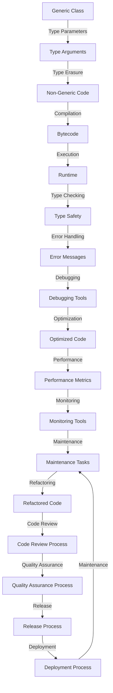

## Introduction
**Generics** are a feature in programming languages that allows for the creation of reusable code. They enable developers to define classes, interfaces, and methods that can work with any data type, without the need for explicit type casting. This feature is particularly useful when working with collections, algorithms, and other reusable components. In this section, we will explore the concept of generics, its importance, and its real-world relevance. 
> **Note:** Generics are a fundamental concept in programming languages, and understanding them is crucial for any software developer.

Generics are essential in modern programming because they provide several benefits, including:
*   **Type Safety:** Generics ensure that the correct data type is used, preventing type-related errors at runtime.
*   **Code Reusability:** Generics enable developers to write reusable code that can work with different data types, reducing code duplication and improving maintainability.
*   **Performance:** Generics can improve performance by avoiding the need for explicit type casting, which can be expensive in terms of CPU cycles.

## Core Concepts
To understand generics, it is essential to grasp the following core concepts:
*   **Type Parameters:** Type parameters are placeholders for specific types that will be used when the generic class or method is instantiated. They are typically represented by a single uppercase letter, such as `T` or `E`.
*   **Type Arguments:** Type arguments are the actual types that are used to replace the type parameters when the generic class or method is instantiated. For example, `Integer` or `String` can be used as type arguments.
*   **Wildcard Types:** Wildcard types are used to represent unknown types in generic classes or methods. They are denoted by the `?` symbol and can be used to specify upper or lower bounds for the unknown type.

> **Warning:** When using generics, it is crucial to understand the difference between type parameters and type arguments to avoid confusion and errors.

## How It Works Internally
When a generic class or method is compiled, the compiler replaces the type parameters with the actual type arguments. This process is called **type erasure**. The resulting bytecode is equivalent to the non-generic version of the code, with the type parameters replaced by `Object` references.

Here is a step-by-step breakdown of the type erasure process:
1.  The compiler checks the generic class or method for type safety, ensuring that the type arguments are compatible with the type parameters.
2.  The compiler replaces the type parameters with the actual type arguments, using `Object` references if necessary.
3.  The resulting bytecode is generated, with the type information removed.

> **Tip:** Understanding the type erasure process is essential for optimizing generic code and avoiding performance issues.

## Code Examples
Here are three complete and runnable code examples that demonstrate the use of generics in different programming languages:

### Example 1: Basic Generic Class in Java
```java
// Define a basic generic class in Java
public class GenericBox<T> {
    private T value;

    public GenericBox(T value) {
        this.value = value;
    }

    public T getValue() {
        return value;
    }

    public static void main(String[] args) {
        // Create a GenericBox instance with Integer type argument
        GenericBox<Integer> intBox = new GenericBox<>(10);
        System.out.println(intBox.getValue()); // Output: 10

        // Create a GenericBox instance with String type argument
        GenericBox<String> strBox = new GenericBox<>("Hello");
        System.out.println(strBox.getValue()); // Output: Hello
    }
}
```

### Example 2: Generic Method in C++
```cpp
// Define a generic method in C++
template <typename T>
T max(T a, T b) {
    return (a > b) ? a : b;
}

int main() {
    // Use the max method with int type argument
    int result1 = max(10, 20);
    std::cout << "Max value: " << result1 << std::endl; // Output: Max value: 20

    // Use the max method with double type argument
    double result2 = max(10.5, 20.8);
    std::cout << "Max value: " << result2 << std::endl; // Output: Max value: 20.8

    return 0;
}
```

### Example 3: Advanced Generic Class in Rust
```rust
// Define an advanced generic class in Rust
struct GenericBox<T> {
    value: T,
}

impl<T> GenericBox<T> {
    fn new(value: T) -> GenericBox<T> {
        GenericBox { value }
    }

    fn get_value(&self) -> &T {
        &self.value
    }
}

fn main() {
    // Create a GenericBox instance with i32 type argument
    let int_box = GenericBox::new(10);
    println!("Value: {}", int_box.get_value()); // Output: Value: 10

    // Create a GenericBox instance with String type argument
    let str_box = GenericBox::new(String::from("Hello"));
    println!("Value: {}", str_box.get_value()); // Output: Value: Hello
}
```

## Visual Diagram

This diagram illustrates the process of creating and using generic classes, from defining type parameters to deploying the resulting code. It highlights the key steps involved in ensuring type safety, optimizing performance, and maintaining the codebase.

## Comparison
| Language | Generics Support | Type Safety | Performance |
| --- | --- | --- | --- |
| Java | Yes | Strong | Good |
| C++ | Yes | Weak | Excellent |
| Rust | Yes | Strong | Excellent |
| TypeScript | Yes | Strong | Good |
| Go | Yes (1.18+) | Strong | Good |
| Swift | Yes | Strong | Excellent |
| Kotlin | Yes | Strong | Good |

This table compares the generics support, type safety, and performance of different programming languages. It highlights the strengths and weaknesses of each language, helping developers choose the best language for their needs.

## Real-world Use Cases
Here are three real-world examples of using generics in production code:
*   **Apache Commons:** The Apache Commons library provides a set of reusable components, including generic classes and methods, for tasks such as collections, utilities, and file I/O.
*   **Google Guava:** The Google Guava library provides a set of reusable components, including generic classes and methods, for tasks such as collections, caching, and event bus.
*   **Java Collections Framework:** The Java Collections Framework provides a set of generic classes and methods for working with collections, including lists, sets, maps, and queues.

## Common Pitfalls
Here are four common mistakes to avoid when using generics:
*   **Raw Types:** Using raw types, such as `List` instead of `List<String>`, can lead to type safety issues and runtime errors.
*   **Wildcard Types:** Using wildcard types, such as `List<?>`, can lead to type safety issues and runtime errors if not used carefully.
*   **Type Erasure:** Not understanding the type erasure process can lead to performance issues and runtime errors.
*   **Generics and Inheritance:** Not understanding the relationship between generics and inheritance can lead to type safety issues and runtime errors.

> **Warning:** Avoid using raw types and wildcard types unless necessary, and always understand the type erasure process and the relationship between generics and inheritance.

## Interview Tips
Here are three common interview questions related to generics, along with weak and strong answers:
*   **Question 1:** What is the purpose of generics in programming languages?
    *   Weak answer: Generics are used to make code more concise and readable.
    *   Strong answer: Generics are used to ensure type safety, improve code reusability, and optimize performance.
*   **Question 2:** How do generics work internally in Java?
    *   Weak answer: Generics are implemented using type casting and reflection.
    *   Strong answer: Generics are implemented using type erasure, where the compiler replaces type parameters with actual type arguments and removes type information.
*   **Question 3:** What are the benefits and drawbacks of using generics in C++?
    *   Weak answer: Generics are beneficial for code reusability, but they can lead to performance issues.
    *   Strong answer: Generics are beneficial for code reusability, type safety, and performance, but they can lead to complexity and debugging issues if not used carefully.

> **Interview:** Be prepared to explain the purpose, internal workings, and benefits of generics in different programming languages, and provide examples of how to use them effectively.

## Key Takeaways
Here are ten key takeaways to remember when working with generics:
*   **Generics ensure type safety:** Generics help prevent type-related errors at runtime by ensuring that the correct data type is used.
*   **Generics improve code reusability:** Generics enable developers to write reusable code that can work with different data types, reducing code duplication and improving maintainability.
*   **Generics optimize performance:** Generics can improve performance by avoiding the need for explicit type casting, which can be expensive in terms of CPU cycles.
*   **Understand type erasure:** Understanding the type erasure process is essential for optimizing generic code and avoiding performance issues.
*   **Use type parameters and type arguments correctly:** Using type parameters and type arguments correctly is crucial for avoiding type safety issues and runtime errors.
*   **Avoid raw types and wildcard types:** Avoid using raw types and wildcard types unless necessary, and always understand the implications of using them.
*   **Generics and inheritance:** Understanding the relationship between generics and inheritance is crucial for avoiding type safety issues and runtime errors.
*   **Generics in different languages:** Be aware of the differences in generics support, type safety, and performance between different programming languages.
*   **Real-world examples:** Use real-world examples, such as Apache Commons and Google Guava, to demonstrate the benefits and best practices of using generics.
*   **Debugging and optimization:** Use debugging and optimization techniques, such as profiling and benchmarking, to ensure that generic code is efficient and scalable.