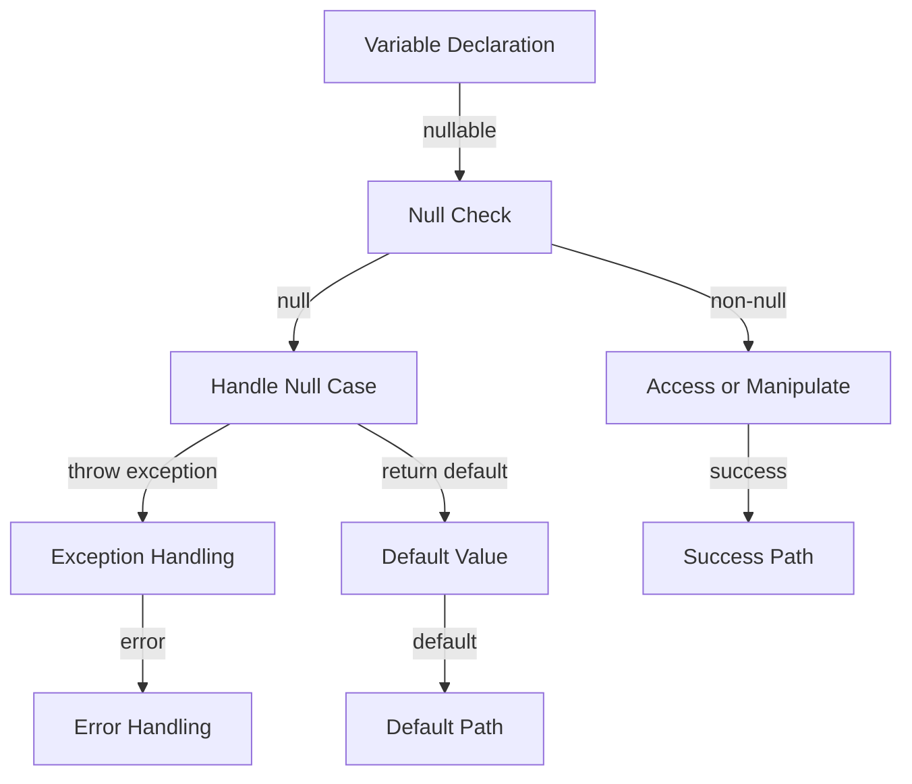

## Introduction
**Null handling** is a crucial aspect of programming that deals with the absence of a value in a variable or data structure. It's a fundamental concept that every programmer should understand, as it can significantly impact the reliability, performance, and maintainability of software systems. In this study guide, we'll delve into the world of null handling, exploring its importance, core concepts, and best practices across various programming languages, including Java, JavaScript, Go, Swift, Ruby, Python, Rust, Kotlin, and TypeScript.

> **Note:** Null handling is not just about checking for null values; it's about designing robust systems that can handle the absence of data gracefully.

In real-world applications, null handling is essential for preventing **NullPointerExceptions** (NPEs) or **null pointer dereferences**, which can lead to system crashes, data corruption, or security vulnerabilities. Moreover, proper null handling can improve code readability, reduce debugging time, and enhance overall system reliability.

## Core Concepts
To understand null handling, it's essential to grasp the following core concepts:

* **Null**: a special value that represents the absence of any object value.
* **Nullability**: the ability of a variable or data structure to hold a null value.
* **Optional**: a type that can represent either a value or the absence of a value.
* **Default value**: a value assigned to a variable or data structure when no value is provided.

> **Warning:** Assuming that a variable or data structure always contains a non-null value can lead to NPEs or unexpected behavior.

Key terminology includes:

* **NullPointerException** (NPE): an exception thrown when attempting to access or manipulate a null object reference.
* **Null safety**: the ability of a programming language or library to prevent NPEs or null pointer dereferences.

## How It Works Internally
Null handling works differently across programming languages, but the basic idea is to check for null values before attempting to access or manipulate them. Here's a step-by-step breakdown of how null handling works internally:

1. **Variable declaration**: a variable is declared with a specific type, which may or may not be nullable.
2. **Assignment**: a value is assigned to the variable, which may be null or non-null.
3. **Null check**: before accessing or manipulating the variable, a null check is performed to determine if the variable contains a null value.
4. **Handling**: if the variable is null, the program may throw an exception, return a default value, or perform some other action.

> **Tip:** Using optional types or null-safe operators can simplify null handling and reduce the risk of NPEs.

## Code Examples
Here are three complete, runnable code examples that demonstrate null handling in different programming languages:

### Example 1: Basic null check in Java
```java
public class NullHandlingExample {
    public static void main(String[] args) {
        String name = null; // declare a nullable variable
        if (name != null) { // perform a null check
            System.out.println(name.toUpperCase()); // access the variable if non-null
        } else {
            System.out.println("Name is null"); // handle the null case
        }
    }
}
```

### Example 2: Using optional types in Rust
```rust
fn main() {
    let name: Option<String> = None; // declare an optional variable
    match name { // use a match statement to handle the optional value
        Some(n) => println!("{}", n.to_uppercase()), // access the value if present
        None => println!("Name is null"), // handle the null case
    }
}
```

### Example 3: Null-safe navigation in TypeScript
```typescript
interface Person {
    name: string | null; // declare a nullable property
}

const person: Person = { name: null }; // create an object with a null property
console.log(person.name?.toUpperCase()); // use null-safe navigation to access the property
```

## Visual Diagram

This diagram illustrates the basic flow of null handling, from variable declaration to handling the null case.

## Comparison
Here's a comparison table that highlights the differences in null handling across various programming languages:

| Language | Null Handling Mechanism | Null Safety |
| --- | --- | --- |
| Java | null checks, Optional class | partial |
| JavaScript | null checks, optional chaining | partial |
| Go | nil checks, error handling | partial |
| Swift | optional types, nil checks | strong |
| Ruby | nil checks, optional chaining | partial |
| Python | None checks, optional types | partial |
| Rust | optional types, Result enum | strong |
| Kotlin | null safety, optional types | strong |
| TypeScript | null safety, optional types | strong |

## Real-world Use Cases
Here are three production examples of null handling in real-world systems:

1. **Google's Guava library**: uses optional types and null safety to prevent NPEs in Java-based systems.
2. **Swift's Optional type**: provides a strong null safety guarantee, making it easier to write robust and reliable code in Swift-based systems.
3. **Rust's Result enum**: uses a strong null safety guarantee to prevent errors and ensure reliable code execution in Rust-based systems.

## Common Pitfalls
Here are four specific mistakes that engineers make when handling null values:

1. **Assuming non-nullability**: assuming that a variable or data structure always contains a non-null value.
2. **Ignoring null checks**: ignoring null checks or using incomplete null handling mechanisms.
3. **Using null as a default value**: using null as a default value instead of a more meaningful default value.
4. **Not handling null cases**: not handling null cases properly, leading to unexpected behavior or errors.

> **Warning:** Ignoring null checks or using incomplete null handling mechanisms can lead to NPEs or unexpected behavior.

Here's an example of wrong vs right code:
```java
// wrong
public void printName(String name) {
    System.out.println(name.toUpperCase()); // assumes non-nullability
}

// right
public void printName(String name) {
    if (name != null) {
        System.out.println(name.toUpperCase()); // performs null check
    } else {
        System.out.println("Name is null"); // handles null case
    }
}
```

## Interview Tips
Here are three common interview questions related to null handling, along with weak and strong answers:

1. **What is null handling, and why is it important?**
	* Weak answer: "Null handling is just checking for null values."
	* Strong answer: "Null handling is the process of checking for and handling null values to prevent NPEs and ensure reliable code execution. It's essential for writing robust and maintainable code."
2. **How do you handle null values in your code?**
	* Weak answer: "I just check for null values before accessing them."
	* Strong answer: "I use a combination of null checks, optional types, and default values to handle null values. I also consider the context and requirements of the system to determine the best approach."
3. **Can you give an example of a null handling mechanism in a programming language?**
	* Weak answer: "Uh, I think Java has a null check or something."
	* Strong answer: "Yes, Java has a null check mechanism that involves using the `!=` operator to check for null values. Additionally, Java 8 introduced the `Optional` class, which provides a more elegant way to handle null values. For example, you can use the `Optional` class to wrap a nullable value and then use the `ifPresent` method to execute a block of code if the value is present."

## Key Takeaways
Here are 10 key takeaways to remember when handling null values:

* **Always check for null values** before accessing or manipulating them.
* **Use optional types** to represent nullable values and prevent NPEs.
* **Handle null cases properly** to ensure reliable code execution.
* **Use default values** to provide a meaningful default value instead of null.
* **Consider the context** and requirements of the system when handling null values.
* **Use null-safe operators** to simplify null handling and reduce the risk of NPEs.
* **Avoid assuming non-nullability** and always check for null values.
* **Use a combination of null checks and optional types** to handle null values.
* **Keep null handling mechanisms simple and consistent** to improve code readability and maintainability.
* **Test null handling mechanisms thoroughly** to ensure reliable code execution.