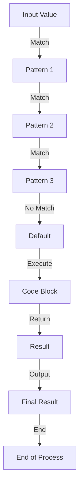

## Introduction
Pattern matching is a powerful feature in programming languages that allows developers to concisely and elegantly handle different cases of data. It is a way to specify multiple alternatives and select the first one that matches. In this section, we will explore the world of pattern matching in various programming languages, including Rust, Swift, Kotlin, Scala, Python 3.10+, and Java 21+. We will delve into the core concepts, internal mechanics, and provide code examples to illustrate the usage of pattern matching in real-world scenarios.

> **Note:** Pattern matching is not a new concept, but its implementation and usage vary across programming languages. It is essential to understand the nuances of each language to effectively utilize pattern matching.

## Core Concepts
Pattern matching involves specifying a value to be matched against a set of patterns. Each pattern is a way of describing a possible value that the input might take. The goal is to find the first pattern that matches the input value. The key concepts in pattern matching are:

* **Patterns:** These are the possible values that the input might take. Patterns can be simple values, such as integers or strings, or complex structures, such as tuples or lists.
* **Matching:** This is the process of comparing the input value against each pattern to find the first match.
* **Binding:** Once a pattern matches, the values in the pattern are bound to the corresponding values in the input.

> **Tip:** When using pattern matching, it is essential to consider the order of the patterns. The first pattern that matches is the one that will be executed.

## How It Works Internally
When a programming language implements pattern matching, it typically involves a combination of the following steps:

1. **Pattern compilation:** The patterns are compiled into a form that can be efficiently matched against the input value.
2. **Input preparation:** The input value is prepared for matching by extracting the relevant information.
3. **Matching:** The input value is compared against each pattern to find the first match.
4. **Binding:** Once a pattern matches, the values in the pattern are bound to the corresponding values in the input.

> **Warning:** In some languages, pattern matching can lead to performance issues if not used carefully. It is essential to consider the complexity of the patterns and the input values to avoid unnecessary overhead.

## Code Examples
Here are three complete and runnable code examples in different programming languages to illustrate the usage of pattern matching:

### Example 1: Basic Pattern Matching in Rust
```rust
fn main() {
    let x = 1;
    match x {
        1 => println!("x is one"),
        2 => println!("x is two"),
        _ => println!("x is something else"),
    }
}
```
This example demonstrates basic pattern matching in Rust. The `match` statement is used to specify a value to be matched against a set of patterns.

### Example 2: Pattern Matching with Tuples in Swift
```swift
let point = (1, 2)
switch point {
case (0, 0):
    print("The point is at the origin")
case (0, let y):
    print("The point is on the y-axis at y = \(y)")
case (let x, 0):
    print("The point is on the x-axis at x = \(x)")
default:
    print("The point is somewhere else at (\(point.0), \(point.1))")
}
```
This example demonstrates pattern matching with tuples in Swift. The `switch` statement is used to specify a value to be matched against a set of patterns.

### Example 3: Advanced Pattern Matching in Scala
```scala
object PatternMatching {
  def main(args: Array[String]): Unit = {
    val list = List(1, 2, 3)
    list match {
      case Nil => println("The list is empty")
      case head :: Nil => println(s"The list has one element: $head")
      case head :: tail => println(s"The list has multiple elements: $head and $tail")
    }
  }
}
```
This example demonstrates advanced pattern matching in Scala. The `match` statement is used to specify a value to be matched against a set of patterns.

## Visual Diagram

This diagram illustrates the pattern matching process. The input value is matched against each pattern, and the first match is executed.

## Comparison
| Language | Pattern Matching Syntax | Time Complexity | Space Complexity | Pros | Cons |
| --- | --- | --- | --- | --- | --- |
| Rust | `match` statement | O(n) | O(1) | Concise and expressive | Steep learning curve |
| Swift | `switch` statement | O(n) | O(1) | Easy to read and write | Limited pattern matching capabilities |
| Kotlin | `when` expression | O(n) | O(1) | Flexible and powerful | Verbose syntax |
| Scala | `match` statement | O(n) | O(1) | Advanced pattern matching capabilities | Complex syntax |
| Python 3.10+ | `match` statement | O(n) | O(1) | Easy to read and write | Limited pattern matching capabilities |
| Java 21+ | `switch` expression | O(n) | O(1) | Concise and expressive | Limited pattern matching capabilities |

## Real-world Use Cases
Here are three real-world use cases for pattern matching:

1. **Data validation:** Pattern matching can be used to validate data against a set of expected patterns. For example, a web application can use pattern matching to validate user input against a set of expected formats.
2. **Error handling:** Pattern matching can be used to handle errors in a concise and expressive way. For example, a web application can use pattern matching to handle different types of errors and provide meaningful error messages.
3. **Data processing:** Pattern matching can be used to process data in a flexible and powerful way. For example, a data processing pipeline can use pattern matching to extract relevant information from a dataset.

> **Tip:** Pattern matching can be used in a variety of contexts, from data validation to error handling. It is essential to consider the specific use case and choose the most suitable pattern matching syntax and approach.

## Common Pitfalls
Here are four common pitfalls to avoid when using pattern matching:

1. **Overly complex patterns:** Avoid using overly complex patterns that are difficult to read and maintain.
2. **Inconsistent pattern ordering:** Ensure that the pattern ordering is consistent and logical.
3. **Missing default case:** Always include a default case to handle unexpected input values.
4. **Inadequate error handling:** Ensure that error handling is adequate and provides meaningful error messages.

> **Warning:** Pattern matching can lead to performance issues if not used carefully. It is essential to consider the complexity of the patterns and the input values to avoid unnecessary overhead.

## Interview Tips
Here are three common interview questions related to pattern matching:

1. **What is pattern matching, and how does it work?**
	* Weak answer: Pattern matching is a way to match values against patterns.
	* Strong answer: Pattern matching is a powerful feature that allows developers to concisely and elegantly handle different cases of data. It involves specifying a value to be matched against a set of patterns and executing the corresponding code block when a match is found.
2. **How do you use pattern matching in your daily work?**
	* Weak answer: I use pattern matching to validate user input.
	* Strong answer: I use pattern matching to validate user input, handle errors, and process data in a flexible and powerful way. I also consider the specific use case and choose the most suitable pattern matching syntax and approach.
3. **What are some common pitfalls to avoid when using pattern matching?**
	* Weak answer: Overly complex patterns and inconsistent pattern ordering.
	* Strong answer: Overly complex patterns, inconsistent pattern ordering, missing default case, and inadequate error handling. It is essential to consider the complexity of the patterns and the input values to avoid unnecessary overhead and ensure that error handling is adequate and provides meaningful error messages.

## Key Takeaways
Here are the key takeaways from this section:

* Pattern matching is a powerful feature that allows developers to concisely and elegantly handle different cases of data.
* Pattern matching involves specifying a value to be matched against a set of patterns and executing the corresponding code block when a match is found.
* The `match` statement is used to specify a value to be matched against a set of patterns in Rust, Scala, and Python 3.10+.
* The `switch` statement is used to specify a value to be matched against a set of patterns in Swift, Kotlin, and Java 21+.
* Pattern matching can be used in a variety of contexts, from data validation to error handling.
* It is essential to consider the complexity of the patterns and the input values to avoid unnecessary overhead and ensure that error handling is adequate and provides meaningful error messages.
* Overly complex patterns, inconsistent pattern ordering, missing default case, and inadequate error handling are common pitfalls to avoid when using pattern matching.
* Pattern matching is a valuable skill for any developer to have, and it is essential to practice and master it to become proficient in using it effectively.