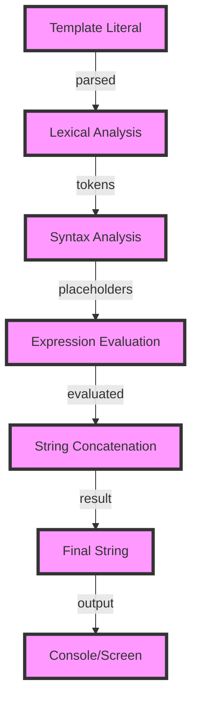

## Introduction
String interpolation is a **fundamental feature** in programming languages that allows developers to embed expressions within string literals. It enables the creation of dynamic strings by replacing placeholders with the actual values of variables or expressions. This feature is **essential** for tasks such as logging, error messages, and user interface text. In this overview, we will explore string interpolation in popular programming languages, including JavaScript, Python, Kotlin, Swift, Ruby, and Rust. We will delve into the **underlying mechanics**, compare the different approaches, and discuss **best practices** for using string interpolation in real-world applications.

## Core Concepts
String interpolation involves the **replacement of placeholders** within a string literal with the actual values of variables or expressions. The placeholder is typically denoted by a special character or syntax, such as `${expression}` or `#{expression}`. The **expression** can be a simple variable, a function call, or a complex calculation. The resulting string is then **evaluated** and returned as a new string object. Key terminology includes:
* **Template literal**: a string literal that contains placeholders for expressions
* **Placeholder**: a special syntax or character that denotes the location of an expression within a template literal
* **Expression**: the code that is evaluated and replaced within a placeholder

> **Note:** String interpolation is not limited to programming languages; it is also used in templating engines, such as Handlebars and Mustache, to generate dynamic HTML templates.

## How It Works Internally
When a programming language encounters a string interpolation expression, it **parses** the template literal and **identifies** the placeholders. The language then **evaluates** the expressions within the placeholders and **replaces** the placeholders with the resulting values. This process involves the following steps:
1. **Lexical analysis**: the language breaks the template literal into individual tokens, including the placeholders
2. **Syntax analysis**: the language parses the tokens and identifies the placeholders
3. **Expression evaluation**: the language evaluates the expressions within the placeholders
4. **String concatenation**: the language concatenates the evaluated expressions with the surrounding string literal

> **Warning:** String interpolation can lead to **security vulnerabilities** if not used properly, such as SQL injection attacks or cross-site scripting (XSS) attacks.

## Code Examples
### Example 1: Basic String Interpolation in JavaScript
```javascript
const name = 'John';
const age = 30;
console.log(`Hello, my name is ${name} and I am ${age} years old.`);
// Output: "Hello, my name is John and I am 30 years old."
```
### Example 2: String Interpolation with Functions in Python
```python
def greet(name):
    return f'Hello, {name}!'

print(greet('Jane'))  # Output: "Hello, Jane!"
```
### Example 3: Advanced String Interpolation with Conditionals in Kotlin
```kotlin
val name = "Bob"
val age = 25
println("Hello, my name is $name and I am ${if (age > 18) "an adult" else "a minor"}.")
// Output: "Hello, my name is Bob and I am an adult."
```
> **Tip:** Use string interpolation to create **dynamic error messages** that include relevant information about the error, such as the error code or the affected variables.

## Visual Diagram

The diagram illustrates the **step-by-step process** of string interpolation, from parsing the template literal to outputting the final string.

## Comparison
| Language | String Interpolation Syntax | Time Complexity | Space Complexity |
| --- | --- | --- | --- |
| JavaScript | `${expression}` | O(n) | O(n) |
| Python | `f-string` | O(n) | O(n) |
| Kotlin | `$variable` or `${expression}` | O(n) | O(n) |
| Swift | `\(expression)` | O(n) | O(n) |
| Ruby | `#{expression}` | O(n) | O(n) |
| Rust | `format!` macro | O(n) | O(n) |

> **Interview:** Can you explain the difference between string interpolation and concatenation? How do you choose between the two in a real-world application?

## Real-world Use Cases
1. **Logging**: string interpolation is used to create dynamic log messages that include relevant information about the error or event.
2. **Error handling**: string interpolation is used to create dynamic error messages that include relevant information about the error, such as the error code or the affected variables.
3. **User interface text**: string interpolation is used to create dynamic user interface text that includes relevant information, such as the user's name or the current date.

## Common Pitfalls
1. **SQL injection**: string interpolation can lead to SQL injection attacks if not used properly.
2. **Cross-site scripting (XSS)**: string interpolation can lead to XSS attacks if not used properly.
3. **Performance issues**: string interpolation can lead to performance issues if not used efficiently.
4. **Security vulnerabilities**: string interpolation can lead to security vulnerabilities if not used properly.

> **Warning:** Always use **parameterized queries** or **prepared statements** to prevent SQL injection attacks.

## Interview Tips
1. **Explain the difference between string interpolation and concatenation**: the interviewer wants to assess your understanding of the two concepts and how to choose between them.
2. **Describe a real-world use case for string interpolation**: the interviewer wants to assess your ability to apply string interpolation to a real-world problem.
3. **Discuss the security implications of string interpolation**: the interviewer wants to assess your understanding of the potential security risks associated with string interpolation.

## Key Takeaways
* String interpolation is a **fundamental feature** in programming languages that allows developers to embed expressions within string literals.
* String interpolation involves the **replacement of placeholders** within a string literal with the actual values of variables or expressions.
* String interpolation can lead to **security vulnerabilities** if not used properly, such as SQL injection attacks or cross-site scripting (XSS) attacks.
* String interpolation has a **time complexity** of O(n) and a **space complexity** of O(n), where n is the length of the string.
* String interpolation is used in **real-world applications**, such as logging, error handling, and user interface text.
* String interpolation should be used **efficiently** to avoid performance issues.
* String interpolation should be used **securely** to avoid security vulnerabilities.