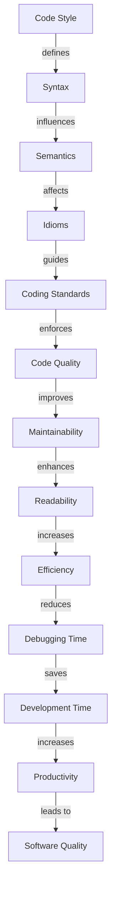

## Introduction
Code style and conventions are essential aspects of software development that ensure the maintainability, readability, and scalability of codebases. **Code style** refers to the set of rules and guidelines that dictate the structure and organization of code, while **conventions** refer to the established practices and standards within a specific programming language or community. In this section, we will explore the importance of code style and conventions, their real-world relevance, and why every engineer should be familiar with them.

> **Note:** Consistent code style and adherence to conventions can significantly reduce the time spent on code reviews, debugging, and maintenance, allowing developers to focus on writing new features and improving the overall quality of the codebase.

In real-world scenarios, code style and conventions play a crucial role in ensuring the success of large-scale software projects. For instance, companies like **Google**, **Microsoft**, and **Facebook** have well-established code style guides that all developers must follow to maintain consistency and readability across their codebases.

## Core Concepts
To understand code style and conventions, it's essential to grasp the following core concepts:

* **Syntax**: The set of rules that define the structure of a programming language.
* **Semantics**: The meaning of the code, including the behavior of variables, functions, and control structures.
* **Idioms**: Established patterns and practices within a programming language or community.
* **Coding standards**: A set of rules and guidelines that dictate the style and structure of code.

> **Tip:** Familiarizing yourself with the core concepts of code style and conventions can help you write more maintainable, readable, and efficient code.

Key terminology includes:

* **KISS principle** (Keep it Simple, Stupid): A design principle that emphasizes simplicity and minimalism in code.
* **DRY principle** (Don't Repeat Yourself): A principle that aims to reduce code duplication and improve maintainability.
* **YAGNI principle** (You Ain't Gonna Need It): A principle that encourages developers to only implement features that are necessary and avoid over-engineering.

## How It Works Internally
Code style and conventions work internally by establishing a set of rules and guidelines that dictate the structure and organization of code. This includes:

1. **Syntax highlighting**: The process of highlighting keywords, variables, and control structures to improve code readability.
2. **Code formatting**: The process of arranging code in a consistent and readable manner.
3. **Code analysis**: The process of examining code for errors, warnings, and suggestions for improvement.

> **Warning:** Ignoring code style and conventions can lead to code that is difficult to maintain, debug, and scale, ultimately affecting the overall quality and reliability of the software.

## Code Examples
Here are three complete and runnable code examples that demonstrate the importance of code style and conventions:

### Example 1: Basic Code Style (Python)
```python
# Define a function to calculate the area of a rectangle
def calculate_area(length, width):
    # Calculate the area using the formula: area = length * width
    area = length * width
    # Return the calculated area
    return area

# Test the function with sample values
length = 10
width = 5
area = calculate_area(length, width)
print("The area of the rectangle is:", area)
```

### Example 2: Real-World Code Style (Java)
```java
// Define a class to represent a bank account
public class BankAccount {
    // Define instance variables to store account information
    private int accountNumber;
    private double balance;

    // Define a constructor to initialize the account
    public BankAccount(int accountNumber, double balance) {
        this.accountNumber = accountNumber;
        this.balance = balance;
    }

    // Define a method to deposit funds into the account
    public void deposit(double amount) {
        // Update the balance by adding the deposited amount
        balance += amount;
    }

    // Define a method to withdraw funds from the account
    public void withdraw(double amount) {
        // Check if the account has sufficient funds
        if (balance >= amount) {
            // Update the balance by subtracting the withdrawn amount
            balance -= amount;
        } else {
            // Throw an exception if the account has insufficient funds
            throw new InsufficientFundsException("Insufficient funds in the account");
        }
    }
}
```

### Example 3: Advanced Code Style (C++)
```cpp
// Define a class to represent a complex number
class ComplexNumber {
    // Define instance variables to store real and imaginary parts
    private double real;
    private double imaginary;

    // Define a constructor to initialize the complex number
    public ComplexNumber(double real, double imaginary) {
        this->real = real;
        this->imaginary = imaginary;
    }

    // Define a method to calculate the magnitude of the complex number
    public double calculateMagnitude() {
        // Calculate the magnitude using the formula: magnitude = sqrt(real^2 + imaginary^2)
        return sqrt(pow(real, 2) + pow(imaginary, 2));
    }

    // Define a method to calculate the conjugate of the complex number
    public ComplexNumber calculateConjugate() {
        // Calculate the conjugate by changing the sign of the imaginary part
        return ComplexNumber(real, -imaginary);
    }
};
```

## Visual Diagram

The diagram illustrates the relationship between code style, syntax, semantics, idioms, coding standards, and software quality.

## Comparison
| Approach | Time Complexity | Space Complexity | Pros | Cons | Best For |
| --- | --- | --- | --- | --- | --- |
| KISS Principle | O(1) | O(1) | Simple, maintainable code | Limited functionality | Small-scale projects |
| DRY Principle | O(n) | O(n) | Reduced code duplication | Increased complexity | Large-scale projects |
| YAGNI Principle | O(1) | O(1) | Avoids over-engineering | Limited features | Rapid prototyping |
| Code Analysis | O(n) | O(n) | Improved code quality | Increased development time | Mission-critical projects |

## Real-world Use Cases
1. **Google's Code Style Guide**: Google has a comprehensive code style guide that covers topics such as naming conventions, coding standards, and best practices. This guide ensures consistency across all Google projects and helps developers write high-quality code.
2. **Microsoft's .NET Framework**: Microsoft's .NET Framework is a large-scale software project that follows a set of coding standards and guidelines. The framework's codebase is maintained by a large team of developers, and adherence to coding standards is crucial for ensuring the quality and reliability of the software.
3. **Facebook's Hack Language**: Facebook's Hack language is a programming language designed for large-scale software development. The language has a set of coding standards and guidelines that ensure consistency and readability across the codebase.

## Common Pitfalls
1. **Inconsistent naming conventions**: Using inconsistent naming conventions can lead to confusion and make the code harder to read.
2. **Ignoring coding standards**: Ignoring coding standards can result in low-quality code that is difficult to maintain and debug.
3. **Over-engineering**: Over-engineering can lead to complex code that is difficult to understand and maintain.
4. **Insufficient testing**: Insufficient testing can result in bugs and errors that can be difficult to detect and fix.

> **Warning:** Ignoring coding standards and best practices can lead to low-quality code that is difficult to maintain, debug, and scale.

## Interview Tips
1. **Be prepared to explain coding standards and guidelines**: Be prepared to explain the coding standards and guidelines you follow, and why they are important.
2. **Show examples of well-written code**: Show examples of well-written code that demonstrate your understanding of coding standards and best practices.
3. **Discuss the importance of code quality**: Discuss the importance of code quality and how it affects the overall software development process.

> **Interview:** Can you explain the difference between the KISS principle and the DRY principle? How do you apply these principles in your coding practice?

## Key Takeaways
* **Code style and conventions are essential for software development**: Consistent code style and adherence to conventions can significantly improve the quality and maintainability of codebases.
* **KISS principle, DRY principle, and YAGNI principle are important coding standards**: These principles help developers write simple, maintainable, and efficient code.
* **Code analysis is crucial for improving code quality**: Code analysis helps developers identify errors, warnings, and suggestions for improvement, ultimately leading to higher-quality code.
* **Ignoring coding standards and best practices can lead to low-quality code**: Ignoring coding standards and best practices can result in low-quality code that is difficult to maintain, debug, and scale.
* **Real-world examples demonstrate the importance of coding standards and guidelines**: Companies like Google, Microsoft, and Facebook have established coding standards and guidelines that ensure consistency and quality across their codebases.
* **Common pitfalls include inconsistent naming conventions, ignoring coding standards, over-engineering, and insufficient testing**: Being aware of these pitfalls can help developers avoid common mistakes and write higher-quality code.
* **Interviewers look for developers who understand coding standards and best practices**: Developers who can explain coding standards and best practices, and demonstrate their application in coding practice, are more likely to succeed in technical interviews.