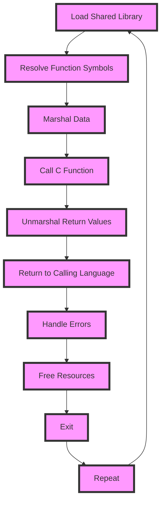

## Introduction
**Foreign Function Interface (FFI)** is a mechanism that allows code written in one programming language to call and interface with code written in another language. FFI is crucial in software development as it enables developers to leverage the strengths of different languages and reuse existing code. In this context, we will explore FFI in Python (using ctypes and cffi), Rust (using bindgen), and Go (using cgo). Understanding FFI is essential for any software engineer, as it allows for more efficient and effective development of complex systems.

## Core Concepts
- **ctypes**: A foreign function library for Python that provides C compatible data types and allows calling functions in DLLs or shared libraries.
- **cffi**: A foreign function interface for calling C code from Python.
- **bindgen**: A Rust library that generates Rust FFI bindings to C and C++ libraries.
- **cgo**: A Go command that enables the creation of Go packages that call C code.

> **Tip:** When working with FFI, it's essential to understand the memory models of the languages involved to avoid common pitfalls like memory leaks or crashes.

## How It Works Internally
When using FFI, the process involves the following steps:
1. **Loading the shared library**: The FFI library loads the shared library containing the C code.
2. **Resolving function symbols**: The FFI library resolves the function symbols in the shared library.
3. **Marshaling data**: The FFI library marshals the data between the two languages, handling differences in data types and memory layouts.
4. **Calling the C function**: The FFI library calls the C function, passing the marshaled data as arguments.
5. **Unmarshaling return values**: The FFI library unmarshals the return values from the C function and returns them to the calling language.

> **Warning:** When working with FFI, it's crucial to understand the calling conventions and data types used by the C code to avoid crashes or incorrect results.

## Code Examples
### Example 1: Basic Usage of ctypes in Python
```python
import ctypes

# Load the shared library
lib = ctypes.CDLL('./libexample.so')

# Define the function signature
lib.example_function.argtypes = [ctypes.c_int]
lib.example_function.restype = ctypes.c_int

# Call the C function
result = lib.example_function(5)
print(result)
```
### Example 2: Using cffi in Python
```python
import cffi

# Create a cffi interface
ffi = cffi.FFI()

# Define the C code
c_code = """
int example_function(int x) {
    return x * 2;
}
"""

# Compile the C code
ffi.cdef(c_code)
lib = ffi.dlopen("./libexample.so")

# Call the C function
result = lib.example_function(5)
print(result)
```
### Example 3: Using bindgen in Rust
```rust
// build.rs
use bindgen::Builder;

fn main() {
    let bindings = Builder::default()
        .header("example.h")
        .generate()
        .expect("Unable to generate bindings");

    bindings.write_to_file("src/bindings.rs").expect("Couldn't write bindings!");
}
```

```rust
// main.rs
extern crate bindings;

use bindings::*;

fn main() {
    let result = example_function(5);
    println!("{}", result);
}
```

## Visual Diagram

The diagram illustrates the steps involved in calling a C function from a different language using FFI.

## Comparison
| Approach | Time Complexity | Space Complexity | Pros | Cons | Best For |
|----------|----------------|-----------------|------|------|----------|
| ctypes | O(1) | O(n) | Easy to use, dynamic typing | Limited control over memory | Python developers who need to call C code |
| cffi | O(1) | O(n) | More control over memory, static typing | Steeper learning curve | Python developers who need fine-grained control over memory |
| bindgen | O(1) | O(n) | Automatically generates Rust bindings, safe | Requires Rust build system | Rust developers who need to call C code |
| cgo | O(1) | O(n) | Easy to use, automatic memory management | Limited control over memory | Go developers who need to call C code |

> **Note:** The time and space complexities listed are approximate and depend on the specific use case.

## Real-world Use Cases
1. **NumPy**: The popular Python library for numerical computing uses ctypes to call C code for performance-critical operations.
2. **Rust's std library**: The Rust standard library uses bindgen to generate bindings to C libraries, allowing Rust code to call C functions.
3. **Go's net library**: The Go net library uses cgo to call C code for network operations, providing a safe and efficient way to perform network I/O.

## Common Pitfalls
1. **Memory leaks**: Failing to free allocated memory can lead to memory leaks and crashes.
2. **Invalid memory access**: Accessing memory outside the bounds of an array or buffer can lead to crashes and security vulnerabilities.
3. **Incorrect data types**: Using incorrect data types can lead to crashes or incorrect results.
4. **Thread safety**: Failing to ensure thread safety can lead to crashes or incorrect results.

> **Warning:** When working with FFI, it's crucial to understand the memory models and data types used by the C code to avoid common pitfalls.

## Interview Tips
1. **What is FFI and how does it work?**: Be prepared to explain the basics of FFI and how it enables calling C code from other languages.
2. **How do you handle memory management when using FFI?**: Discuss the importance of memory management when using FFI and how to avoid common pitfalls like memory leaks.
3. **What are some common use cases for FFI?**: Be prepared to provide examples of real-world use cases for FFI, such as calling C code from Python or Rust.

> **Interview:** When answering FFI-related questions, be sure to emphasize your understanding of the memory models and data types used by the C code, as well as your ability to handle common pitfalls like memory leaks.

## Key Takeaways
* FFI enables calling C code from other languages, allowing for more efficient and effective development of complex systems.
* Understanding the memory models and data types used by the C code is crucial to avoid common pitfalls like memory leaks.
* ctypes, cffi, bindgen, and cgo are popular libraries for working with FFI in Python, Rust, and Go.
* Real-world use cases for FFI include numerical computing, network programming, and systems programming.
* Common pitfalls when working with FFI include memory leaks, invalid memory access, and incorrect data types.
* When using FFI, it's essential to ensure thread safety and handle errors properly.
* FFI can be used to improve performance, reuse existing code, and integrate with other languages and libraries.