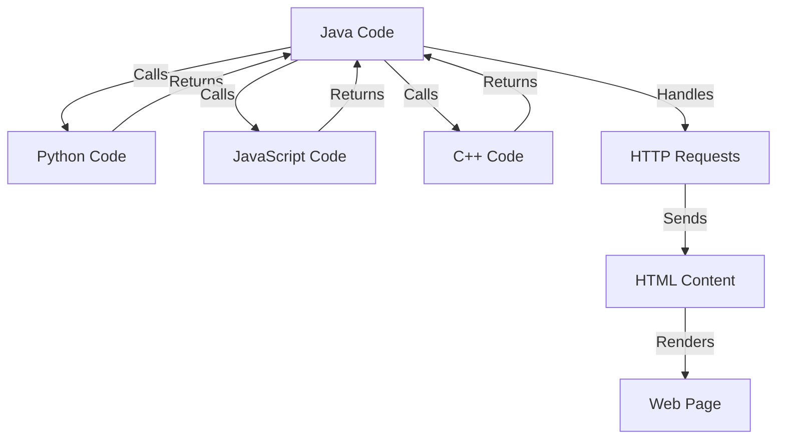

## Introduction
Polyglot programming is a software development approach that combines multiple programming languages to leverage their individual strengths and create a more efficient, scalable, and maintainable system. This approach has gained popularity in recent years due to the increasing complexity of modern software systems and the need for specialized languages to tackle specific problems. As a result, polyglot programming has become a valuable skill for software engineers, allowing them to create robust and high-performance systems that meet the demands of today's applications.

In real-world scenarios, polyglot programming is used in various domains, such as web development, mobile app development, and enterprise software development. For instance, a web application might use **JavaScript** for client-side scripting, **Python** for server-side logic, and **SQL** for database interactions. By combining these languages, developers can create a more efficient and scalable system that leverages the strengths of each language.

> **Note:** Polyglot programming is not about using multiple languages for the sake of using multiple languages, but rather about using the right language for the right task to create a more efficient and maintainable system.

## Core Concepts
To understand polyglot programming, it's essential to grasp the core concepts and terminology. Some key terms include:

* **Language interoperability**: The ability of different programming languages to communicate and exchange data with each other.
* **Language integration**: The process of combining multiple programming languages into a single system.
* **Polyglot framework**: A framework that supports the use of multiple programming languages, such as **Apache Polyglot** or **Google's Polyglot**.

A mental model for polyglot programming is to think of it as a **toolbox** where each language is a tool that serves a specific purpose. Just as a carpenter uses different tools for different tasks, a polyglot programmer uses different languages for different tasks.

## How It Works Internally
When combining multiple programming languages, it's essential to understand how they interact with each other internally. Here's a high-level overview of the process:

1. **Language compilation**: Each language is compiled into an intermediate representation (IR) that can be executed by the runtime environment.
2. **Runtime environment**: The runtime environment provides a common interface for the different languages to interact with each other.
3. **Data exchange**: Data is exchanged between languages using a common data format, such as **JSON** or **Protocol Buffers**.
4. **Function calls**: Functions are called between languages using a common interface, such as **REST APIs** or **gRPC**.

The under-the-hood mechanics of polyglot programming involve a complex interplay between language compilers, runtime environments, and data exchange protocols. Understanding these mechanics is crucial for building efficient and scalable polyglot systems.

## Code Examples
Here are three code examples that demonstrate polyglot programming in action:

### Example 1: Basic Polyglot Programming
```python
# Python code that calls a JavaScript function
import subprocess

def call_javascript():
    # Call the JavaScript function using Node.js
    result = subprocess.check_output(["node", "javascript_code.js"])
    return result.decode("utf-8")

print(call_javascript())
```

```javascript
// JavaScript code that returns a result
console.log("Hello from JavaScript!");
```

This example demonstrates a basic polyglot programming scenario where Python calls a JavaScript function using the `subprocess` module.

### Example 2: Polyglot Web Development
```java
// Java code that handles HTTP requests
import java.io.IOException;
import java.net.URI;
import java.net.http.HttpClient;
import java.net.http.HttpRequest;
import java.net.http.HttpResponse;

public class WebServer {
    public static void main(String[] args) {
        // Handle HTTP requests using Java
        HttpClient client = HttpClient.newHttpClient();
        HttpRequest request = HttpRequest.newBuilder()
                .uri(URI.create("http://localhost:8080"))
                .GET()
                .build();

        try {
            HttpResponse<String> response = client.send(request, HttpResponse.BodyHandlers.ofString());
            System.out.println(response.body());
        } catch (IOException | InterruptedException e) {
            e.printStackTrace();
        }
    }
}
```

```python
# Python code that generates HTML content
from flask import Flask, render_template

app = Flask(__name__)

@app.route("/")
def index():
    return render_template("index.html")

if __name__ == "__main__":
    app.run(port=8080)
```

This example demonstrates a polyglot web development scenario where Java handles HTTP requests and Python generates HTML content using the **Flask** framework.

### Example 3: Advanced Polyglot Programming
```cpp
// C++ code that calls a Python function
#include <iostream>
#include <Python.h>

int main() {
    // Initialize the Python interpreter
    Py_Initialize();

    // Call the Python function
    PyObject* result = PyObject_CallObject(PyObject_GetAttrString(PyObject_GetModule("python_code"), "python_function"), NULL);

    // Print the result
    std::cout << PyUnicode_AsUTF8(PyObject_Str(result)) << std::endl;

    // Clean up
    Py_Finalize();
    return 0;
}
```

```python
# Python code that returns a result
def python_function():
    return "Hello from Python!"
```

This example demonstrates an advanced polyglot programming scenario where C++ calls a Python function using the **Python/C API**.

## Visual Diagram

This diagram illustrates the polyglot programming scenario where Java code calls Python code, which returns a result. The Java code then calls JavaScript code, which returns another result. The Java code also handles HTTP requests and sends HTML content to the client.

> **Tip:** When designing a polyglot system, it's essential to consider the language interoperability and data exchange protocols to ensure seamless communication between languages.

## Comparison
| Approach | Time Complexity | Space Complexity | Pros | Cons | Best For |
|----------|----------------|-----------------|------|------|----------|
| Monolithic | O(n) | O(n) | Easy to develop, maintain | Limited scalability, performance | Small-scale applications |
| Microservices | O(log n) | O(log n) | Scalable, flexible | Complex, difficult to maintain | Large-scale applications |
| Polyglot | O(n) | O(n) | Leverages language strengths, efficient | Complex, difficult to integrate | Systems with diverse requirements |
| Hybrid | O(n) | O(n) | Combines strengths of multiple approaches | Complex, difficult to maintain | Systems with mixed requirements |

This comparison table highlights the trade-offs between different approaches to software development. Polyglot programming offers a unique set of benefits, including leveraging language strengths and efficient development, but also presents challenges, such as complex integration and maintenance.

## Real-world Use Cases
1. **Netflix**: Netflix uses a polyglot approach to develop its content delivery system, which combines Java, Python, and JavaScript to provide a scalable and efficient platform for streaming content.
2. **Google**: Google uses a polyglot approach to develop its search engine, which combines C++, Java, and Python to provide a fast and efficient search experience.
3. **Amazon**: Amazon uses a polyglot approach to develop its e-commerce platform, which combines Java, Python, and JavaScript to provide a scalable and efficient platform for online shopping.

> **Warning:** Polyglot programming can be complex and difficult to maintain if not done correctly. It's essential to consider the language interoperability and data exchange protocols to ensure seamless communication between languages.

## Common Pitfalls
1. **Language fragmentation**: Using too many languages can lead to fragmentation and make maintenance difficult.
2. **Data exchange issues**: Data exchange between languages can be challenging and may require additional overhead.
3. **Integration complexity**: Integrating multiple languages can be complex and require significant effort.
4. **Debugging challenges**: Debugging polyglot systems can be challenging due to the complexity of the system.

> **Interview:** When asked about polyglot programming in an interview, be prepared to discuss the benefits and challenges of using multiple languages in a single system. Emphasize the importance of language interoperability and data exchange protocols.

## Interview Tips
1. **Be prepared to discuss language strengths and weaknesses**: Be prepared to discuss the strengths and weaknesses of different programming languages and how they can be used in a polyglot system.
2. **Emphasize language interoperability**: Emphasize the importance of language interoperability and data exchange protocols in a polyglot system.
3. **Highlight system complexity**: Highlight the complexity of polyglot systems and the need for careful planning and maintenance.

> **Tip:** When designing a polyglot system, consider using a **polyglot framework** to simplify the integration process and reduce the complexity of the system.

## Key Takeaways
* Polyglot programming is a software development approach that combines multiple programming languages to leverage their individual strengths.
* Language interoperability and data exchange protocols are crucial for seamless communication between languages.
* Polyglot systems can be complex and difficult to maintain if not done correctly.
* The benefits of polyglot programming include efficient development, scalability, and flexibility.
* The challenges of polyglot programming include language fragmentation, data exchange issues, integration complexity, and debugging challenges.
* Polyglot frameworks can simplify the integration process and reduce the complexity of the system.
* Real-world examples of polyglot programming include Netflix, Google, and Amazon.
* When designing a polyglot system, consider the language strengths and weaknesses, language interoperability, and system complexity.