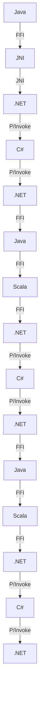

## Introduction
**Language interoperability** refers to the ability of different programming languages to interact and exchange data with each other seamlessly. In the context of **JVM (Java/Kotlin/Scala)** and **.NET (C#/F#/VB)**, language interoperability is crucial for building complex systems that require the strengths of multiple languages. For instance, a Java-based web application might need to integrate with a .NET-based service, or a Scala-based data processing pipeline might need to interact with a C#-based GUI application. Every engineer needs to understand language interoperability to design and implement efficient, scalable, and maintainable systems.

## Core Concepts
**Polyglot programming** is the practice of using multiple programming languages in a single project or system. **Language integration** refers to the process of combining multiple languages into a single system, while **foreign function interfaces (FFIs)** enable languages to call functions written in other languages. Key terminology includes **interop**, **marshaling**, and **unmarshaling**, which refer to the process of converting data between languages. A mental model for language interoperability is to think of it as a **bridge** between different language ecosystems, allowing them to communicate and exchange data.

## How It Works Internally
When a Java program calls a .NET method, the **JVM** and **CLR (Common Language Runtime)** need to communicate with each other. This is achieved through **FFIs**, which provide a way for languages to call functions written in other languages. The process involves **marshaling** the data from the Java side to the .NET side, and **unmarshaling** it back to Java. The **JNI (Java Native Interface)** and **P/Invoke (Platform Invoke)** are examples of FFIs that enable language interoperability between Java and .NET.

> **Note:** The JVM and CLR have different memory management models, which can lead to performance issues if not handled properly.

## Code Examples
### Example 1: Basic Java-.NET Interop using IKVM
```java
// Java code
import cli.System;

public class HelloWorld {
    public static void main(String[] args) {
        System.out.println("Hello, World!"); // prints to console
        cli.System.Console.WriteLine("Hello, .NET World!"); // prints to console
    }
}
```
This example demonstrates basic interop between Java and .NET using the **IKVM** library.

### Example 2: Scala-.NET Interop using Scala.NET
```scala
// Scala code
import scala.net._

object HelloWorld {
  def main(args: Array[String]) {
    println("Hello, World!") // prints to console
    val clr = new CLR()
    clr.Invoke("System.Console.WriteLine", "Hello, .NET World!") // prints to console
  }
}
```
This example demonstrates interop between Scala and .NET using the **Scala.NET** library.

### Example 3: Advanced Java-.NET Interop using JNA
```java
// Java code
import com.sun.jna.Library;
import com.sun.jna.Native;

public interface MyNETLibrary extends Library {
    void myNETMethod();
}

public class HelloWorld {
    public static void main(String[] args) {
        MyNETLibrary lib = Native.load("myNETLibrary", MyNETLibrary.class);
        lib.myNETMethod(); // calls the .NET method
    }
}
```
This example demonstrates advanced interop between Java and .NET using the **JNA (Java Native Access)** library.

## Visual Diagram

This diagram illustrates the language interoperability process between Java, .NET, and Scala.

> **Tip:** Use a **bridge** library like IKVM or Scala.NET to simplify the interop process.

## Comparison
| Approach | Time Complexity | Space Complexity | Pros | Cons | Best For |
| --- | --- | --- | --- | --- | --- |
| IKVM | O(1) | O(n) | Easy to use, supports multiple .NET versions | Limited control over memory management | Small-scale Java-.NET interop |
| Scala.NET | O(n) | O(n) | Flexible, supports advanced .NET features | Steeper learning curve, requires Scala expertise | Large-scale Scala-.NET interop |
| JNA | O(1) | O(1) | Low-level control, supports multiple .NET versions | Complex, requires native code expertise | Performance-critical Java-.NET interop |
| P/Invoke | O(n) | O(n) | Easy to use, supports multiple .NET versions | Limited control over memory management, requires .NET expertise | Small-scale .NET-C# interop |

## Real-world Use Cases
* **Apache Spark**: uses Scala-.NET interop to integrate with .NET-based data sources
* **Microsoft Azure**: uses Java-.NET interop to integrate with Java-based services
* **Google Cloud**: uses Scala-.NET interop to integrate with .NET-based services

> **Warning:** Poorly implemented language interoperability can lead to performance issues and memory leaks.

## Common Pitfalls
* **Memory management issues**: failing to properly manage memory between languages can lead to crashes and performance issues
* **Data type mismatches**: failing to properly convert data types between languages can lead to errors and crashes
* **Thread safety issues**: failing to properly handle thread safety between languages can lead to crashes and data corruption
* **Versioning issues**: failing to properly manage versioning between languages can lead to compatibility issues and errors

> **Interview:** Can you explain the difference between **marshaling** and **unmarshaling** in the context of language interoperability?

## Interview Tips
* **What is language interoperability?**: explain the concept of language interoperability and its importance in software development
* **How does Java-.NET interop work?**: explain the process of Java-.NET interop, including FFIs, marshaling, and unmarshaling
* **What are the benefits and drawbacks of using IKVM?**: discuss the pros and cons of using IKVM for Java-.NET interop

## Key Takeaways
* Language interoperability is crucial for building complex systems that require multiple languages
* **Polyglot programming** is the practice of using multiple programming languages in a single project or system
* **FFIs** provide a way for languages to call functions written in other languages
* **Marshaling** and **unmarshaling** are critical components of language interoperability
* **Memory management** and **thread safety** are important considerations when implementing language interoperability
* **Versioning** and **compatibility** issues can arise when working with multiple languages and versions
* **IKVM**, **Scala.NET**, and **JNA** are popular libraries for Java-.NET interop
* **P/Invoke** is a popular library for .NET-C# interop