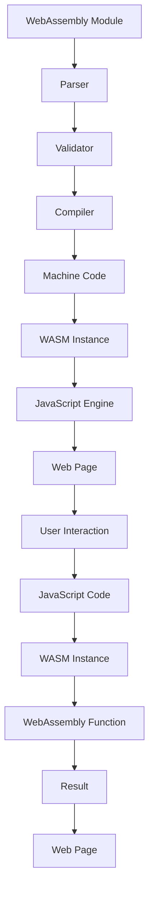

## Introduction
**WebAssembly (WASM)** is a binary instruction format that allows code written in languages such as **Rust**, **C++**, and **Go** to run in web browsers, as well as other environments that support the WASM runtime. This technology has been gaining traction in recent years, and its importance cannot be overstated. With WASM, developers can leverage the performance and security benefits of languages like **Rust** and **C++** in the browser, while still using high-level languages like **JavaScript** for scripting and DOM manipulation.
> **Note:** WebAssembly is not a replacement for JavaScript, but rather a complementary technology that allows for more efficient and secure execution of certain types of code.

In real-world scenarios, WASM is being used in various applications, such as **game development**, **scientific simulations**, and **cryptographic operations**. For instance, the **Mozilla** foundation is using WASM to power their **Firefox** browser's **WebVR** and **WebXR** features. Other companies, like **Google** and **Microsoft**, are also investing in WASM technology, with **Google** using it in their **Chrome** browser and **Microsoft** using it in their **Edge** browser.

## Core Concepts
To understand how WebAssembly works, we need to grasp some key concepts:
* **Module**: A WebAssembly module is a binary file that contains compiled code, which can be executed by a WASM runtime.
* **Instance**: A WebAssembly instance is an execution context for a module, which provides access to the module's functions and data.
* **Memory**: WebAssembly memory is a contiguous block of memory that can be accessed by a WASM instance.
* **Table**: A WebAssembly table is a data structure that stores function pointers, which can be used to invoke functions in a WASM instance.

These concepts are essential to understanding how WebAssembly works, and how to use it effectively in your applications.
> **Tip:** When working with WebAssembly, it's essential to understand the concept of **memory safety**, as WASM code can access and manipulate memory directly.

## How It Works Internally
When a WebAssembly module is loaded into a browser, the following steps occur:
1. **Parsing**: The WASM module is parsed into an **Abstract Syntax Tree (AST)**, which represents the module's structure and contents.
2. **Validation**: The AST is validated to ensure that it conforms to the WASM binary format specification.
3. **Compilation**: The validated AST is compiled into **machine code**, which can be executed by the browser's **JavaScript engine**.
4. **Instantiation**: The compiled machine code is instantiated into a **WASM instance**, which provides access to the module's functions and data.

This process happens transparently, and developers can focus on writing their application code without worrying about the underlying details.
> **Warning:** When working with WebAssembly, it's essential to be aware of the **security implications** of executing foreign code in the browser.

## Code Examples
### Example 1: Basic Usage
```rust
// hello.rs
use wasm_bindgen::prelude::*;

#[wasm_bindgen]
pub fn hello() {
    println!("Hello, world!");
}

#[wasm_bindgen]
pub fn add(a: i32, b: i32) -> i32 {
    a + b
}
```
```javascript
// main.js
import { hello, add } from './hello';

hello();
console.log(add(2, 3));
```
This example demonstrates how to use the **wasm-bindgen** tool to generate a WebAssembly module from Rust code, and how to invoke the module's functions from JavaScript.

### Example 2: Real-world Pattern
```cpp
// fibonacci.cpp
extern "C" {
    int fibonacci(int n);
}

int fibonacci(int n) {
    if (n <= 1) {
        return n;
    }
    return fibonacci(n - 1) + fibonacci(n - 2);
}
```
```javascript
// main.js
import { fibonacci } from './fibonacci';

console.log(fibonacci(10));
```
This example demonstrates how to use the **emscripten** tool to generate a WebAssembly module from C++ code, and how to invoke the module's functions from JavaScript.

### Example 3: Advanced Usage
```go
// goroutine.go
package main

import "fmt"

func fibonacci(n int) int {
    if n <= 1 {
        return n
    }
    return fibonacci(n - 1) + fibonacci(n - 2)
}

func main() {
    fmt.Println(fibonacci(10))
}
```
```javascript
// main.js
import { fibonacci } from './goroutine';

console.log(fibonacci(10));
```
This example demonstrates how to use the **go-wasm** tool to generate a WebAssembly module from Go code, and how to invoke the module's functions from JavaScript.

## Visual Diagram

This diagram illustrates the process of loading and executing a WebAssembly module in a browser.

## Comparison
| Approach | Time Complexity | Space Complexity | Pros | Cons | Best For |
| --- | --- | --- | --- | --- | --- |
| WebAssembly | O(1) | O(1) | High performance, memory safety | Limited support for dynamic typing | Games, scientific simulations |
| JavaScript | O(n) | O(n) | Dynamic typing, ease of development | Slow performance, memory leaks | Web development, scripting |
| Native Code | O(1) | O(1) | High performance, low-level access | Platform dependence, security risks | System programming, embedded systems |
| Emscripten | O(n) | O(n) | Easy conversion of C++ code, dynamic typing | Slow performance, large binary size | Porting C++ code to the web |

## Real-world Use Cases
1. **Mozilla**: Using WebAssembly to power their **Firefox** browser's **WebVR** and **WebXR** features.
2. **Google**: Using WebAssembly to power their **Chrome** browser's **WebAssembly** support.
3. **Microsoft**: Using WebAssembly to power their **Edge** browser's **WebAssembly** support.
4. **Autodesk**: Using WebAssembly to power their **AutoCAD** web application.
5. **Unity**: Using WebAssembly to power their **Unity** game engine's web deployment.

## Common Pitfalls
1. **Memory Safety**: WebAssembly code can access and manipulate memory directly, which can lead to security vulnerabilities if not handled properly.
2. **Performance Optimization**: WebAssembly code can be optimized for performance, but this requires a deep understanding of the underlying hardware and software architecture.
3. **Debugging**: Debugging WebAssembly code can be challenging due to the lack of visibility into the execution context.
4. **Interoperability**: WebAssembly code may not be compatible with all browsers or environments, which can lead to compatibility issues.

## Interview Tips
1. **What is WebAssembly?**: A binary instruction format that allows code written in languages like Rust, C++, and Go to run in web browsers.
2. **How does WebAssembly work?**: WebAssembly code is compiled into machine code, which is executed by the browser's JavaScript engine.
3. **What are the benefits of using WebAssembly?**: High performance, memory safety, and low-level access to hardware resources.
> **Interview:** Be prepared to answer questions about the benefits and trade-offs of using WebAssembly, as well as the challenges of debugging and optimizing WebAssembly code.

## Key Takeaways
* WebAssembly is a binary instruction format that allows code written in languages like Rust, C++, and Go to run in web browsers.
* WebAssembly code is compiled into machine code, which is executed by the browser's JavaScript engine.
* WebAssembly provides high performance, memory safety, and low-level access to hardware resources.
* WebAssembly is not a replacement for JavaScript, but rather a complementary technology that allows for more efficient and secure execution of certain types of code.
* WebAssembly is being used in various applications, such as game development, scientific simulations, and cryptographic operations.
* WebAssembly code can be optimized for performance, but this requires a deep understanding of the underlying hardware and software architecture.
* Debugging WebAssembly code can be challenging due to the lack of visibility into the execution context.
* WebAssembly may not be compatible with all browsers or environments, which can lead to compatibility issues.