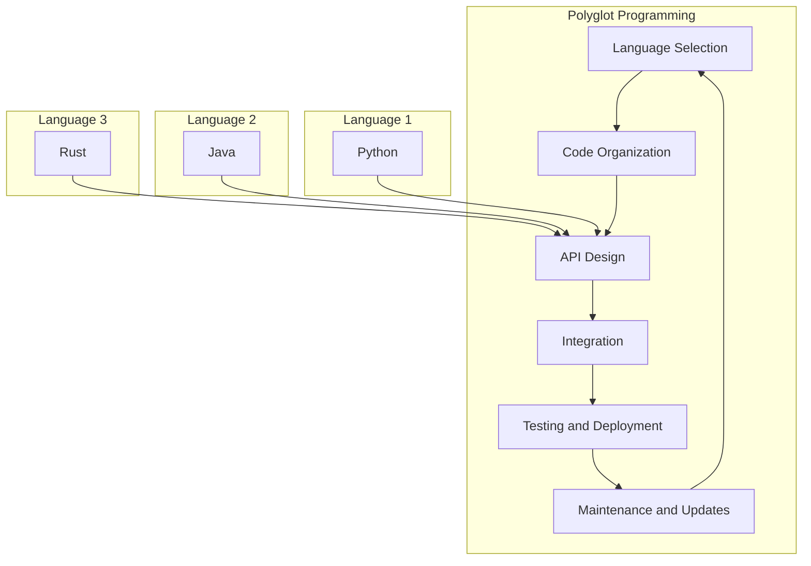

## Introduction
As a software engineer, it's essential to have a strong foundation in multiple programming languages. **Polyglot programming** refers to the practice of using multiple languages to develop a single application or system. This approach has become increasingly popular in recent years due to the diverse needs of modern software development. In this section, we'll explore why learning multiple languages is crucial for every engineer, and how it can benefit your career.

> **Note:** In today's fast-paced software development landscape, being proficient in a single language is no longer sufficient. Employers and clients expect developers to be adaptable and proficient in multiple languages to tackle complex projects.

## Core Concepts
To understand the importance of polyglot programming, let's define some key terms:

* **Programming paradigm**: A fundamental style or approach to programming, such as object-oriented, functional, or imperative.
* **Language syntax**: The set of rules that govern the structure of a programming language.
* **Language semantics**: The meaning and behavior of a programming language, including its type system, memory management, and concurrency model.

A mental model for polyglot programming is to consider each language as a tool in your toolbox. Just as a carpenter needs different tools for various tasks, a software engineer needs to be proficient in multiple languages to tackle diverse projects.

## How It Works Internally
When working with multiple languages, it's essential to understand how they interact and integrate with each other. Here's a step-by-step breakdown of the process:

1. **Language selection**: Choose the languages that best fit the project's requirements.
2. **Code organization**: Organize code into modules or components that can be developed and maintained independently.
3. **API design**: Design APIs to facilitate communication between languages and components.
4. **Integration**: Integrate code from different languages using techniques such as foreign function interfaces, RESTful APIs, or message queues.

> **Warning:** When working with multiple languages, it's easy to introduce complexity and technical debt. Be mindful of the trade-offs and ensure that the benefits of polyglot programming outweigh the added complexity.

## Code Examples
Here are three complete and runnable code examples that demonstrate polyglot programming:

### Example 1: Basic Polyglot Programming (Python and Java)
```python
# Python code that calls a Java method
import jpype

# Start the JVM
jpype.startJVM()

# Import the Java class
java_class = jpype.JClass("HelloWorld")

# Create an instance of the Java class
java_instance = java_class()

# Call the Java method
java_instance.sayHello()

# Shutdown the JVM
jpype.shutdownJVM()
```

```java
// Java code that defines the HelloWorld class
public class HelloWorld {
    public void sayHello() {
        System.out.println("Hello, World!");
    }
}
```

### Example 2: Real-World Polyglot Programming (Node.js and Python)
```javascript
// Node.js code that calls a Python script using child_process
const childProcess = require("child_process");

// Call the Python script
childProcess.exec("python python_script.py", (error, stdout, stderr) => {
    if (error) {
        console.error(error);
    } else {
        console.log(stdout);
    }
});
```

```python
# Python script that performs some calculation
def calculate_result():
    # Perform some calculation
    result = 2 + 2
    return result

# Print the result
print(calculate_result())
```

### Example 3: Advanced Polyglot Programming (Go and Rust)
```go
// Go code that calls a Rust function using cgo
package main

/*
#cgo LDFLAGS: -L. -lrust_lib
#include "rust_lib.h"
*/
import "C"
import "fmt"

func main() {
    // Call the Rust function
    result := C.rust_function()
    fmt.Println(result)
}
```

```rust
// Rust code that defines the rust_function
#[no_mangle]
pub extern "C" fn rust_function() -> i32 {
    // Perform some calculation
    let result = 2 + 2;
    result
}
```

## Visual Diagram

This diagram illustrates the polyglot programming process, from language selection to maintenance and updates. It also shows how different languages can be integrated using APIs and foreign function interfaces.

## Comparison
| Approach | Time Complexity | Space Complexity | Pros | Cons | Best For |
| --- | --- | --- | --- | --- | --- |
| Monolithic Architecture | O(1) | O(1) | Simple, easy to maintain | Limited scalability, inflexible | Small projects, prototypes |
| Microservices Architecture | O(n) | O(n) | Scalable, flexible | Complex, difficult to maintain | Large projects, enterprise systems |
| Polyglot Programming | O(n) | O(n) | Flexible, adaptable | Complex, difficult to maintain | Projects with diverse requirements, multiple languages |
| Service-Oriented Architecture | O(n) | O(n) | Scalable, flexible | Complex, difficult to maintain | Large projects, enterprise systems |

> **Tip:** When choosing an approach, consider the project's requirements, scalability needs, and maintainability. Polyglot programming can be a good choice when working with diverse languages and frameworks.

## Real-world Use Cases
Here are three real-world examples of polyglot programming in production:

1. **Netflix**: Netflix uses a combination of Java, Python, and JavaScript to power its streaming platform. Java is used for the backend, Python for data science and machine learning, and JavaScript for the frontend.
2. **Google**: Google uses a combination of C++, Java, and Python to power its search engine and other services. C++ is used for the core search algorithm, Java for the backend, and Python for data science and machine learning.
3. **Amazon**: Amazon uses a combination of Java, Python, and C++ to power its e-commerce platform. Java is used for the backend, Python for data science and machine learning, and C++ for the core database and storage systems.

## Common Pitfalls
Here are four common mistakes to avoid when working with polyglot programming:

1. **Inconsistent coding style**: Using different coding styles and conventions across languages can lead to confusion and maintenance issues.
2. **Insufficient testing**: Failing to test code thoroughly across languages and frameworks can lead to bugs and errors.
3. **Inadequate documentation**: Failing to document code and APIs properly can lead to confusion and maintenance issues.
4. **Over-engineering**: Using too many languages and frameworks can lead to complexity and technical debt.

> **Interview:** When asked about polyglot programming in an interview, be prepared to discuss the benefits and challenges of using multiple languages, and provide examples of how you've applied polyglot programming in your previous work.

## Interview Tips
Here are three common interview questions related to polyglot programming, along with weak and strong answers:

1. **Question:** What are the benefits of polyglot programming?
	* Weak answer: "It's just a way to use multiple languages."
	* Strong answer: "Polyglot programming allows us to choose the best language for each task, improving productivity and maintainability. It also enables us to leverage the strengths of different languages and frameworks."
2. **Question:** How do you handle inconsistencies between languages?
	* Weak answer: "I just use a single language for everything."
	* Strong answer: "I use a combination of coding standards, automated testing, and code reviews to ensure consistency across languages. I also document code and APIs thoroughly to facilitate maintenance and collaboration."
3. **Question:** What are some common pitfalls to avoid when working with polyglot programming?
	* Weak answer: "I don't know."
	* Strong answer: "Some common pitfalls include inconsistent coding style, insufficient testing, inadequate documentation, and over-engineering. I avoid these pitfalls by using coding standards, automated testing, and code reviews, and by carefully selecting the languages and frameworks that best fit the project's requirements."

## Key Takeaways
Here are ten key takeaways to remember when working with polyglot programming:

* **Choose the right languages**: Select languages that best fit the project's requirements.
* **Use coding standards**: Establish consistent coding standards across languages.
* **Test thoroughly**: Test code thoroughly across languages and frameworks.
* **Document code and APIs**: Document code and APIs thoroughly to facilitate maintenance and collaboration.
* **Avoid over-engineering**: Avoid using too many languages and frameworks.
* **Leverage language strengths**: Leverage the strengths of different languages and frameworks.
* **Use foreign function interfaces**: Use foreign function interfaces to integrate code from different languages.
* **Use APIs and message queues**: Use APIs and message queues to facilitate communication between languages and components.
* **Monitor and maintain**: Monitor and maintain code and systems to ensure scalability and performance.
* **Continuously learn**: Continuously learn and adapt to new languages, frameworks, and technologies.