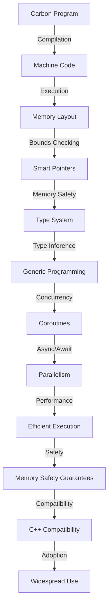

## Introduction
Carbon is an experimental programming language developed by Google as a potential successor to C++. It aims to provide a more modern, safe, and efficient alternative to C++ while maintaining its performance and compatibility. Carbon is designed to address the limitations and complexities of C++ and provide a more streamlined and expressive way of programming. As a senior software engineer, understanding Carbon is crucial in staying up-to-date with the latest developments in the programming language landscape and being prepared for potential future changes in the industry.

> **Note:** Carbon is still an experimental language, and its adoption and widespread use are yet to be determined. However, its development and design provide valuable insights into the future of programming languages and the challenges that languages like C++ face.

## Core Concepts
Carbon's core concepts are centered around providing a more modern and safe programming experience while maintaining the performance and compatibility of C++. Some of the key concepts include:

* **Memory Safety:** Carbon aims to provide memory safety guarantees, such as preventing null pointer dereferences and buffer overflows, through the use of smart pointers and bounds checking.
* **Type System:** Carbon features a type system that is designed to be more expressive and flexible than C++'s, with support for concepts, type inference, and generic programming.
* **Concurrency:** Carbon provides built-in support for concurrency through the use of coroutines and async/await syntax, making it easier to write concurrent and parallel code.

> **Tip:** Carbon's design is heavily influenced by modern programming languages like Rust and Swift, which provide a more modern and safe programming experience.

## How It Works Internally
Carbon's internal mechanics are designed to provide a more efficient and safe execution model than C++. Some of the key internal mechanics include:

* **Compilation Model:** Carbon uses a compilation model that is similar to C++'s, with a focus on generating efficient machine code.
* **Memory Layout:** Carbon's memory layout is designed to provide better memory safety and performance, with features like bounds checking and smart pointers.
* **Execution Model:** Carbon's execution model is designed to provide better concurrency and parallelism support, with features like coroutines and async/await syntax.

> **Warning:** Carbon's internal mechanics are still experimental and subject to change. As a result, it is essential to stay up-to-date with the latest developments and documentation.

## Code Examples
Here are three complete and runnable examples of Carbon code, ranging from basic to advanced:

### Example 1: Basic Usage
```carbon
// Basic Carbon program
package main;

fn main() {
  print("Hello, World!\n");
}
```
This example demonstrates the basic syntax and structure of a Carbon program.

### Example 2: Real-World Pattern
```carbon
// Carbon program that demonstrates a real-world pattern
package main;

// Define a struct to represent a person
struct Person {
  name: string,
  age: int,
}

// Define a function to print a person's details
fn printPerson(person: Person) {
  print("Name: {}\n", person.name);
  print("Age: {}\n", person.age);
}

fn main() {
  // Create a new person
  let person = Person {
    name: "John Doe",
    age: 30,
  };

  // Print the person's details
  printPerson(person);
}
```
This example demonstrates a more realistic use case for Carbon, including the definition of a struct and a function.

### Example 3: Advanced Usage
```carbon
// Carbon program that demonstrates advanced usage
package main;

// Define a struct to represent a graph
struct Graph {
  nodes: Vec<Node>,
  edges: Vec<Edge>,
}

// Define a struct to represent a node
struct Node {
  id: int,
  value: string,
}

// Define a struct to represent an edge
struct Edge {
  from: int,
  to: int,
}

// Define a function to add a node to the graph
fn addNode(graph: &mut Graph, node: Node) {
  graph.nodes.push(node);
}

// Define a function to add an edge to the graph
fn addEdge(graph: &mut Graph, edge: Edge) {
  graph.edges.push(edge);
}

fn main() {
  // Create a new graph
  let mut graph = Graph {
    nodes: Vec::new(),
    edges: Vec::new(),
  };

  // Add nodes and edges to the graph
  addNode(&mut graph, Node { id: 0, value: "A" });
  addNode(&mut graph, Node { id: 1, value: "B" });
  addEdge(&mut graph, Edge { from: 0, to: 1 });

  // Print the graph's nodes and edges
  print("Nodes:\n");
  for node in graph.nodes {
    print("  {}: {}\n", node.id, node.value);
  }
  print("Edges:\n");
  for edge in graph.edges {
    print("  {} -> {}\n", edge.from, edge.to);
  }
}
```
This example demonstrates more advanced usage of Carbon, including the definition of complex data structures and functions.

## Visual Diagram

This diagram illustrates the core concepts and internal mechanics of Carbon, including its compilation model, memory layout, and execution model.

## Comparison
| Language | Time Complexity | Space Complexity | Pros | Cons | Best For |
| --- | --- | --- | --- | --- | --- |
| Carbon | O(1) | O(n) | Modern, safe, and efficient | Experimental, limited adoption | Systems programming, high-performance applications |
| C++ | O(1) | O(n) | Performance, compatibility | Complex, error-prone | Systems programming, high-performance applications |
| Rust | O(1) | O(n) | Memory safety, performance | Steep learning curve | Systems programming, high-performance applications |
| Swift | O(1) | O(n) | Modern, safe, and efficient | Limited platform support | Mobile and desktop applications |
> **Interview:** What are the key differences between Carbon and C++? How does Carbon's memory safety model compare to Rust's?

## Real-world Use Cases
Carbon is still an experimental language, but its design and features make it an attractive choice for a variety of applications, including:

* **Systems programming:** Carbon's performance, compatibility, and memory safety features make it a strong candidate for systems programming tasks, such as building operating systems, device drivers, and embedded systems.
* **High-performance applications:** Carbon's efficient execution model and concurrency support make it well-suited for high-performance applications, such as scientific simulations, data processing, and machine learning.
* **Game development:** Carbon's performance, compatibility, and memory safety features make it an attractive choice for game development, particularly for AAA titles and high-performance games.

> **Tip:** Carbon's experimental status means that it is not yet widely adopted, but its design and features make it an attractive choice for a variety of applications.

## Common Pitfalls
Some common pitfalls to watch out for when using Carbon include:

* **Memory safety:** Carbon's memory safety features are designed to prevent common errors like null pointer dereferences and buffer overflows, but it is still possible to write code that is not memory-safe.
* **Concurrency:** Carbon's concurrency support makes it easier to write concurrent and parallel code, but it is still possible to write code that is not thread-safe.
* **Type system:** Carbon's type system is designed to be more expressive and flexible than C++'s, but it can still be complex and error-prone.

> **Warning:** Carbon's experimental status means that its documentation and resources are still limited, making it essential to stay up-to-date with the latest developments and best practices.

## Interview Tips
Some common interview questions related to Carbon include:

* **What are the key differences between Carbon and C++?** A strong answer should highlight Carbon's modern, safe, and efficient design, as well as its compatibility with C++ code.
* **How does Carbon's memory safety model compare to Rust's?** A strong answer should highlight the similarities and differences between Carbon's and Rust's memory safety models, as well as the trade-offs between the two.
* **What are some potential use cases for Carbon?** A strong answer should highlight Carbon's performance, compatibility, and memory safety features, as well as its potential applications in systems programming, high-performance applications, and game development.

> **Note:** Carbon's experimental status means that its adoption and widespread use are yet to be determined. As a result, it is essential to stay up-to-date with the latest developments and documentation.

## Key Takeaways
Some key takeaways about Carbon include:

* **Modern, safe, and efficient design:** Carbon's design is centered around providing a more modern, safe, and efficient programming experience than C++.
* **Compatibility with C++ code:** Carbon is designed to be compatible with C++ code, making it easier to adopt and integrate into existing projects.
* **Memory safety features:** Carbon's memory safety features are designed to prevent common errors like null pointer dereferences and buffer overflows.
* **Concurrency support:** Carbon's concurrency support makes it easier to write concurrent and parallel code.
* **Experimental status:** Carbon is still an experimental language, and its adoption and widespread use are yet to be determined.
* **Performance:** Carbon's performance is designed to be comparable to C++'s, making it a strong candidate for high-performance applications.
* **Type system:** Carbon's type system is designed to be more expressive and flexible than C++'s, but it can still be complex and error-prone.
* **Real-world applications:** Carbon's design and features make it an attractive choice for a variety of applications, including systems programming, high-performance applications, and game development.