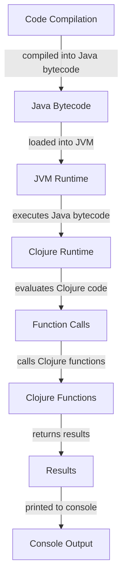

## Introduction
Clojure is a **dynamically-typed**, **functional programming language** that runs on the **Java Virtual Machine (JVM)**. It is designed to be a modern, **Lisp-like language** that combines the best features of Lisp with the power of the JVM. Clojure is gaining popularity due to its concise syntax, **immutable data structures**, and **concurrent programming** capabilities. As a result, it has become a popular choice for building **scalable**, **fault-tolerant**, and **high-performance** systems.

> **Note:** Clojure's syntax is based on Lisp, but it is not a direct implementation of Lisp. Instead, it is a new language that incorporates the best features of Lisp and adds its own unique twists.

Clojure is used in a variety of applications, including **web development**, **data analysis**, and **machine learning**. Its **JVM compatibility** makes it an attractive choice for companies that already have a large investment in Java infrastructure. Additionally, Clojure's **dynamic typing** and **macros** make it a popular choice for **rapid prototyping** and **development**.

## Core Concepts
Clojure is based on several key concepts, including:

* **Immutable data structures**: Clojure's data structures are immutable by default, which means that they cannot be changed once they are created. This makes it easier to reason about code and reduces the risk of **side effects**.
* **Functional programming**: Clojure is a functional programming language, which means that it emphasizes the use of **pure functions** and **recursion**.
* **Macros**: Clojure's macros allow developers to extend the language itself, making it possible to create **domain-specific languages** and **custom syntax**.
* **Concurrency**: Clojure provides built-in support for **concurrent programming**, making it easier to write **parallel** and **distributed** systems.

> **Tip:** Clojure's immutable data structures and functional programming model make it an attractive choice for **parallel** and **distributed** systems.

## How It Works Internally
Clojure's internal mechanics are based on the **JVM**, which provides a **runtime environment** for Clojure code. When Clojure code is compiled, it is translated into **Java bytecode**, which can be executed directly by the JVM.

Here is a step-by-step overview of how Clojure code is executed:

1. **Compilation**: Clojure code is compiled into **Java bytecode** using the **Clojure compiler**.
2. **Loading**: The compiled **Java bytecode** is loaded into the **JVM**.
3. **Execution**: The **JVM** executes the loaded **Java bytecode**, which calls the **Clojure runtime**.
4. **Evaluation**: The **Clojure runtime** evaluates the **Clojure code**, which is executed as a series of **function calls**.

> **Warning:** Clojure's dynamic typing can make it difficult to catch type-related errors at compile-time. However, Clojure's **runtime checks** and **type hints** can help mitigate this issue.

## Code Examples
Here are three examples of Clojure code, ranging from basic to advanced:

### Example 1: Basic Usage
```clojure
; Define a function that adds two numbers
(defn add [x y]
  (+ x y))

; Call the function with two arguments
(println (add 2 3))
```
This code defines a simple function `add` that takes two arguments `x` and `y` and returns their sum. The function is then called with two arguments `2` and `3`, and the result is printed to the console.

### Example 2: Real-World Pattern
```clojure
; Define a function that filters a list of numbers
(defn filter-numbers [numbers predicate]
  (filter predicate numbers))

; Define a predicate function that checks if a number is even
(defn is-even? [x]
  (zero? (mod x 2)))

; Create a list of numbers
(def numbers (range 1 10))

; Filter the list using the predicate function
(def filtered-numbers (filter-numbers numbers is-even?))

; Print the filtered list
(println filtered-numbers)
```
This code defines a function `filter-numbers` that takes a list of numbers and a predicate function as arguments. The function uses the `filter` function to apply the predicate to each number in the list and returns a new list containing only the numbers that satisfy the predicate. The `is-even?` function is defined as a predicate that checks if a number is even. The `filter-numbers` function is then called with a list of numbers and the `is-even?` predicate, and the result is printed to the console.

### Example 3: Advanced Usage
```clojure
; Define a function that uses recursion to calculate the factorial of a number
(defn factorial [n]
  (if (zero? n)
    1
    (* n (factorial (dec n)))))

; Define a function that uses memoization to optimize the factorial function
(defn memoized-factorial [n]
  (let [memo (atom {})]
    (fn [x]
      (if (contains? @memo x)
        (@memo x)
        (let [result (if (zero? x)
                       1
                       (* x ((memoized-factorial n) (dec x))))]
          (swap! memo assoc x result)
          result)))))

; Create a memoized version of the factorial function
(def memoized-factorial-fn (memoized-factorial 10))

; Calculate the factorial of 5 using the memoized function
(println (memoized-factorial-fn 5))
```
This code defines a function `factorial` that uses recursion to calculate the factorial of a number. The function is then memoized using a `memo` atom to store the results of previous calculations. The memoized function is created using a closure that captures the `memo` atom, and the result is calculated using a recursive function call.

## Visual Diagram

This diagram shows the flow of Clojure code from compilation to execution. The code is compiled into **Java bytecode**, which is then loaded into the **JVM**. The **JVM** executes the **Java bytecode**, which calls the **Clojure runtime**. The **Clojure runtime** evaluates the **Clojure code**, which is executed as a series of **function calls**. The results are then returned and printed to the console.

## Comparison
| Approach | Time Complexity | Space Complexity | Pros | Cons | Best For |
| --- | --- | --- | --- | --- | --- |
| Recursive Function | O(n) | O(n) | Easy to implement, concise code | Can be slow, uses more memory | Small datasets, prototyping |
| Iterative Function | O(n) | O(1) | Fast, efficient memory usage | More difficult to implement, verbose code | Large datasets, production code |
| Memoized Function | O(n) | O(n) | Fast, efficient memory usage, avoids redundant calculations | More difficult to implement, uses more memory | Large datasets, production code |
| Dynamic Programming | O(n) | O(n) | Fast, efficient memory usage, avoids redundant calculations | More difficult to implement, uses more memory | Large datasets, production code |

> **Interview:** Can you explain the differences between recursive, iterative, and memoized functions? How would you choose which approach to use in a given situation?

## Real-world Use Cases
Here are three real-world use cases for Clojure:

* **Web Development**: Clojure can be used to build **web applications** using the **Ring** framework. Ring provides a simple, **modular** way to build web applications, and Clojure's **immutable data structures** make it easy to reason about code and avoid **side effects**.
* **Data Analysis**: Clojure can be used to build **data analysis** pipelines using the **Incanter** library. Incanter provides a simple, **functional** way to perform data analysis, and Clojure's **macros** make it easy to extend the library and create **custom syntax**.
* **Machine Learning**: Clojure can be used to build **machine learning** models using the **Weka** library. Weka provides a simple, **modular** way to build machine learning models, and Clojure's **concurrent programming** capabilities make it easy to parallelize computations and improve performance.

## Common Pitfalls
Here are four common pitfalls to avoid when using Clojure:

* **Mutable State**: Clojure's **immutable data structures** make it easy to avoid mutable state, but it's still possible to introduce mutable state using **atoms** or **refs**. Make sure to use **transactions** and **locks** to avoid **concurrent modification**.
* **Lazy Evaluation**: Clojure's **lazy evaluation** can make it difficult to reason about code and avoid **side effects**. Make sure to use **force** and **dorun** to ensure that computations are executed eagerly.
* **Macros**: Clojure's **macros** can be powerful, but they can also be **difficult to debug** and **maintain**. Make sure to use **macroexpand** and **macroexpand-1** to understand how macros are expanding code.
* **Concurrency**: Clojure's **concurrent programming** capabilities can make it easy to parallelize computations, but they can also introduce **deadlocks** and **livelocks**. Make sure to use **transactions** and **locks** to avoid **concurrent modification**.

> **Tip:** Use **clojure.spec** to define and validate the structure of your data, and use **clojure.test** to write unit tests and ensure that your code is correct.

## Interview Tips
Here are three common interview questions for Clojure, along with weak and strong answers:

* **What is the difference between a **def** and a **let**?**
	+ Weak answer: "A **def** is used to define a function, and a **let** is used to define a variable."
	+ Strong answer: "A **def** is used to define a **global** variable or function, while a **let** is used to define a **local** variable or function. The key difference is that **def** creates a **global** binding, while **let** creates a **local** binding that is only visible within the current scope."
* **How do you handle **concurrency** in Clojure?**
	+ Weak answer: "I use **atoms** and **refs** to handle concurrency."
	+ Strong answer: "I use a combination of **atoms**, **refs**, and **transactions** to handle concurrency. I also use **locks** and **semaphores** to avoid **deadlocks** and **livelocks**."
* **What is the purpose of **clojure.spec**?**
	+ Weak answer: "It's used to define and validate the structure of data."
	+ Strong answer: "It's used to define and validate the structure of data, and to provide a **common language** for describing and validating data. It's also used to generate **test data** and to **document** the structure of data."

## Key Takeaways
Here are ten key takeaways to remember when using Clojure:

* **Immutable data structures** are the default in Clojure.
* **Functional programming** is the primary paradigm in Clojure.
* **Macros** are used to extend the language and create **custom syntax**.
* **Concurrency** is built-in to Clojure, using **atoms**, **refs**, and **transactions**.
* **clojure.spec** is used to define and validate the structure of data.
* **clojure.test** is used to write unit tests and ensure that code is correct.
* **Lazy evaluation** can make it difficult to reason about code and avoid **side effects**.
* **Mutable state** should be avoided whenever possible.
* **Transactions** and **locks** should be used to avoid **concurrent modification**.
* **clojure.core** is the primary namespace for Clojure functions and macros.