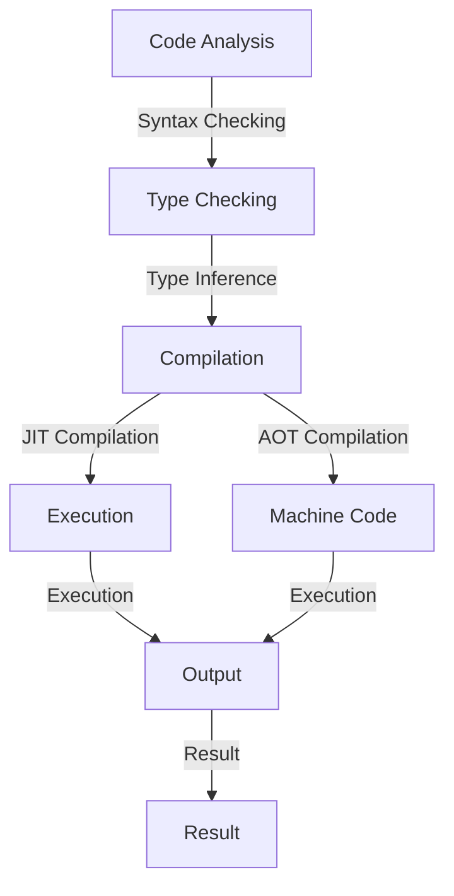

## Introduction
**Dart** is a modern, object-oriented programming language developed by Google, designed to create fast, scalable, and maintainable applications. It is the primary language used for building **Flutter** applications, a popular framework for developing natively compiled applications for mobile, web, and desktop. Dart's syntax is simple and easy to learn, making it an ideal language for both beginners and experienced developers.

> **Note:** Dart's primary goal is to provide a high-level, easy-to-learn language that can be used for a wide range of applications, from small scripts to large-scale enterprise systems.

Dart's real-world relevance is evident in its widespread adoption in the industry. Many companies, including Google, Alibaba, and Tencent, use Dart to build their applications. With Dart, developers can create high-performance, visually appealing applications with a single codebase, making it an attractive choice for cross-platform development.

## Core Concepts
To understand Dart, it's essential to grasp its core concepts. Here are some key terms and definitions:

* **Variables**: In Dart, variables are declared using the `var` keyword. Variables can hold values of any type, including numbers, strings, and objects.
* **Functions**: Functions in Dart are blocks of code that can be executed multiple times from different parts of a program. Functions can take arguments and return values.
* **Classes**: Classes in Dart are templates for creating objects. Classes define properties and methods that can be used to manipulate objects.
* **Inheritance**: Inheritance in Dart allows one class to inherit properties and methods from another class.

> **Tip:** Dart's syntax is similar to Java and C#, making it easier for developers familiar with these languages to learn Dart.

## How It Works Internally
Dart's internal workings are based on a just-in-time (JIT) compiler and an ahead-of-time (AOT) compiler. The JIT compiler compiles Dart code into machine code at runtime, while the AOT compiler compiles Dart code into machine code before runtime.

Here's a step-by-step breakdown of how Dart works internally:

1. **Code Analysis**: The Dart compiler analyzes the code and performs syntax checking, type checking, and other checks to ensure the code is valid.
2. **Compilation**: The Dart compiler compiles the code into an intermediate representation (IR) that can be executed by the Dart runtime.
3. **Execution**: The Dart runtime executes the IR code, either by compiling it to machine code using the JIT compiler or by executing the pre-compiled machine code using the AOT compiler.

> **Warning:** Dart's JIT compiler can introduce performance overhead due to the compilation process. However, the AOT compiler can mitigate this overhead by compiling the code ahead of time.

## Code Examples
Here are three complete and runnable code examples that demonstrate Dart's features:

### Example 1: Basic Usage
```dart
// Define a function to print a message
void printMessage(String message) {
  print(message);
}

// Call the function with a message
void main() {
  printMessage('Hello, World!');
}
```

### Example 2: Real-World Pattern
```dart
// Define a class to represent a person
class Person {
  String name;
  int age;

  // Constructor to initialize the person's name and age
  Person(this.name, this.age);

  // Method to print the person's details
  void printDetails() {
    print('Name: $name, Age: $age');
  }
}

// Create a person object and print their details
void main() {
  Person person = Person('John Doe', 30);
  person.printDetails();
}
```

### Example 3: Advanced Usage
```dart
// Define a class to represent a bank account
class BankAccount {
  String accountNumber;
  double balance;

  // Constructor to initialize the account number and balance
  BankAccount(this.accountNumber, this.balance);

  // Method to deposit money into the account
  void deposit(double amount) {
    balance += amount;
  }

  // Method to withdraw money from the account
  void withdraw(double amount) {
    if (balance >= amount) {
      balance -= amount;
    } else {
      print('Insufficient balance!');
    }
  }

  // Method to print the account details
  void printDetails() {
    print('Account Number: $accountNumber, Balance: $balance');
  }
}

// Create a bank account object, deposit and withdraw money, and print the account details
void main() {
  BankAccount account = BankAccount('1234567890', 1000.0);
  account.deposit(500.0);
  account.withdraw(200.0);
  account.printDetails();
}
```

## Visual Diagram


The diagram illustrates the internal workings of Dart, from code analysis to execution.

## Comparison
Here's a comparison table that highlights Dart's features and performance:

| Language | Time Complexity | Space Complexity | Pros | Cons | Best For |
| --- | --- | --- | --- | --- | --- |
| Dart | O(1) - O(n) | O(1) - O(n) | Easy to learn, high-performance, cross-platform | Steep learning curve for advanced features | Mobile and web application development |
| Java | O(1) - O(n) | O(1) - O(n) | Robust ecosystem, large community | Verbose syntax, slow startup time | Enterprise software development |
| C++ | O(1) - O(n) | O(1) - O(n) | High-performance, low-level memory management | Steep learning curve, error-prone | Operating systems, games, and high-performance applications |
| JavaScript | O(1) - O(n) | O(1) - O(n) | Ubiquitous, dynamic, and flexible | Security concerns, slow performance | Web development, scripting |

> **Interview:** When asked about the pros and cons of using Dart, a good answer would highlight its ease of use, high-performance capabilities, and cross-platform support, while also acknowledging its limitations, such as the steep learning curve for advanced features.

## Real-world Use Cases
Here are three real-world use cases that demonstrate Dart's capabilities:

1. **Google Ads**: Google uses Dart to build its Google Ads platform, which handles millions of requests per second.
2. **Alibaba's Flutter-based App**: Alibaba built its mobile app using Flutter and Dart, which provides a seamless user experience and high-performance capabilities.
3. **Tencent's WeChat**: Tencent uses Dart to build its WeChat platform, which has over a billion active users.

## Common Pitfalls
Here are four common pitfalls to watch out for when using Dart:

1. **Null Safety**: Dart's null safety feature can help prevent null pointer exceptions, but it requires careful handling of null values.
2. **Async/Await**: Dart's async/await syntax can simplify asynchronous programming, but it requires careful handling of promises and futures.
3. **Type Inference**: Dart's type inference feature can simplify type declarations, but it requires careful handling of type parameters and generics.
4. **Error Handling**: Dart's error handling mechanisms can help catch and handle errors, but it requires careful handling of try-catch blocks and error types.

> **Warning:** Failing to handle null values, async/await promises, type inference, and error handling can lead to runtime errors and performance issues.

## Interview Tips
Here are three common interview questions and tips for answering them:

1. **What is Dart's null safety feature?**: A good answer would explain Dart's null safety feature, its benefits, and how to handle null values.
2. **How does Dart's async/await syntax work?**: A good answer would explain Dart's async/await syntax, its benefits, and how to handle promises and futures.
3. **What is the difference between Dart's JIT and AOT compilers?**: A good answer would explain the difference between Dart's JIT and AOT compilers, their benefits, and how to use them.

> **Tip:** When answering interview questions, be sure to provide specific examples and code snippets to demonstrate your understanding of Dart's features and concepts.

## Key Takeaways
Here are ten key takeaways to remember when using Dart:

* **Dart is a modern, object-oriented programming language**.
* **Dart is designed for building fast, scalable, and maintainable applications**.
* **Dart's syntax is simple and easy to learn**.
* **Dart has a high-performance JIT compiler and AOT compiler**.
* **Dart supports null safety, async/await, and type inference**.
* **Dart has a large and growing ecosystem of libraries and frameworks**.
* **Dart is used by Google, Alibaba, and Tencent for building large-scale applications**.
* **Dart's time complexity and space complexity vary depending on the use case**.
* **Dart's pros include ease of use, high-performance capabilities, and cross-platform support**.
* **Dart's cons include a steep learning curve for advanced features and limited resources for certain use cases**.

> **Note:** By following these key takeaways, you can get started with Dart and build high-performance, scalable, and maintainable applications.