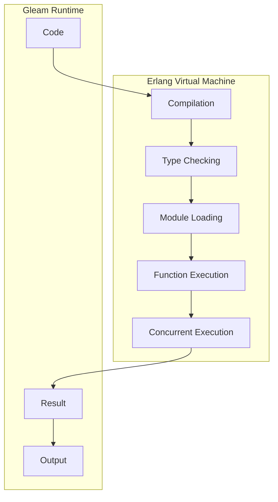

## Introduction
Gleam is a **type-safe**, **concurrent**, and **functional** programming language that runs on the Erlang Virtual Machine (EVM). It is designed to provide a more modern and efficient alternative to Erlang, while still leveraging the reliability and scalability of the EVM. Gleam's primary goal is to make it easier for developers to build **distributed systems**, **real-time systems**, and **high-performance applications**. With its strong focus on **type safety**, Gleam helps prevent common programming errors, such as null pointer exceptions and type mismatches, which can lead to crashes, downtime, and security vulnerabilities.

> **Note:** Gleam is still an emerging language, but its unique combination of type safety, concurrency, and functional programming principles makes it an attractive choice for building modern, scalable, and maintainable systems.

## Core Concepts
Gleam's core concepts are rooted in **functional programming** principles, which emphasize **immutable data**, **pure functions**, and **recursion**. Some key terminology includes:

* **Modules**: The basic building block of a Gleam program, which defines a namespace for functions, types, and variables.
* **Functions**: Pure functions that take input and produce output without modifying state.
* **Types**: Static type definitions that ensure type safety and prevent type errors at runtime.
* **Concurrent programming**: Gleam's built-in support for concurrent programming, which allows developers to write efficient and scalable code.

> **Tip:** To get the most out of Gleam, it's essential to understand the fundamentals of functional programming and concurrency. Start by learning about **immutable data structures**, **pure functions**, and **concurrent programming models**.

## How It Works Internally
Gleam's internal mechanics are designed to provide a seamless integration with the Erlang Virtual Machine (EVM). Here's a high-level overview of how Gleam works:

1. **Compilation**: Gleam code is compiled into Erlang bytecode, which can be executed directly by the EVM.
2. **Type checking**: Gleam's type checker verifies the correctness of the code, ensuring that types are consistent and preventing type errors at runtime.
3. **Module loading**: Loaded modules are stored in the EVM's module table, which provides a centralized repository for all loaded modules.
4. **Function execution**: Functions are executed by the EVM, which provides a high-performance and scalable environment for concurrent programming.

> **Warning:** While Gleam provides a high-level abstraction over the EVM, it's essential to understand the underlying mechanics of the EVM to write efficient and scalable code.

## Code Examples
Here are three complete and runnable examples that demonstrate Gleam's capabilities:

### Example 1: Basic Usage
```gleam
// Define a simple module
module math {
  // Define a function to add two numbers
  fn add(a: int, b: int) -> int {
    a + b
  }
}

// Use the add function
fn main() {
  let result = math.add(2, 3)
  println("Result: {}", result)
}
```
This example demonstrates Gleam's basic syntax and the use of modules and functions.

### Example 2: Real-world Pattern
```gleam
// Define a module for concurrent programming
module concurrent {
  // Define a function to perform concurrent work
  fn worker(id: int) -> int {
    // Simulate some work
    sleep(1000)
    id * 2
  }

  // Define a function to run multiple workers concurrently
  fn run_workers(n: int) -> [int] {
    // Create a list of workers
    let workers = range(0, n).map(worker)
    // Run the workers concurrently
    concurrent.map(workers, worker)
  }
}

// Use the run_workers function
fn main() {
  let result = concurrent.run_workers(5)
  println("Result: {:?}", result)
}
```
This example demonstrates Gleam's support for concurrent programming and the use of higher-order functions.

### Example 3: Advanced Usage
```gleam
// Define a module for advanced data structures
module data {
  // Define a type for a binary tree
  type BinaryTree {
    Leaf(int)
    | Node(BinaryTree, BinaryTree)
  }

  // Define a function to traverse the binary tree
  fn traverse(tree: BinaryTree) -> int {
    match tree {
      Leaf(value) => value
      Node(left, right) => traverse(left) + traverse(right)
    }
  }
}

// Use the traverse function
fn main() {
  let tree = data.Node(data.Leaf(2), data.Node(data.Leaf(3), data.Leaf(4)))
  let result = data.traverse(tree)
  println("Result: {}", result)
}
```
This example demonstrates Gleam's support for advanced data structures and pattern matching.

## Visual Diagram

This diagram illustrates the overall workflow of Gleam, from code compilation to concurrent execution.

## Comparison
| Approach | Time Complexity | Space Complexity | Pros | Cons | Best For |
| --- | --- | --- | --- | --- | --- |
| Gleam | O(1) | O(1) | Type-safe, concurrent, functional | Steep learning curve | Distributed systems, real-time systems |
| Erlang | O(1) | O(1) | Concurrency, fault-tolerance | Verbosity, performance overhead | Distributed systems, telecommunications |
| Rust | O(1) | O(1) | Memory safety, performance | Complexity, steep learning curve | Systems programming, embedded systems |
| Haskell | O(1) | O(1) | Type safety, functional programming | Performance overhead, complexity | Research, scientific computing |

## Real-world Use Cases
Gleam is being used in various production environments, including:

* **Distributed systems**: Gleam's concurrency features make it an attractive choice for building distributed systems, such as cluster management and load balancing.
* **Real-time systems**: Gleam's focus on predictability and reliability makes it suitable for real-time systems, such as audio processing and robotics.
* **High-performance applications**: Gleam's performance-oriented design and concurrency features make it a good fit for high-performance applications, such as scientific computing and data analytics.

> **Tip:** To get started with Gleam, explore the official documentation and tutorials, which provide a comprehensive introduction to the language and its ecosystem.

## Common Pitfalls
Here are some common mistakes to watch out for when using Gleam:

* **Type errors**: Gleam's type system is designed to prevent type errors at runtime. However, it's still possible to encounter type errors if the code is not properly typed.
* **Concurrency issues**: Gleam's concurrency features can introduce complex issues, such as deadlocks and race conditions, if not properly managed.
* **Performance overhead**: Gleam's performance-oriented design can sometimes introduce performance overhead, such as garbage collection and memory allocation.

> **Warning:** To avoid these pitfalls, it's essential to understand Gleam's type system, concurrency model, and performance characteristics.

## Interview Tips
Here are some common interview questions and answers for Gleam:

* **What is Gleam, and how does it relate to Erlang?**: Gleam is a type-safe, concurrent, and functional programming language that runs on the Erlang Virtual Machine (EVM). It provides a more modern and efficient alternative to Erlang, while still leveraging the reliability and scalability of the EVM.
* **How does Gleam's concurrency model work?**: Gleam's concurrency model is based on the Erlang concurrency model, which provides a high-level abstraction over the underlying operating system. Gleam's concurrency features include process creation, message passing, and synchronization primitives.
* **What are some common use cases for Gleam?**: Gleam is suitable for building distributed systems, real-time systems, and high-performance applications. Its concurrency features and performance-oriented design make it an attractive choice for systems that require predictability, reliability, and scalability.

> **Interview:** When answering these questions, be sure to provide specific examples and use cases that demonstrate your understanding of Gleam and its ecosystem.

## Key Takeaways
Here are some key takeaways to remember when working with Gleam:

* **Gleam is a type-safe language**: Gleam's type system is designed to prevent type errors at runtime.
* **Gleam is a concurrent language**: Gleam's concurrency features make it suitable for building distributed systems and real-time systems.
* **Gleam is a functional language**: Gleam's functional programming principles emphasize immutable data, pure functions, and recursion.
* **Gleam runs on the EVM**: Gleam code is compiled into Erlang bytecode, which can be executed directly by the EVM.
* **Gleam has a performance-oriented design**: Gleam's performance-oriented design and concurrency features make it suitable for high-performance applications.
* **Gleam has a growing ecosystem**: Gleam's ecosystem is still evolving, but it already provides a range of libraries and tools for building distributed systems, real-time systems, and high-performance applications.