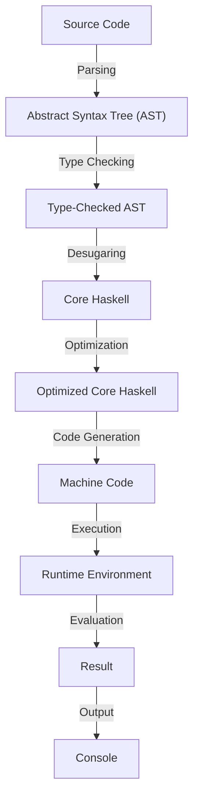

## Introduction
Haskell is a statically typed, purely functional programming language that has gained significant attention in recent years due to its strong type system, rigorous mathematical foundations, and high-level abstractions. As a **purely functional language**, Haskell enforces the concept of **referential transparency**, where the output of a function depends solely on its input arguments and not on any side effects. This property makes Haskell programs easier to reason about, test, and maintain. In this overview, we will delve into the core concepts of Haskell, its internal mechanics, and explore its applications in real-world scenarios.

## Core Concepts
Haskell's core concepts are built around the idea of **functions as first-class citizens**. In Haskell, functions are treated as regular values that can be passed as arguments to other functions, returned as values from functions, and composed together to create new functions. This concept is fundamental to Haskell's **functional programming model**, where programs are composed of pure functions that take input and produce output without modifying the state of the program.

Some key terminology in Haskell includes:

* **Lambda expressions**: anonymous functions that can be defined inline
* **Closures**: functions that capture their surrounding environment and can access variables from that environment
* **Higher-order functions**: functions that take other functions as arguments or return functions as output
* **Type classes**: a way to define a set of functions that can be used with a particular type

> **Note:** Haskell's strong type system is based on the concept of **type inference**, where the type of a variable or expression is inferred by the compiler rather than being explicitly declared by the programmer.

## How It Works Internally
Haskell's internal mechanics are based on a concept called **lazy evaluation**, where expressions are only evaluated when their values are actually needed. This approach allows Haskell to avoid unnecessary computations and improve performance. Haskell's **runtime environment** is responsible for managing the evaluation of expressions, handling errors, and providing a set of built-in functions and data types.

Here is a step-by-step breakdown of how Haskell evaluates an expression:

1. **Parsing**: the Haskell compiler parses the source code into an abstract syntax tree (AST)
2. **Type checking**: the compiler checks the types of the expressions in the AST to ensure that they are correct
3. **Desugaring**: the compiler translates the AST into a simpler form called **core Haskell**
4. **Optimization**: the compiler applies various optimizations to the core Haskell code, such as inlining and dead code elimination
5. **Code generation**: the compiler generates machine code from the optimized core Haskell code

## Code Examples
### Example 1: Basic Haskell Program
```haskell
-- Define a function to add two numbers
add :: Int -> Int -> Int
add x y = x + y

-- Define a main function to test the add function
main :: IO ()
main = print (add 2 3)
```
This program defines a simple function `add` that takes two integers and returns their sum. The `main` function tests the `add` function by printing the result of `add 2 3`.

### Example 2: Higher-Order Function
```haskell
-- Define a higher-order function to apply a function to a list
map :: (a -> b) -> [a] -> [b]
map _ [] = []
map f (x:xs) = f x : map f xs

-- Define a function to double a number
double :: Int -> Int
double x = x * 2

-- Define a main function to test the map function
main :: IO ()
main = print (map double [1, 2, 3, 4, 5])
```
This program defines a higher-order function `map` that applies a given function to each element of a list. The `double` function is defined to double a given number. The `main` function tests the `map` function by applying `double` to a list of numbers.

### Example 3: Recursive Function
```haskell
-- Define a recursive function to calculate the factorial of a number
factorial :: Int -> Int
factorial 0 = 1
factorial n = n * factorial (n-1)

-- Define a main function to test the factorial function
main :: IO ()
main = print (factorial 5)
```
This program defines a recursive function `factorial` that calculates the factorial of a given number. The `main` function tests the `factorial` function by printing the result of `factorial 5`.

## Visual Diagram

This diagram illustrates the steps involved in compiling and executing a Haskell program.

## Comparison
| Approach | Time Complexity | Space Complexity | Pros | Cons | Best For |
| --- | --- | --- | --- | --- | --- |
| **Lazy Evaluation** | O(1) | O(n) | Avoids unnecessary computations, improves performance | Can lead to increased memory usage | Real-time systems, embedded systems |
| **Eager Evaluation** | O(n) | O(1) | Simplifies the evaluation process, reduces memory usage | Can lead to unnecessary computations, reduces performance | Batch processing, scientific computing |
| **Functional Programming** | O(n) | O(n) | Improves code readability, reduces bugs | Can be less efficient than imperative programming | Web development, data analysis |
| **Imperative Programming** | O(1) | O(1) | Efficient, easy to implement | Can lead to bugs, reduces code readability | Operating systems, device drivers |

> **Warning:** Haskell's lazy evaluation can lead to increased memory usage if not managed properly.

## Real-world Use Cases
1. **GHC**: the Glasgow Haskell Compiler is a real-world example of a Haskell program that uses lazy evaluation and functional programming to improve performance and reduce bugs.
2. **Yesod**: a Haskell web framework that uses functional programming to improve code readability and reduce bugs.
3. **Pandoc**: a Haskell-based document conversion tool that uses lazy evaluation and functional programming to improve performance and reduce memory usage.

> **Tip:** Haskell's strong type system and functional programming model make it an ideal choice for developing robust and maintainable software systems.

## Common Pitfalls
1. **Infinite recursion**: a common mistake that can lead to a program crashing or running out of memory.
```haskell
-- Wrong way: infinite recursion
factorial :: Int -> Int
factorial n = n * factorial n
```
```haskell
-- Right way: recursive function with base case
factorial :: Int -> Int
factorial 0 = 1
factorial n = n * factorial (n-1)
```
2. **Type errors**: a common mistake that can lead to a program failing to compile.
```haskell
-- Wrong way: type error
add :: Int -> Int -> String
add x y = x + y
```
```haskell
-- Right way: correct type signature
add :: Int -> Int -> Int
add x y = x + y
```
3. **Lazy evaluation**: a common mistake that can lead to increased memory usage.
```haskell
-- Wrong way: lazy evaluation
list :: [Int]
list = [1..1000000]
```
```haskell
-- Right way: strict evaluation
list :: [Int]
list = [1..1000000] :: [Int]
```
4. **Functional programming**: a common mistake that can lead to less efficient code.
```haskell
-- Wrong way: imperative programming
sum :: [Int] -> Int
sum [] = 0
sum (x:xs) = x + sum xs
```
```haskell
-- Right way: functional programming
sum :: [Int] -> Int
sum = foldl (+) 0
```

## Interview Tips
1. **What is functional programming?**: a common interview question that tests the candidate's understanding of functional programming concepts.
> **Interview:** "Can you explain the concept of functional programming and how it differs from imperative programming?"
> **Weak answer:** "Functional programming is a programming paradigm that uses functions to perform computations."
> **Strong answer:** "Functional programming is a programming paradigm that treats functions as first-class citizens and emphasizes the use of pure functions, immutability, and recursion to perform computations."
2. **How does Haskell's type system work?**: a common interview question that tests the candidate's understanding of Haskell's type system.
> **Interview:** "Can you explain how Haskell's type system works and how it differs from other programming languages?"
> **Weak answer:** "Haskell's type system is based on type inference and uses type classes to define functions that can be used with a particular type."
> **Strong answer:** "Haskell's type system is based on type inference and uses a combination of type classes, type families, and kind polymorphism to define functions that can be used with a particular type. The type system is also based on the concept of type inference, where the type of a variable or expression is inferred by the compiler rather than being explicitly declared by the programmer."
3. **What is lazy evaluation?**: a common interview question that tests the candidate's understanding of lazy evaluation.
> **Interview:** "Can you explain the concept of lazy evaluation and how it is used in Haskell?"
> **Weak answer:** "Lazy evaluation is a technique used in Haskell to delay the evaluation of an expression until its value is actually needed."
> **Strong answer:** "Lazy evaluation is a technique used in Haskell to delay the evaluation of an expression until its value is actually needed. This is achieved through the use of thunks, which are data structures that represent a computation that has not yet been performed. When the value of a thunk is needed, the computation is performed and the result is stored in the thunk, so that subsequent evaluations of the same expression can return the cached result."

## Key Takeaways
* **Haskell is a purely functional programming language** that enforces the concept of referential transparency.
* **Functional programming is a programming paradigm** that treats functions as first-class citizens and emphasizes the use of pure functions, immutability, and recursion to perform computations.
* **Lazy evaluation is a technique** used in Haskell to delay the evaluation of an expression until its value is actually needed.
* **Type inference is a technique** used in Haskell to infer the type of a variable or expression without explicit type annotations.
* **Type classes are a way** to define a set of functions that can be used with a particular type.
* **Higher-order functions are functions** that take other functions as arguments or return functions as output.
* **Closures are functions** that capture their surrounding environment and can access variables from that environment.
* **Lambda expressions are anonymous functions** that can be defined inline.
* **Haskell's strong type system** makes it an ideal choice for developing robust and maintainable software systems.
* **Haskell's functional programming model** makes it an ideal choice for developing concurrent and parallel systems.