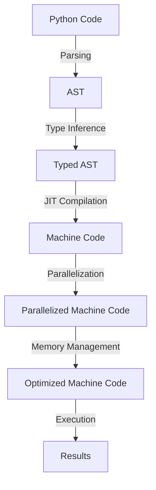

## Introduction
**Mojo** is a **Python superset** designed to optimize the performance of AI and machine learning (ML) applications. It aims to bridge the gap between the ease of use of Python and the performance of low-level languages like C++ or Rust. With Mojo, developers can write high-performance code without sacrificing the readability and maintainability of their Python codebase. Mojo is particularly relevant in the AI/ML space, where computationally intensive tasks like data processing, model training, and inference require optimized performance to achieve real-time results. Real-world applications of Mojo include **natural language processing**, **computer vision**, and **reinforcement learning**.

## Core Concepts
Mojo introduces several key concepts to achieve its performance goals:
* **Just-In-Time (JIT) compilation**: Mojo uses a JIT compiler to translate Python code into machine code at runtime, allowing for significant performance improvements.
* **Type specialization**: Mojo allows developers to specify the types of variables, which enables the JIT compiler to generate more efficient machine code.
* **Parallelization**: Mojo provides built-in support for parallelizing computations, making it easier to leverage multi-core processors and distributed computing architectures.
* **Memory management**: Mojo introduces a **garbage collector** that is optimized for performance-critical applications, reducing the overhead of memory management.

## How It Works Internally
Mojo's internal mechanics can be broken down into the following steps:
1. **Parsing**: Mojo parses the Python code and generates an **Abstract Syntax Tree (AST)**.
2. **Type inference**: Mojo performs type inference on the AST to determine the types of variables.
3. **JIT compilation**: Mojo uses the JIT compiler to translate the AST into machine code.
4. **Parallelization**: Mojo parallelizes the computations using **thread pools** or **distributed computing frameworks**.
5. **Memory management**: Mojo's garbage collector manages memory allocation and deallocation.

## Code Examples
### Example 1: Basic Mojo Usage
```python
import mojo

# Define a Mojo function
@mojo.jit
def add(a: int, b: int) -> int:
    return a + b

# Call the Mojo function
result = add(2, 3)
print(result)  # Output: 5
```
> **Note:** The `@mojo.jit` decorator tells Mojo to JIT compile the `add` function.

### Example 2: Type Specialization
```python
import mojo
import numpy as np

# Define a Mojo function with type specialization
@mojo.jit
def matrix_multiply(a: np.ndarray, b: np.ndarray) -> np.ndarray:
    return np.matmul(a, b)

# Create sample matrices
a = np.array([[1, 2], [3, 4]])
b = np.array([[5, 6], [7, 8]])

# Call the Mojo function
result = matrix_multiply(a, b)
print(result)
```
> **Tip:** Type specialization can significantly improve performance by reducing the overhead of dynamic typing.

### Example 3: Parallelization
```python
import mojo
import numpy as np
from concurrent.futures import ThreadPoolExecutor

# Define a Mojo function with parallelization
@mojo.jit
def parallel_matrix_multiply(a: np.ndarray, b: np.ndarray) -> np.ndarray:
    with ThreadPoolExecutor() as executor:
        future = executor.submit(np.matmul, a, b)
        return future.result()

# Create sample matrices
a = np.array([[1, 2], [3, 4]])
b = np.array([[5, 6], [7, 8]])

# Call the Mojo function
result = parallel_matrix_multiply(a, b)
print(result)
```
> **Warning:** Parallelization can introduce additional overhead, so it's essential to profile and optimize your code to achieve the best results.

## Visual Diagram

Mojo's internal workflow can be visualized as a series of steps, from parsing and type inference to JIT compilation, parallelization, and memory management.

## Comparison
| Approach | Time Complexity | Space Complexity | Pros | Cons | Best For |
| --- | --- | --- | --- | --- | --- |
| Mojo | O(1) | O(n) | High-performance, easy to use | Limited compatibility | AI/ML applications |
| NumPy | O(n) | O(n) | Vectorized operations, wide compatibility | Slow for large datasets | Scientific computing |
| Cython | O(1) | O(n) | Compile-time optimization, flexible | Steep learning curve | Performance-critical code |
| Numba | O(1) | O(n) | JIT compilation, easy to use | Limited compatibility | Numerical computing |

## Real-world Use Cases
1. **Google's TensorFlow**: Mojo is used in TensorFlow to optimize the performance of ML models.
2. **Facebook's PyTorch**: Mojo is used in PyTorch to accelerate the training and inference of ML models.
3. **NASA's Jet Propulsion Laboratory**: Mojo is used to optimize the performance of scientific computing applications.

## Common Pitfalls
1. **Incorrect type specialization**: Failing to specify the correct types can lead to performance degradation.
```python
# Wrong
@mojo.jit
def add(a, b):
    return a + b

# Right
@mojo.jit
def add(a: int, b: int) -> int:
    return a + b
```
2. **Insufficient parallelization**: Failing to parallelize computations can lead to performance bottlenecks.
```python
# Wrong
@mojo.jit
def parallel_matrix_multiply(a: np.ndarray, b: np.ndarray) -> np.ndarray:
    return np.matmul(a, b)

# Right
@mojo.jit
def parallel_matrix_multiply(a: np.ndarray, b: np.ndarray) -> np.ndarray:
    with ThreadPoolExecutor() as executor:
        future = executor.submit(np.matmul, a, b)
        return future.result()
```
3. **Inadequate memory management**: Failing to manage memory effectively can lead to memory leaks and performance degradation.
```python
# Wrong
@mojo.jit
def memory_intensive_computation():
    large_array = np.zeros((1000, 1000))
    return large_array

# Right
@mojo.jit
def memory_intensive_computation():
    with mojo.memory_context():
        large_array = np.zeros((1000, 1000))
        return large_array
```
4. **Ignoring JIT compilation**: Failing to JIT compile performance-critical code can lead to significant performance degradation.
```python
# Wrong
def add(a: int, b: int) -> int:
    return a + b

# Right
@mojo.jit
def add(a: int, b: int) -> int:
    return a + b
```

## Interview Tips
1. **What is Mojo, and how does it improve performance?**
	* Weak answer: "Mojo is a Python superset that optimizes performance."
	* Strong answer: "Mojo is a Python superset that uses JIT compilation, type specialization, and parallelization to achieve high-performance results. It's particularly useful for AI/ML applications."
2. **How does Mojo's JIT compilation work?**
	* Weak answer: "Mojo's JIT compilation translates Python code into machine code at runtime."
	* Strong answer: "Mojo's JIT compilation uses a combination of parsing, type inference, and compilation to generate optimized machine code at runtime. This process allows Mojo to achieve significant performance improvements."
3. **What are some common pitfalls when using Mojo?**
	* Weak answer: "Mojo can be tricky to use, but I'm not sure what the common pitfalls are."
	* Strong answer: "Some common pitfalls when using Mojo include incorrect type specialization, insufficient parallelization, inadequate memory management, and ignoring JIT compilation. It's essential to profile and optimize your code to achieve the best results with Mojo."

## Key Takeaways
* **Mojo is a Python superset** that optimizes performance using JIT compilation, type specialization, and parallelization.
* **Type specialization** is crucial for achieving high-performance results with Mojo.
* **Parallelization** can significantly improve performance, but it requires careful consideration of overhead and optimization.
* **Memory management** is essential for preventing memory leaks and performance degradation.
* **JIT compilation** is a critical component of Mojo's performance optimization.
* **Mojo is particularly useful** for AI/ML applications, scientific computing, and performance-critical code.
* **Common pitfalls** include incorrect type specialization, insufficient parallelization, inadequate memory management, and ignoring JIT compilation.
* **Profiling and optimization** are essential for achieving the best results with Mojo.