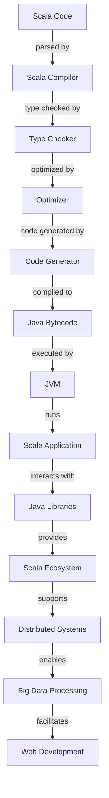

## Introduction
Scala is a **multi-paradigm language** that runs on the **Java Virtual Machine (JVM)**, combining elements of **object-oriented programming (OOP)** and **functional programming**. It was designed to address the limitations of Java and provide a more concise, expressive, and efficient way of developing software. Scala is widely used in industry and academia, with companies like **Twitter**, **LinkedIn**, and **Apache Spark** relying on it for their core infrastructure. As a language, Scala is particularly well-suited for **distributed systems**, **big data processing**, and **web development**, making it an essential skill for any software engineer working in these areas.

> **Note:** Scala's interoperability with Java allows developers to leverage the vast ecosystem of Java libraries and frameworks, while also benefiting from Scala's more concise and expressive syntax.

## Core Concepts
Scala's core concepts include **immutability**, **type inference**, **higher-order functions**, and **pattern matching**. These concepts enable developers to write concise, efficient, and safe code, while also providing a strong foundation for **functional programming**.

*   **Immutability**: Scala encourages the use of immutable data structures, which ensures that once created, an object's state cannot be modified. This provides thread safety and makes code easier to reason about.
*   **Type Inference**: Scala can automatically infer the types of variables, eliminating the need for explicit type declarations. This feature makes the code more concise and easier to write.
*   **Higher-Order Functions**: Scala supports higher-order functions, which are functions that take other functions as arguments or return functions as output. This enables developers to write abstract, composable code.
*   **Pattern Matching**: Scala provides a powerful pattern matching mechanism, which allows developers to specify multiple alternatives for how to handle a piece of data. This feature makes code more expressive and easier to read.

> **Warning:** While Scala's type inference can make code more concise, it can also lead to type-related issues if not used carefully. It's essential to understand the type system and use type annotations when necessary.

## How It Works Internally
Scala's compiler, **scalac**, converts Scala code into **Java bytecode**, which can then be executed by the JVM. This process involves several stages, including **parsing**, **type checking**, **optimization**, and **code generation**.

1.  **Parsing**: The Scala compiler reads the source code and breaks it down into an **abstract syntax tree (AST)**.
2.  **Type Checking**: The compiler checks the AST for type errors, ensuring that the code is type-safe.
3.  **Optimization**: The compiler applies various optimizations to the AST, such as **inlining** and **dead code elimination**.
4.  **Code Generation**: The compiler generates Java bytecode from the optimized AST.

> **Tip:** Understanding the internal workings of the Scala compiler can help developers optimize their code and troubleshoot issues more effectively.

## Code Examples
Here are three complete, runnable examples of Scala code, demonstrating basic usage, real-world patterns, and advanced techniques:

### Example 1: Basic Usage
```scala
// Define a simple function that adds two numbers
def add(x: Int, y: Int): Int = x + y

// Call the function and print the result
val result = add(2, 3)
println(result) // Output: 5
```

### Example 2: Real-World Pattern
```scala
// Define a case class for a user
case class User(id: Int, name: String)

// Define a function that filters users by name
def filterUsers(users: List[User], name: String): List[User] = users.filter(_.name == name)

// Create a list of users and filter it
val users = List(User(1, "John"), User(2, "Jane"), User(3, "John"))
val filteredUsers = filterUsers(users, "John")

// Print the filtered users
filteredUsers.foreach(println)
```

### Example 3: Advanced Usage
```scala
// Define a trait for a functor
trait Functor[F[_]] {
  def map[A, B](fa: F[A])(f: A => B): F[B]
}

// Define a functor instance for the Option type
implicit val optionFunctor: Functor[Option] = new Functor[Option] {
  override def map[A, B](fa: Option[A])(f: A => B): Option[B] = fa.map(f)
}

// Define a function that uses the functor
def lift[A, B](f: A => B): Option[A] => Option[B] = _.map(f)

// Create an option and lift a function over it
val option = Some(2)
val lifted = lift((x: Int) => x * 2)(option)

// Print the result
println(lifted) // Output: Some(4)
```

## Visual Diagram

This diagram illustrates the Scala compilation process and how it integrates with the Java ecosystem.

> **Note:** The Scala compiler is designed to work seamlessly with the Java ecosystem, allowing developers to leverage the vast array of Java libraries and frameworks.

## Comparison
| Approach | Time Complexity | Space Complexity | Pros | Cons | Best For |
| --- | --- | --- | --- | --- | --- |
| Scala | O(1) - O(n) | O(1) - O(n) | Concise, expressive, interoperable with Java | Steeper learning curve, slower performance than native languages | Distributed systems, big data processing, web development |
| Java | O(1) - O(n) | O(1) - O(n) | Platform independent, large community, vast ecosystem | Verbose, less expressive than Scala | Android app development, enterprise software, desktop applications |
| Python | O(1) - O(n) | O(1) - O(n) | Easy to learn, flexible, extensive libraries | Slow performance, less suitable for distributed systems | Data science, machine learning, scripting |
| Haskell | O(1) - O(n) | O(1) - O(n) | Strongly typed, functional, lazy evaluation | Steep learning curve, less practical for real-world applications | Research, academic projects, functional programming |

## Real-world Use Cases
Here are three concrete production examples of Scala in use:

1.  **Twitter**: Twitter uses Scala for its core infrastructure, including its **tweet processing pipeline** and **user timeline generation**.
2.  **LinkedIn**: LinkedIn relies on Scala for its **data processing pipeline**, which handles massive amounts of data from various sources.
3.  **Apache Spark**: Apache Spark, a popular big data processing framework, is written primarily in Scala. It provides a high-level API for processing large-scale data sets.

> **Tip:** Scala's concise and expressive syntax makes it an ideal choice for complex, distributed systems, while its interoperability with Java ensures seamless integration with existing infrastructure.

## Common Pitfalls
Here are four specific mistakes that engineers may make when working with Scala:

1.  **Incorrectly handling null values**: Scala's **Option** type is designed to handle null values explicitly, but developers may still encounter issues if they're not careful.
    ```scala
// Wrong way: using null directly
val x: String = null
// Right way: using Option to handle null values
val x: Option[String] = None
```
2.  **Not understanding type inference**: Scala's type inference can lead to type-related issues if not used carefully.
    ```scala
// Wrong way: relying solely on type inference
val x = 5
// Right way: using type annotations when necessary
val x: Int = 5
```
3.  **Not using immutable data structures**: Scala encourages the use of immutable data structures, but developers may still use mutable data structures out of habit.
    ```scala
// Wrong way: using a mutable list
val list = scala.collection.mutable.ListBuffer(1, 2, 3)
// Right way: using an immutable list
val list = List(1, 2, 3)
```
4.  **Not handling exceptions properly**: Scala provides a strong **exception handling** mechanism, but developers may still encounter issues if they don't handle exceptions correctly.
    ```scala
// Wrong way: not handling exceptions
def divide(x: Int, y: Int): Int = x / y
// Right way: handling exceptions using try-catch blocks
def divide(x: Int, y: Int): Option[Int] = try {
  Some(x / y)
} catch {
  case _: ArithmeticException => None
}
```

## Interview Tips
Here are three common interview questions related to Scala, along with weak and strong answers:

1.  **What is the difference between **val** and **var** in Scala?**
    *   Weak answer: "Val is like a constant, and var is like a variable."
    *   Strong answer: "**Val** is a value that cannot be reassigned, while **var** is a variable that can be reassigned. However, both **val** and **var** can be mutable if they refer to a mutable object."
2.  **How does Scala's **type inference** work?**
    *   Weak answer: "Scala's type inference is like a magic box that figures out the types for you."
    *   Strong answer: "Scala's type inference uses a combination of local type inference and global type inference to determine the types of variables and expressions. It's based on the **Hindley-Milner** type inference algorithm, which ensures that the types are inferred correctly and efficiently."
3.  **What is the purpose of Scala's **Option** type?**
    *   Weak answer: "Option is like a wrapper around a value that might be null."
    *   Strong answer: "Scala's **Option** type is a **sum type** that represents a value that may or may not be present. It's used to handle null values explicitly and provide a safe way to work with values that might be absent. The **Option** type has two subtypes: **Some**, which represents a value that is present, and **None**, which represents a value that is absent."

> **Interview:** When answering Scala interview questions, be sure to provide specific examples and explain the concepts in detail. Show the interviewer that you have a deep understanding of the language and its ecosystem.

## Key Takeaways
Here are ten key takeaways to remember when working with Scala:

*   **Scala is a multi-paradigm language** that combines elements of OOP and functional programming.
*   **Scala runs on the JVM**, providing access to the vast Java ecosystem.
*   **Immutability** is a core concept in Scala, and it's essential to understand how to work with immutable data structures.
*   **Type inference** is a powerful feature in Scala, but it requires careful use to avoid type-related issues.
*   **Higher-order functions** are a fundamental concept in functional programming, and Scala provides strong support for them.
*   **Pattern matching** is a powerful mechanism in Scala for handling different cases and alternatives.
*   **Scala's **Option** type** is a sum type that represents a value that may or may not be present.
*   **Scala's **exception handling** mechanism** is based on try-catch blocks and provides a safe way to handle errors.
*   **Scala's **type system** is based on the **Hindley-Milner** type inference algorithm, which ensures that types are inferred correctly and efficiently.
*   **Scala's **interoperability with Java** provides access to the vast Java ecosystem and allows developers to leverage existing libraries and frameworks.