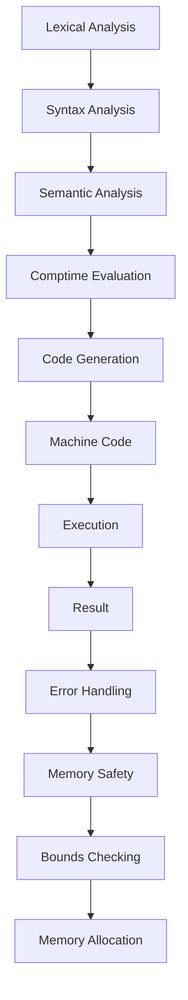

## Introduction
Zig is a general-purpose programming language that aims to replace C as a systems programming language. It was designed by Andrew Kelley and first released in 2016. **Zig's primary goal is to provide a safer and more efficient alternative to C**, with a focus on performance, reliability, and maintainability. Zig's key features include a **comptime** system, which allows for compile-time evaluation of expressions, and a lack of **hidden control flow**, which makes it easier to reason about the behavior of Zig programs.

> **Note:** Zig is still a relatively new language, but it has already gained significant attention and adoption in the systems programming community.

Zig's real-world relevance can be seen in its use in various projects, such as the **Zig standard library**, which provides a set of libraries and tools for systems programming, and **Lmdb**, a high-performance database library written in Zig. Zig is also being used in various industries, including **embedded systems**, **operating systems**, and **game development**.

## Core Concepts
Zig's core concepts include:

* **Comptime**: a system that allows for compile-time evaluation of expressions, which enables advanced metaprogramming capabilities.
* **No hidden control flow**: Zig's design ensures that control flow is always explicit, making it easier to reason about the behavior of Zig programs.
* **Error handling**: Zig provides a strong focus on error handling, with a built-in **error** type and a set of **error handling** mechanisms.
* **Memory safety**: Zig provides a set of mechanisms to ensure memory safety, including **bounds checking** and **memory allocation**.

> **Warning:** Zig's comptime system can be complex and error-prone if not used carefully, so it's essential to understand the language's rules and best practices.

## How It Works Internally
Zig's internal mechanics include:

1. **Lexical analysis**: Zig's compiler performs lexical analysis to break the source code into tokens.
2. **Syntax analysis**: Zig's compiler performs syntax analysis to parse the tokens into an abstract syntax tree (AST).
3. **Semantic analysis**: Zig's compiler performs semantic analysis to check the AST for errors and to perform type checking.
4. **Comptime evaluation**: Zig's comptime system evaluates expressions at compile-time, which enables advanced metaprogramming capabilities.
5. **Code generation**: Zig's compiler generates machine code from the AST.

> **Tip:** Understanding Zig's internal mechanics can help you optimize your code and avoid common pitfalls.

## Code Examples
### Example 1: Basic Usage
```zig
const std = @import("std");

pub fn main() !void {
    std.debug.print("Hello, world!\n", .{});
}
```
This example demonstrates basic usage of Zig, including importing the standard library and using the `std.debug.print` function to print a message to the console.

### Example 2: Real-World Pattern
```zig
const std = @import("std");

pub fn factorial(n: u32) u32 {
    if (n == 0) {
        return 1;
    } else {
        return n * factorial(n - 1);
    }
}

pub fn main() !void {
    const result = factorial(5);
    std.debug.print("Factorial of 5: {}\n", .{result});
}
```
This example demonstrates a real-world pattern in Zig, including defining a recursive function to calculate the factorial of a number and using the `std.debug.print` function to print the result to the console.

### Example 3: Advanced Usage
```zig
const std = @import("std");

pub fn fibonacci(n: u32) u32 {
    var a: u32 = 0;
    var b: u32 = 1;
    var i: u32 = 0;
    while (i < n) {
        const temp = a;
        a = b;
        b = temp + b;
        i += 1;
    }
    return a;
}

pub fn main() !void {
    const result = fibonacci(10);
    std.debug.print("Fibonacci of 10: {}\n", .{result});
}
```
This example demonstrates advanced usage of Zig, including defining a function to calculate the Fibonacci sequence and using a loop to iterate over the sequence.

## Visual Diagram

This diagram illustrates the internal mechanics of Zig, including lexical analysis, syntax analysis, semantic analysis, comptime evaluation, code generation, and execution.

> **Note:** This diagram provides a high-level overview of Zig's internal mechanics and is not exhaustive.

## Comparison
| Language | Time Complexity | Space Complexity | Pros | Cons | Best For |
| --- | --- | --- | --- | --- | --- |
| Zig | O(1) | O(1) | Performance, reliability, maintainability | Steep learning curve | Systems programming, embedded systems |
| C | O(1) | O(1) | Performance, portability | Error-prone, lack of memory safety | Systems programming, operating systems |
| Rust | O(1) | O(1) | Memory safety, performance | Steep learning curve, complexity | Systems programming, web development |
| C++ | O(1) | O(1) | Performance, flexibility | Complexity, error-prone | Systems programming, game development |

> **Warning:** This comparison is not exhaustive and is intended to provide a general overview of the languages.

## Real-world Use Cases
1. **Zig standard library**: Zig's standard library provides a set of libraries and tools for systems programming.
2. **Lmdb**: Lmdb is a high-performance database library written in Zig.
3. **Embedded systems**: Zig is being used in various embedded systems projects, including **robotics** and **automotive** systems.

> **Tip:** Zig's real-world use cases demonstrate its potential for systems programming and embedded systems development.

## Common Pitfalls
1. **Comptime evaluation errors**: Comptime evaluation can be complex and error-prone if not used carefully.
2. **Memory safety issues**: Zig's memory safety mechanisms can be bypassed if not used correctly.
3. **Error handling mistakes**: Error handling can be complex and error-prone if not used carefully.
4. **Performance optimization mistakes**: Performance optimization can be complex and error-prone if not used carefully.

> **Warning:** These pitfalls can lead to errors and performance issues if not addressed properly.

## Interview Tips
1. **What is Zig's comptime system?**: A strong answer should explain the concept of comptime evaluation and its benefits.
2. **How does Zig ensure memory safety?**: A strong answer should explain Zig's memory safety mechanisms and how they ensure memory safety.
3. **What are some common pitfalls in Zig programming?**: A strong answer should explain the common pitfalls and how to avoid them.

> **Interview:** Be prepared to answer questions about Zig's core concepts, internal mechanics, and best practices.

## Key Takeaways
* **Zig is a systems programming language**: Zig is designed for systems programming and provides a set of features and mechanisms to ensure performance, reliability, and maintainability.
* **Comptime evaluation is a key feature**: Comptime evaluation enables advanced metaprogramming capabilities and provides a way to optimize code at compile-time.
* **Memory safety is a top priority**: Zig's memory safety mechanisms ensure that memory is accessed safely and securely.
* **Error handling is critical**: Error handling is essential in Zig programming, and the language provides a set of mechanisms to handle errors correctly.
* **Performance optimization is important**: Performance optimization is critical in systems programming, and Zig provides a set of mechanisms to optimize code for performance.
* **Zig has a steep learning curve**: Zig's unique features and mechanisms can be complex and error-prone if not used carefully.
* **Zig is being used in various industries**: Zig is being used in various industries, including embedded systems, operating systems, and game development.
* **Zig's community is growing**: Zig's community is growing, and the language is gaining attention and adoption in the systems programming community.
* **Zig's standard library is comprehensive**: Zig's standard library provides a set of libraries and tools for systems programming.
* **Zig's documentation is extensive**: Zig's documentation is extensive and provides a comprehensive overview of the language and its features.